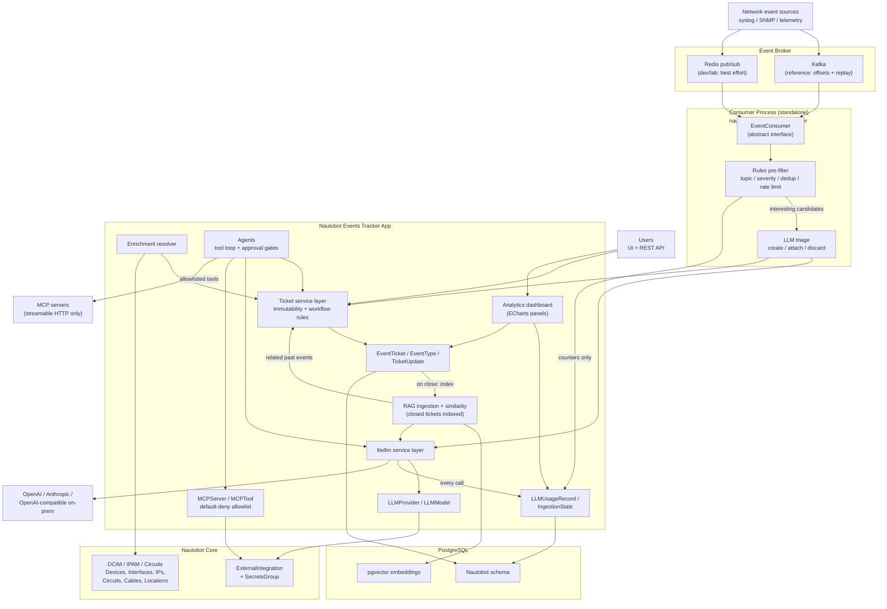

# Architecture

!!! warning "Draft"
    This document was reconstructed from the system diagram supplied at project kickoff. It describes the **target** system across all phases. Phases 1 and 2 are implemented, and Phase 3 is specified in [its spec](specs/phase-3-llm-triage.md). Everything else is stated here so that the implemented phases do not paint later ones into a corner.

Event Tracker turns raw network events into tickets that a human or an AI agent can work, and keeps a complete, append-only record of who did what. Nautobot is the source of truth for the network itself; this app never duplicates that data, it references it.

## Guiding shape

The system splits into three tiers that are deliberately kept apart:

1. **Ingestion** — a standalone consumer process reads from an event broker, drops noise cheaply, and asks an LLM to triage what survives.
2. **Domain** — the ticket models plus a service layer that owns every mutation. The service layer is the only writer.
3. **Assist** — LLM providers, MCP tools, RAG over closed tickets, and usage accounting. All of it calls the domain through the same service layer that humans use.

The reason for the split is that the AI tier must not be able to do anything a human could not do through the UI. Confining every mutation to one service layer is what makes that enforceable rather than aspirational.

## Components

### Event broker

Network event sources (syslog, SNMP traps, streaming telemetry) publish onto a broker. Kafka is the reference deployment because consumer offsets make replay possible after an outage. Redis pub/sub is supported for dev and lab use, where losing events during a restart is acceptable. See [ADR 0004](decisions/0004-pluggable-event-broker-consumers.md).

### Consumer process

A standalone `nautobot-server eventconsumer` management command, not a Celery task and not a Job. It runs a long-lived loop, so it needs a process lifetime that Nautobot's worker model does not offer. See [ADR 0005](decisions/0005-standalone-consumer-process.md).

Inside it, a cheap deterministic pre-filter runs before any LLM call: topic matching, severity floors, dedup windows, and rate limits. Events the pre-filter rejects are counted and discarded — they never cost a token. Only survivors reach LLM triage, which decides among create a ticket, attach to an existing ticket, or discard.

### Ticket service layer

The subject of Phase 1, and the narrow waist of the whole system. Every mutation — from a human clicking a button, from the REST API, from the consumer, from an agent — goes through `services/tickets.py`. It owns the status workflow graph, the append-only update trail, and the rule that AI may not touch resolved or closed tickets. See [ADR 0001](decisions/0001-ticket-service-layer-as-sole-mutation-path.md) and [ADR 0002](decisions/0002-explicit-status-workflow-graph.md).

### Enrichment resolver

Resolves references in raw event payloads (a hostname, an interface name, an IP) into real Nautobot objects, and attaches them to the ticket. This is why the app holds no copy of device or circuit data: it points at the source of truth.

### Agents

Tool-using loops that work a ticket. Their reach is bounded twice over: they can only call MCP tools that an operator has explicitly allowlisted, and any action with a side effect passes an approval gate. See [ADR 0007](decisions/0007-mcp-tools-streamable-http-and-default-deny.md).

### LLM service layer

All model calls funnel through litellm, so provider choice is configuration rather than code. Credentials live in Nautobot `ExternalIntegration` and `SecretsGroup` objects, never in app settings. Every call writes an `LLMUsageRecord`. See [ADR 0006](decisions/0006-litellm-service-layer-and-credential-storage.md).

### RAG over closed tickets

When a ticket closes it becomes training material: the ticket, its updates, and its resolution are embedded and indexed in pgvector. Similarity search then surfaces "we have seen this before" context on new tickets. Only closed tickets are indexed, so the corpus is made of resolved problems rather than open speculation. See [ADR 0003](decisions/0003-postgresql-with-pgvector-only.md).

### Analytics

Dashboard panels built on the UI Component Framework's ECharts components, reading from ticket data and usage records. See [ADR 0008](decisions/0008-ui-component-framework-only.md).

## Phasing

| Phase | Scope |
| ----- | ----- |
| **1** | Tickets, service layer, workflow graph, REST/GraphQL, UI, filtersets, permissions. **No AI whatsoever.** |
| 2 | Broker abstraction, consumer process, deterministic pre-filter, ingestion stats. |
| 3 | LLM service layer, provider/model registry, usage accounting, LLM triage in the consumer. |
| 4 | Enrichment resolver and agents with MCP tooling and approval gates. |
| 5 | RAG indexing on close, similarity surfacing, analytics dashboard. |

Phase 1 is AI-free by design. The `source` field on tickets and updates already carries an `ai` value, and the service layer already enforces the AI immutability rule, so that later phases plug in without reopening the domain model. Nothing in Phase 1 imports litellm or talks to a provider.

## Cross-cutting decisions

| ADR | Decision |
| --- | -------- |
| [0001](decisions/0001-ticket-service-layer-as-sole-mutation-path.md) | The service layer is the only path that mutates tickets |
| [0002](decisions/0002-explicit-status-workflow-graph.md) | Ticket status is a code-defined choice set with an explicit transition graph |
| [0003](decisions/0003-postgresql-with-pgvector-only.md) | PostgreSQL with pgvector is the only supported database |
| [0004](decisions/0004-pluggable-event-broker-consumers.md) | Broker access sits behind an `EventConsumer` interface |
| [0005](decisions/0005-standalone-consumer-process.md) | Ingestion runs as a standalone process, not a Celery task |
| [0006](decisions/0006-litellm-service-layer-and-credential-storage.md) | All LLM calls go through litellm; credentials live in `ExternalIntegration` |
| [0007](decisions/0007-mcp-tools-streamable-http-and-default-deny.md) | MCP over streamable HTTP only, default-deny allowlist |
| [0008](decisions/0008-ui-component-framework-only.md) | UI is `NautobotUIViewSet` plus the UI Component Framework, no hand-written templates |
