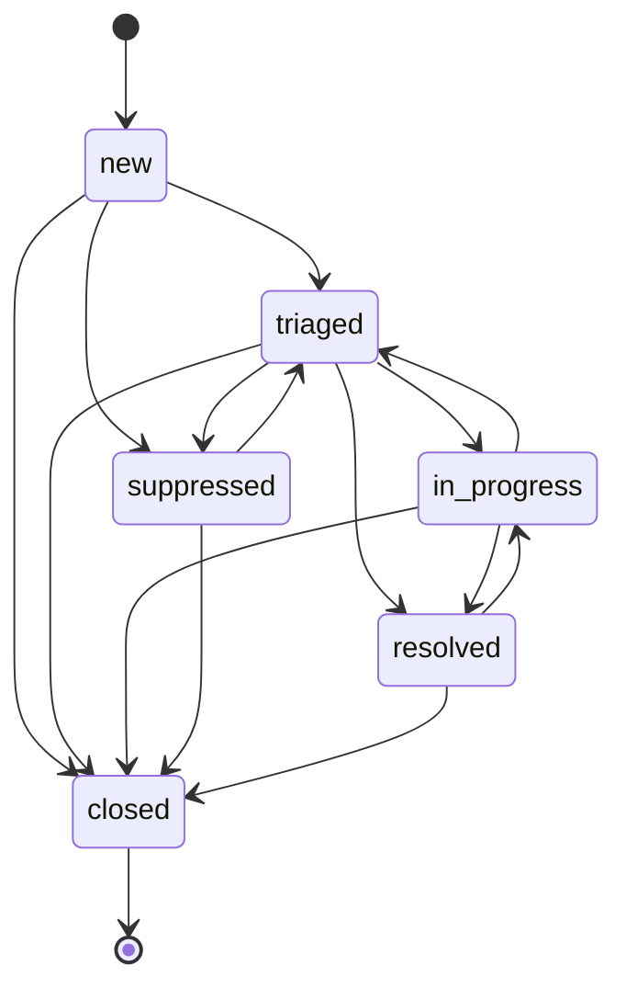

# Phase 1 — Ticketing

!!! info "Implemented"
    Phase 1 is implemented and merged. Section 11's ten calls are answered: each entry now records the decision taken and what it costs, rather than a reading awaiting a second opinion.

API names quoted here were verified against an installed Nautobot 3.2.2 rather than taken from memory.

## 1. Scope

Phase 1 delivers ticketing and nothing else: the three ticket models, a service layer that owns every mutation, the status workflow, REST and GraphQL access, filtersets, the UI, and permissions.

**Phase 1 is AI-free by design.** No LLM dependency appears in `pyproject.toml`. No module imports `litellm` or any provider SDK. No code path calls a model. The `ai` value exists in `TicketSourceChoices` and the service layer already enforces the rule that AI cannot touch resolved or closed tickets — the rule is built and tested now, before there is an AI to enforce it against, so that Phase 3 plugs in without reopening the domain model.

Explicitly out of scope: broker consumers, the enrichment resolver, agents, MCP, RAG, usage records, and the analytics dashboard.

## 2. Choices and the workflow graph

All choice sets live in `nautobot_event_tracker/choices.py` and subclass `nautobot.apps.choices.ChoiceSet`.

### 2.1 `TicketStatusChoices`

| Constant | Value | Meaning |
| --- | --- | --- |
| `NEW` | `new` | Created, not yet looked at |
| `TRIAGED` | `triaged` | Assessed as real, awaiting or ready for work |
| `IN_PROGRESS` | `in_progress` | Actively being worked |
| `SUPPRESSED` | `suppressed` | Judged noise; kept for the record, not worked |
| `RESOLVED` | `resolved` | Fixed, pending confirmation |
| `CLOSED` | `closed` | Terminal |

### 2.2 `SeverityChoices`

`CRITICAL` (`critical`), `MAJOR` (`major`), `MINOR` (`minor`), `WARNING` (`warning`), `INFO` (`info`).

The set is ordered most to least severe. A module-level `SEVERITY_WEIGHTS` maps each value to an integer so that ordering and comparison do not depend on alphabetical accident.

### 2.3 `TicketSourceChoices`

| Constant | Value | Meaning |
| --- | --- | --- |
| `HUMAN` | `human` | A person, via UI or API, acting as themselves |
| `AI` | `ai` | An LLM triage step or agent (Phase 3+) |
| `SYSTEM` | `system` | Deterministic automation: the pre-filter, dedup, migrations |

### 2.4 `UpdateTypeChoices`

`CREATED`, `COMMENT`, `STATUS_CHANGE`, `ASSIGNMENT`, `SEVERITY_CHANGE`, `OBJECT_ATTACHED`, `OBJECT_DETACHED`, `RECURRENCE`. Values are the lowercase constant names.

### 2.5 The workflow graph

Per [ADR 0002](../decisions/0002-explicit-status-workflow-graph.md) the graph is a plain data structure in `choices.py`, and it is the **only** definition of transition legality in the codebase:

```python
TICKET_STATUS_TRANSITIONS: dict[str, frozenset[str]] = {
    TicketStatusChoices.NEW:         frozenset({TRIAGED, SUPPRESSED, CLOSED}),
    TicketStatusChoices.TRIAGED:     frozenset({IN_PROGRESS, SUPPRESSED, RESOLVED, CLOSED}),
    TicketStatusChoices.IN_PROGRESS: frozenset({TRIAGED, RESOLVED, CLOSED}),
    TicketStatusChoices.SUPPRESSED:  frozenset({TRIAGED, CLOSED}),
    TicketStatusChoices.RESOLVED:    frozenset({IN_PROGRESS, CLOSED}),
    TicketStatusChoices.CLOSED:      frozenset(),
}
```



Properties that follow, and that the tests assert directly:

- `closed` is terminal. No edge leaves it.
- No state has an edge to itself. Transitioning a ticket to the status it already holds is always illegal.
- `resolved -> in_progress` is the reopen path, and it is available to humans only — rule S3 blocks AI from it.
- Every key and every member of every value is a member of `TicketStatusChoices.values()`. A test asserts this so that a typo cannot silently create an unreachable state.

The graph has 6 states, so 36 ordered pairs, of which **14 are legal and 22 are illegal**.

## 3. Data model

Three models in `nautobot_event_tracker/models.py`. Every model carries `@extras_features("custom_links", "custom_validators", "export_templates", "graphql", "webhooks")` except where noted.

### 3.1 `EventType`

Base class `OrganizationalModel` (UUID pk, change logging, custom fields, notes, natural key). A catalogue of the kinds of event the system knows about.

| Field | Type | Notes |
| --- | --- | --- |
| `name` | `CharField(max_length=CHARFIELD_MAX_LENGTH, unique=True)` | Natural key |
| `description` | `CharField(max_length=CHARFIELD_MAX_LENGTH, blank=True)` | |
| `default_severity` | `CharField(choices=SeverityChoices, default=MINOR)` | Used when a caller creates a ticket without an explicit severity |
| `enabled` | `BooleanField(default=True)` | A disabled type cannot be used for new tickets; existing tickets keep theirs |

`Meta.ordering = ["name"]`. `__str__` returns `name`.

### 3.2 `EventTicket`

Base class `PrimaryModel` (adds tags and relationships on top of the above).

| Field | Type | Notes |
| --- | --- | --- |
| `title` | `CharField(max_length=CHARFIELD_MAX_LENGTH)` | |
| `event_type` | `FK(EventType, on_delete=PROTECT, related_name="tickets")` | PROTECT: an event type with tickets cannot be deleted |
| `status` | `CharField(choices=TicketStatusChoices, default=NEW, db_index=True)` | **Service-owned.** Never assigned outside `services/tickets.py` |
| `severity` | `CharField(choices=SeverityChoices, db_index=True)` | |
| `source` | `CharField(choices=TicketSourceChoices)` | How the ticket came to exist |
| `description` | `TextField(blank=True)` | |
| `assigned_to` | `FK(AUTH_USER_MODEL, null=True, blank=True, on_delete=PROTECT, related_name="event_tickets")` | |
| `dedup_key` | `CharField(max_length=255, blank=True, db_index=True)` | Idempotency key for rule S5 |
| `event_count` | `PositiveIntegerField(default=1)` | Incremented by S5 recurrence |
| `first_seen` | `DateTimeField()` | Defaults to creation time |
| `last_seen` | `DateTimeField(db_index=True)` | Bumped by S5 recurrence |
| `resolved_at` | `DateTimeField(null=True, blank=True)` | Stamped by the service |
| `closed_at` | `DateTimeField(null=True, blank=True)` | Stamped by the service |
| `resolution` | `TextField(blank=True)` | |
| `payload` | `JSONField(default=dict, blank=True)` | Raw event data; unused in Phase 1, populated from Phase 2 |

`Meta.ordering = ["-last_seen"]`.

`Meta.permissions = [("transition_eventticket", "Can transition event ticket status")]` — the custom permission gating the transition action in both the API and the UI. Django's four default permissions (`add`, `change`, `delete`, `view`) are generated as usual; this is a fifth.

`Meta.indexes` includes a composite index on `(dedup_key, status)`, which is the lookup S5 performs on every ingested event.

### 3.3 `TicketUpdate`

Base classes `BaseModel, ChangeLoggedModel` — UUID pk plus `created` and `last_updated` — with `@extras_features("graphql")` only. It is deliberately **not** a `PrimaryModel`: an append-only audit row should not itself carry tags, custom fields, or a change log.

| Field | Type | Notes |
| --- | --- | --- |
| `ticket` | `FK(EventTicket, on_delete=CASCADE, related_name="updates")` | |
| `update_type` | `CharField(choices=UpdateTypeChoices)` | |
| `source` | `CharField(choices=TicketSourceChoices)` | |
| `user` | `FK(AUTH_USER_MODEL, null=True, blank=True, on_delete=PROTECT, related_name="event_ticket_updates")` | Set iff `source=human` |
| `message` | `TextField(blank=True)` | |
| `from_status` | `CharField(choices=TicketStatusChoices, blank=True)` | Status changes only |
| `to_status` | `CharField(choices=TicketStatusChoices, blank=True)` | Status changes only |
| `related_object_type` | `FK(ContentType, null=True, blank=True, on_delete=PROTECT)` | Attach/detach only |
| `related_object_id` | `UUIDField(null=True, blank=True)` | Attach/detach only |
| `related_object` | `GenericForeignKey("related_object_type", "related_object_id")` | Not a column |

`Meta.ordering = ["created"]` — chronological, oldest first, which is the order the timeline renders in.

**Append-only enforcement.** `save()` raises `TicketUpdateImmutableError` when `self.present_in_database` is true; `delete()` raises unconditionally. Note the limitation: Django's cascade collector and `QuerySet.delete()` bypass `Model.delete()`, so deleting a ticket still removes its updates, and a direct queryset delete would too. The model guard covers instance-level misuse; the real protection is that no API or UI route exists to reach either operation (acceptance criterion 5).

### 3.4 Attached objects

Attached network objects are **not** a fourth model. The set of objects attached to a ticket is derived from its update trail: the objects named by `object_attached` rows, minus those subsequently named by `object_detached` rows. `services.tickets.get_related_objects()` computes it.

This keeps the model count at the three the brief specifies and makes attachment history append-only for free — you can see that an object was attached at 03:14 and detached at 04:02, which a mutable join table would lose. See section 11.1; this is the call most worth challenging.

Because the pointer is a `GenericForeignKey` rather than a foreign key per type, any Nautobot object can be attached without the app declaring a relationship to it: `Device`, `Interface`, `IPAddress`, `Prefix`, `Circuit`, `Cable`, `Location`. The ticket stores a content type and a UUID, never a copy of the object — the source of truth stays in DCIM, IPAM and Circuits.

`related_object_id` is a `UUIDField` rather than the `PositiveIntegerField` a generic Django implementation would use, because every Nautobot model derives from `BaseModel` and therefore has a UUID primary key. This is also why the allowlist in section 3.5 matters: a stock Django model with an integer primary key could not be stored in this column at all.

### 3.5 Attachable types

Not everything should be attachable. Without a constraint, `attach_object()` would happily point a ticket at a `Secret`, a `User`, or another ticket, and the grouped panel would render whatever it was given.

An app setting `attachable_object_types` holds a list of `app_label.model` strings, defaulting to the source-of-truth models named in the architecture diagram:

```python
"attachable_object_types": [
    "dcim.device", "dcim.interface", "dcim.cable", "dcim.location",
    "ipam.ipaddress", "ipam.prefix",
    "circuits.circuit",
],
```

`attach_object()` validates the object's content type against this list and raises `ValidationError` when it is not a member. Deployments extend the list through `PLUGINS_CONFIG`; the app-config schema constrains entries to the `app_label.model` form. `detach_object()` does **not** validate, so that an object attached under an older configuration can still be removed.

### 3.6 Validation rules

These are `clean()` implementations, invoked through `full_clean()`. They validate *shape*, never *actor* — an actor rule cannot live here because `clean()` never sees who is calling (see [ADR 0001](../decisions/0001-ticket-service-layer-as-sole-mutation-path.md)).

**C1 — `EventTicket`: timestamps agree with status.**

- `resolved_at` is non-null if and only if `status` is `resolved` or `closed`.
- `closed_at` is non-null if and only if `status` is `closed`.
- When both are set, `closed_at >= resolved_at`.

**C2 — `EventTicket`: resolution text agrees with status.**

- `resolution` is non-empty if and only if `status` is `resolved` or `closed`.

The "only if" half matters: reopening a ticket must clear the resolution, not leave a stale one behind.

**C3 — `TicketUpdate`: payload and actor agree with update type.**

- `update_type=comment` requires non-empty `message`.
- `update_type=status_change` requires both `from_status` and `to_status`, and they must differ. Every other update type requires both to be blank.
- `update_type` in (`object_attached`, `object_detached`) requires both `related_object_type` and `related_object_id`. Every other update type requires both to be null.
- `source=human` requires `user` to be set. `source` in (`ai`, `system`) requires `user` to be null.

### 3.7 Migrations

- `0001_initial.py` — the three models, generated by `makemigrations`, hand-checked for a stable `Meta.permissions` entry and the composite index.
- `0002_seed_event_types.py` — a data migration seeding the starter catalogue below.

The seed migration uses `apps.get_model()` rather than direct imports, is written with `get_or_create` keyed on `name` so it is idempotent, and provides a reverse operation that deletes only seeded rows that still have no tickets. It must not fail on a database where an operator has already created a type of the same name.

| Name | Default severity |
| --- | --- |
| Device Unreachable | critical |
| Interface Down | major |
| BGP Session Down | major |
| Circuit Down | critical |
| Optical Degradation | minor |
| High CPU Utilization | minor |
| High Memory Utilization | minor |
| Configuration Drift | warning |
| Hardware Alarm | major |
| Unclassified | info |

## 4. Service layer

`nautobot_event_tracker/services/tickets.py`, with exceptions in `nautobot_event_tracker/services/exceptions.py`. This module is the only code in the app that writes to `EventTicket` or `TicketUpdate`.

### 4.1 Exceptions

```
TicketServiceError(Exception)
├── TicketImmutableError       # actor may not modify this ticket in this state
├── InvalidTransitionError     # not an edge in the workflow graph
└── InvalidActorError          # source/user combination violates S4
TicketUpdateImmutableError(Exception)   # raised by the model, not the service
```

### 4.2 Contracts

All parameters are keyword-only. All mutating functions return the `TicketUpdate` they wrote, except `create_ticket`, which returns the ticket.

```python
def create_ticket(*, title, event_type, source, severity=None, description="",
                  user=None, dedup_key="", payload=None, related_objects=None,
                  occurred_at=None, pk=None) -> EventTicket
```
Creates a ticket in `new`, or returns an existing one per S5. `severity` defaults to `event_type.default_severity`. `occurred_at` defaults to now and sets both `first_seen` and `last_seen`. Each object in `related_objects` is attached with its own `object_attached` update — on a new ticket and on a joined one alike, since a recurrence can implicate objects the first occurrence did not name. Writes a `created` update. Raises `ValidationError` if `event_type.enabled` is false.

`pk` lets the caller choose the ticket's primary key, which the REST API allows on create and data imports rely on; it is ignored when the call joins an existing ticket. The returned instance carries `was_created`, True when this call opened the ticket and False when it joined one — the transports read it rather than inferring from the event count, so that a recurrence never has the caller's custom fields written over it.

```python
def add_comment(*, ticket, message, source, user=None) -> TicketUpdate
```
Appends a `comment`. `message` must be non-empty.

```python
def transition(*, ticket, to_status, source, user=None, message="", resolution="") -> TicketUpdate
```
Moves the ticket along the graph and writes a `status_change`. Stamps and clears timestamps and resolution per S2. `resolution` is required when `to_status` is `resolved`.

```python
def attach_object(*, ticket, obj, source, user=None, message="") -> TicketUpdate
def detach_object(*, ticket, obj, source, user=None, message="") -> TicketUpdate
```
`obj` is any saved Nautobot model instance. `attach_object()` rejects a type outside the section 3.5 allowlist with `ValidationError`; `detach_object()` does not check, so objects attached under an older configuration remain removable.

Attaching an already-attached object, or detaching one that is not attached, is a no-op that returns `None` without writing a row — so a re-delivered event does not pollute the timeline.

These are the two functions the enrichment resolver calls: it turns the hostname and interface strings in a raw event payload into real Nautobot objects and attaches them with `source=system`. The architecture's phasing table places the resolver in Phase 4; an earlier draft of this line said Phase 2, which the [Phase 2 spec](phase-2-ingestion.md) records as open question 13.2. Phase 1 builds these functions for humans and the API; nothing about the contract changes when the resolver arrives.

```python
def assign(*, ticket, assignee, source, user=None) -> TicketUpdate
def set_severity(*, ticket, severity, source, user=None) -> TicketUpdate
```
`assignee=None` unassigns. Both are no-ops returning `None` when the value is unchanged.

```python
def get_allowed_transitions(ticket, *, source=TicketSourceChoices.HUMAN) -> frozenset[str]
```
Read-only. Returns the graph's edge set for the ticket's current status, or an empty set if S3 would block this source. The UI and the API both call this rather than reading the graph themselves.

```python
def get_related_objects(ticket) -> dict[ContentType, list[Model]]
```
Read-only. Currently attached objects grouped by content type, per section 3.4. Groups are ordered by content type label; objects within a group by string representation. Rows whose target has since been deleted are skipped rather than raising.

### 4.3 Rules

**S1 — Atomicity and trail.** Every mutating function runs inside `transaction.atomic()` and writes exactly one `TicketUpdate` describing what it did. The ticket row and its update row commit together or not at all. No mutating function can succeed without leaving a trail, and none writes more than one row per call — except `create_ticket`, which writes one `created` update plus one `object_attached` per initial related object, all in the same transaction.

**S2 — Transition legality.** `transition()` permits `to_status` only when it is a member of `TICKET_STATUS_TRANSITIONS[ticket.status]`, and raises `InvalidTransitionError` otherwise. Because no state has a self-edge, transitioning to the current status always raises. On success the service also:

- sets `resolved_at` to now and stores `resolution` when entering `resolved`;
- sets `closed_at` to now when entering `closed`, and sets `resolved_at` too if it was null (closing straight from `new` or `suppressed`, with `resolution` defaulting to a generated note when the caller supplies none);
- clears `resolved_at`, `closed_at` and `resolution` when leaving `resolved` for `in_progress`.

These keep C1 and C2 satisfied, and `full_clean()` runs before save so a bug here fails loudly.

**S3 — AI immutability.** Any mutating call with `source=ai` against a ticket whose current status is `resolved` or `closed` raises `TicketImmutableError`. This covers `add_comment`, `transition`, `attach_object`, `detach_object`, `assign` and `set_severity` without exception.

The check runs **first**, before actor validation and before transition legality. An AI attempting an otherwise-legal `closed -> ...` move gets `TicketImmutableError`, never `InvalidTransitionError`; the precedence is specified because it is observable and therefore has to be pinned by a test.

`source=human` and `source=system` are unaffected: a person can reopen a resolved ticket, and closed tickets remain commentable by people.

**S4 — Actor binding.** `source=human` requires a non-null `user`; `source` in (`ai`, `system`) requires `user` to be null. Violations raise `InvalidActorError`. This is what makes C3's actor clause satisfiable at the model layer, and it stops an AI action from being recorded as though a person took it.

**S5 — Idempotent creation.** When `create_ticket` is called with a non-empty `dedup_key`, the service looks for an existing ticket with that key whose status is **not** `resolved` or `closed`. If one exists it does not create a second ticket; instead, within one transaction, it increments `event_count`, advances `last_seen` to `occurred_at`, writes a `recurrence` update, and returns the existing ticket.

If the only matching tickets are resolved or closed, a new ticket is created — a recurrence after a fix is a new problem, not a continuation of the old one. An empty `dedup_key` disables the behaviour entirely.

Concurrent deliveries of the same key are serialized by a transaction-scoped PostgreSQL advisory lock taken on the key before the lookup. `select_for_update()` cannot do this job: until the first ticket for a key exists there is no row to lock, so two simultaneous first deliveries would each find nothing and each open a ticket — precisely the case this rule exists to prevent. The lock is keyed on the value rather than on a row, so it holds before the row exists; ADR 0003 already makes PostgreSQL the only supported backend.

## 5. REST API and GraphQL

Routes are registered under `/api/plugins/event-tracker/`.

| Route | Methods | Notes |
| --- | --- | --- |
| `event-types/` | full CRUD | Standard `NautobotModelViewSet` |
| `tickets/` | `GET`, `POST`, `PUT`, `PATCH`, `DELETE` | `status` is read-only; see below |
| `tickets/{id}/transition/` | `POST` | Requires `transition_eventticket` |
| `tickets/{id}/comment/` | `POST` | |
| `tickets/{id}/attach/` `tickets/{id}/detach/` | `POST` | Body carries `object_type` (an `app_label.model` string) and `object_id` (a UUID). Attach rejects types outside the section 3.5 allowlist with 400 |
| `ticket-updates/` | `GET` only | `http_method_names = ["get", "head", "options"]` |

**Creation through the API** routes to `services.tickets.create_ticket()` by overriding `perform_create()` on the ticket viewset, so an API-created ticket gets its `created` update and its dedup behaviour like any other. A list payload is a bulk create in Nautobot, so the override handles one ticket or many. Fields the service does not own — custom fields, relationships — are applied by the serializer to the row the service wrote, except when the call joined an existing ticket, which belongs to an earlier event and is left alone.

**Updates that carry their own update type** route through the service too. `perform_update()` sends a changed `severity` to `set_severity()` and a changed `assigned_to` to `assign()` before saving the rest, so a `PATCH` cannot change either without recording who changed it and from what. The bulk `PATCH` route calls `perform_update()` once per object, so it is covered by the same override. The stored row is re-read first: Nautobot's `ValidatedModelSerializer.validate()` has already applied the incoming values to `serializer.instance`, so comparing against that instance would find nothing changed.

**Direct status changes are rejected, not ignored.** `status` is in `read_only_fields`, which alone would make DRF silently drop it — a client would get a 200 and believe it had worked. Instead `EventTicketSerializer.validate()` inspects `self.initial_data`: if `status` is present it raises `ValidationError` pointing at the transition endpoint. Same treatment for `resolved_at`, `closed_at` and `event_count`, which are equally service-owned.

**The transition action** takes `{"to_status": ..., "message": ..., "resolution": ...}`, calls the service with `source=human` and `user=request.user`, and maps errors: `InvalidTransitionError` and `TicketImmutableError` to **409 Conflict**, `InvalidActorError` and `ValidationError` to **400**. The response body is the serialized ticket. A `GET` on the same URL returns the currently allowed transitions from `get_allowed_transitions()`, so a client can drive its own UI without a copy of the graph.

**GraphQL.** `EventType` and `EventTicket` are exposed through the `graphql` entry in their `extras_features`. `TicketUpdate` gets an explicit type in `nautobot_event_tracker/graphql/types.py`, since it is not a `PrimaryModel`. All three are read-only through GraphQL — Nautobot's GraphQL is query-only, which suits a service-layer-owned model.

An update's `related_object_type` is exposed as the `ContentType` relation, queried as `related_object_type { app_label model }`, rather than as a synthesized `app_label.model` string. An earlier draft of this spec specified the string form; graphene-django generates the relation from the model field and overrides a same-named scalar declared on the type, so the string form is not reachable without renaming the field. The nested form is the more idiomatic GraphQL shape in any case. The REST serializer still returns the flat `app_label.model` string, where it is the natural fit.

## 6. UI

Per [ADR 0008](../decisions/0008-ui-component-framework-only.md), `NautobotUIViewSet` and the UI Component Framework only. The app ships **no page templates**.

`EventTicketUIViewSet.object_detail_content` is an `ObjectDetailContent` of:

| Panel | Section | Content |
| --- | --- | --- |
| `ObjectFieldsPanel` | left half | Core fields: title, event type, status, severity, source, assignee, counts, timestamps |
| `ObjectTextPanel` | left half | Description, then resolution when present |
| `GroupedKeyValueTablePanel` | right half | Attached objects from `get_related_objects()`, grouped by content type, each rendered as a link |
| `ObjectsTablePanel` | full width | The update trail, oldest first, as a `TicketUpdateTable` |

**Transition buttons.** One `PostButton` subclass per target status, whose `should_render(context)` returns true only when both hold: the target is in `get_allowed_transitions(ticket)`, and the user has `nautobot_event_tracker.transition_eventticket`. The graph is consulted through the service; it is never restated in the view. Buttons post to the same transition endpoint the REST API exposes, so there is one implementation of a transition and one place it can go wrong.

Where more than three transitions are legal from a state, they collapse into a `DropdownButton`.

**Attaching objects.** An **Attach Object** `Button` on the ticket detail page links to an attach view on the same viewset, which asks two questions in turn:

- `AttachObjectTypeForm` — a choice field over the allowlist in section 3.5.
- `AttachObjectForm` — the chosen type as a hidden field, plus `object_id` as a `DynamicModelChoiceField` over that type's objects, giving the standard Nautobot type-ahead picker rather than a raw UUID box.

Two steps rather than one because a `DynamicModelChoiceField` needs a concrete queryset to exist at all, and the queryset is not known until the type is chosen. A submission carrying both fields at once — as the REST API and the test suite send — skips straight to the attachment, so the second step is a convenience for people rather than a required round trip.

On submit the view calls `services.tickets.attach_object()` with `source=human` and `user=request.user`, and redirects back to the ticket. It never touches `TicketUpdate` itself. The button renders only for users holding `change_eventticket`, and is hidden entirely when the ticket is `resolved` or `closed`.

Each row of the grouped related-objects panel carries a detach control, linking to a detach confirmation and then through the service under the same permission. The control appears only on an open ticket, and only for a user holding `change_eventticket`. Detaching writes an `object_detached` row; it removes nothing.

The panel renders each object under its own name. `KeyValueTablePanel` would otherwise run the key through `bettertitle()`, which is right for a field label and wrong for a device called `edge_rtr_01`, so `RelatedObjectsPanel` overrides `render_key()` to return the name verbatim.

**Transition buttons collapse into a `DropdownButton`** that renders only when at least one of its children does. The stock component renders regardless of its children, which would offer a closed ticket — or a user without the permission — a button opening an empty menu.

This is a form view, not a hand-written page: Nautobot renders it through its generic object-edit template, so ADR 0008 holds. The form and its two service calls are the only UI-side attachment code.

`EventTypeUIViewSet` is a conventional viewset with a fields panel and a table of its tickets. Forms for `EventTicket` **omit** `status`, `resolved_at`, `closed_at` and `event_count` — the edit form cannot reach them, so the only path to a status change is a transition button.

**The edit form routes through the service** for the two fields that carry their own update type: `form_save()` sends a changed `severity` to `set_severity()` and a changed `assigned_to` to `assign()`, then saves the rest as usual. Creation does the same in reverse — the service writes the row, then the form saves the custom fields and relationships it owns onto it, unless the create joined an existing ticket under S5.

**The bulk edit form offers neither `severity` nor `assigned_to`.** Nautobot applies a bulk edit by assigning attributes to each object and saving it, with no hook the service could run in, so either field there would be a ticket mutation with no trail — the one thing criterion 3 forbids. Both remain editable one ticket at a time, and in bulk through the REST bulk `PATCH`, which does route through the service.

## 7. Filtersets

`nautobot_event_tracker/filters.py`, all subclassing `NautobotFilterSet`.

**`EventTypeFilterSet`** — `q` (`SearchFilter` over `name`, `description`), `name`, `default_severity`, `enabled`.

**`EventTicketFilterSet`**

| Filter | Type |
| --- | --- |
| `q` | `SearchFilter` over `title`, `description`, `resolution`, `event_type__name` |
| `status`, `severity`, `source` | `MultiValueCharFilter` bounded to their choice sets |
| `event_type` | `NaturalKeyOrPKMultipleChoiceFilter` on `name` |
| `assigned_to` | `NaturalKeyOrPKMultipleChoiceFilter` on `username` |
| `has_assignee` | `RelatedMembershipBooleanFilter` |
| `first_seen`, `last_seen`, `resolved_at`, `closed_at`, `created`, `last_updated` | `MultiValueDateTimeFilter` |
| `event_count` | `MultiValueNumberFilter` |
| `dedup_key` | `MultiValueCharFilter` |
| `is_open` | `BooleanFilter`, true when status is not `resolved` or `closed` |
| `related_object_type` | `ContentTypeMultipleChoiceFilter` over currently attached objects |
| `tags` | `TagFilter` |

`is_open` and `related_object_type` derive their meaning from the workflow graph and the attachment rule respectively, so both take their definition from the same constants the service uses.

**`TicketUpdateFilterSet`** — `q` over `message`, plus `ticket`, `update_type`, `source`, `user`, `created`, `related_object_type`.

## 8. Permissions, navigation and documentation

**Permissions.** The four Django defaults per model, plus `nautobot_event_tracker.transition_eventticket` from `EventTicket.Meta.permissions`. Transitioning requires `transition_eventticket`; it does **not** imply `change_eventticket`, so an operator can be allowed to move tickets through the workflow without being allowed to edit their content — which is the point of having a separate permission.

**Navigation.** A `NavMenuTab` "Apps" → group "Event Tracker" with items for Tickets (with an add button) and Event Types (with an add button), each gated on the corresponding `view_` permission.

**Documentation.** `docs/user/app_use_cases.md` gains a walkthrough of the ticket lifecycle: the state diagram, what each transition means, who may perform it, why status cannot be edited directly, and how the append-only trail behaves. `docs/admin/install.md` gains a stub section for the Phase 3 AI service account describing the permission set it will need — `view` and `add` on all three models, `transition_eventticket`, and explicitly **not** `delete` on any — flagged as forward-looking so an operator planning a rollout knows what is coming.

## 9. Acceptance criteria

1. **Schema.** The three models exist as specified. `makemigrations --check --dry-run` reports no missing migrations, migrations apply cleanly to an empty PostgreSQL database, the seed migration creates the ten event types and is idempotent when run against a database that already has them, and `nautobot-server check` passes.
2. **Workflow graph.** `TICKET_STATUS_TRANSITIONS` is the sole definition of legality. All 36 ordered state pairs behave through `transition()` exactly as the matrix in section 2.5 specifies — 14 permitted, 22 raising `InvalidTransitionError`.
3. **Service layer is the only writer.** Every ticket mutation goes through `services/tickets.py`; no view, serializer, form, or test helper assigns `ticket.status`. Every mutating call writes its `TicketUpdate` in the same transaction, and a failure at either step leaves neither.
4. **AI immutability.** With `source=ai` against a `resolved` or `closed` ticket, each of `add_comment`, `transition`, `attach_object`, `detach_object`, `assign` and `set_severity` raises `TicketImmutableError`, and that error takes precedence over `InvalidTransitionError`. The same calls with `source=human` succeed where the graph allows.
5. **Append-only updates.** Re-saving a persisted `TicketUpdate` raises; deleting one raises. No API route and no UI route offers edit or delete for updates.
6. **API surface.** The transition action performs transitions through the service and enforces `transition_eventticket`; a `PATCH` carrying `status` is rejected with 400 and an actionable message; service errors map to 409; `ticket-updates/` accepts no write method; all three models are queryable through GraphQL.
7. **Filtersets.** Every filter in section 7 exists, is exercised by a test, and returns the expected rows.
8. **UI.** The ticket detail page renders the grouped related-objects panel, the update timeline, and transition buttons for exactly the legal next states — no more — with buttons hidden from users lacking `transition_eventticket`. A human can attach and detach an object from the ticket page through the service layer, with the object picker limited to the allowlist. The navigation entries appear. The app contains no hand-written page template.

## 10. Test plan

Tests live under `nautobot_event_tracker/tests/`, extending the cookiecutter's generated layout. Models and services are tested **before** the API and UI are built.

| File | Covers | Criteria |
| --- | --- | --- |
| `test_models.py` | Field definitions and defaults; C1, C2, C3 each with a passing and a failing case per clause; append-only `save()`/`delete()` guards; `PROTECT` on `EventType` deletion | 1, 3, 5 |
| `test_choices.py` | Graph keys and members are all valid statuses; `closed` is terminal; no self-edges; the legal-edge count is 14 | 2 |
| `test_services.py` | The full 36-pair transition matrix, written out longhand rather than derived from the graph; S1 atomicity including a forced-failure rollback; S3 across all six mutating functions in both terminal states, plus the precedence assertion; S4 for all six source/user combinations; S5 recurrence, new-ticket-after-close, and concurrent creation; attach and detach idempotency, allowlist rejection, and `get_related_objects()` grouping after an attach/detach/re-attach sequence; timestamp and resolution stamping and clearing | 2, 3, 4 |
| `test_migrations.py` | The seed migration creates ten types, is idempotent, and reverses without touching types that have tickets | 1 |
| `test_api.py` | Transition action success and permission denial; 409 mapping; `PATCH` with `status` rejected with 400; `ticket-updates/` rejects `POST`, `PATCH`, `DELETE`; creation routes through the service and produces a `created` update; attach and detach round-trip, and attaching a disallowed type returns 400 | 3, 6 |
| `test_graphql.py` | All three types queryable; ticket query returns nested updates | 6 |
| `test_filters.py` | Every filter in section 7, including `is_open` and `related_object_type` | 7 |
| `test_views.py` | Standard viewset cases from the template's `ViewTestCases`; transition buttons render for exactly the legal set and vanish without the permission; the grouped panel groups by content type; the attach form offers only allowlisted types and routes through the service; the attach button is hidden on resolved and closed tickets; the ticket form has no `status` field | 3, 8 |

Two cross-cutting tests do not belong to a single model:

- A **static guard** asserting that no module outside `services/` contains an assignment to `.status` on a ticket, and that `EventTicketSerializer` and the ticket forms do not expose `status` as writable. This is the mechanical half of criterion 3, which is otherwise only a convention.
- A **template guard** asserting the app ships no page templates, per criterion 8 and ADR 0008.

The test factories in `tests/fixtures.py` build tickets **through the service layer**, never by direct ORM creation with an arbitrary status. Where a test needs a ticket in `closed`, it walks the graph to get there. This is slower, and it is deliberate: a fixture that sets status directly would be the first violation of the rule the whole spec exists to enforce.

## 11. Decisions taken

These are the calls made while writing this spec that most deserved a second opinion. Each was raised with a proposed reading and decided as proposed, except where an entry says otherwise. They are kept here as the record of what was decided and what it costs.

**11.1 Attached objects have no dedicated model (section 3.4).** The brief names exactly three models, so attachments are derived from the update trail rather than stored in a join table. *Decided:* keep it — attachment history comes out append-only for free, and the query is a single indexed filter over a ticket's updates. *Cost:* "currently attached" is a computation rather than a relation, so it cannot be filtered on with a plain join, and `related_object_type` in section 7 needs a subquery. If you would rather have a `TicketObject` through-model, this is the moment to say so — it changes sections 3.4, 4.2, 6 and 7.

**11.2 Status is a `ChoiceSet`, not a Nautobot `Status` (ADR 0002).** This departs from Nautobot convention, and a reviewer familiar with core will notice. *Decided:* the departure is justified because the transition graph and the AI safety rule both key off specific states that must not be administrator-editable. Recorded as an ADR precisely because it is contestable.

**11.3 `SUPPRESSED` as a first-class state.** The brief does not name the states. I included `suppressed` because the Phase 2 pre-filter needs somewhere to put events judged to be noise while keeping them on the record. *Decided:* keep it. If suppression should instead be a boolean flag or a tag, the graph loses two states and four edges.

**11.4 `resolved -> in_progress` is the only reopen path.** A ticket cannot be reopened once `closed`. *Decided:* keep `closed` strictly terminal — it is what makes the AI immutability rule simple to state and to test. The cost is that a wrongly-closed ticket needs a new ticket rather than a reopen, which some operators will dislike.

**11.5 Rule S5 keys dedup on non-terminal status.** A recurrence while a ticket is still open joins that ticket; a recurrence after it resolves opens a new one. *Decided:* as written. The alternative — a time window rather than a status test — is more tunable but needs a configuration knob this phase does not otherwise need.

**11.6 `TicketUpdate` is not a `PrimaryModel`.** It gets `BaseModel` and `ChangeLoggedModel` only. *Decided:* correct for an audit row; tags and custom fields on a log entry would be strange, and change-logging an append-only record is circular. *Cost:* it needs a hand-written GraphQL type and a `BaseModelSerializer` rather than getting both for free.

**11.7 The MySQL scaffold artifacts.** *Resolved: removed.* ADR 0003 makes PostgreSQL the only supported backend, but the baked template shipped `invoke.mysql.yml`, `development/docker-compose.mysql.yml`, `development/development_mysql.env`, MySQL branches in the `db` invoke tasks, and a MySQL leg in the CI matrix. All are gone. The CI leg passed only because Phase 1 happens to use no PostgreSQL-only feature; keeping it would have meant testing a configuration the install guide tells operators not to run, and it would have broken as soon as pgvector arrived.

**11.8 Docker is unavailable in the current environment.** *Resolved: the invoke tasks are the runner.* Every invoke task was left untouched, and the suite has since run under Docker as written — `invoke tests` drives ruff, pylint, djlint, yamllint, markdownlint, hadolint, `check-migrations`, the documentation build and `nautobot-server test` inside the development container. The rule the question was really asking for stands: any claim that the suite is green says which runner produced it.

**11.9 The attachable-type allowlist and its default (section 3.5).** The first draft of this spec had no constraint on what could be attached, which would have let a ticket point at a `Secret` or a `User`. *Decided:* constrain it, defaulting to the seven DCIM/IPAM/Circuits models named in the architecture diagram, and let deployments extend the list through `PLUGINS_CONFIG`. The default is a guess at what an operator wants on day one — if `dcim.devicetype`, `dcim.rack`, `dcim.virtualchassis` or the virtualization models belong there too, adding them is a one-line change to the default and costs nothing later.

**11.10 Attach is a form view rather than an inline control.** *Resolved: two form steps.* Section 6 routes attachment through a small form on the ticket page, using Nautobot's generic object-edit rendering so that ADR 0008 holds. The dependent two-field picker the first draft wanted does not exist in the UI Component Framework, and building it inline would mean custom JavaScript or a hand-written template — the second is exactly what ADR 0008 forbids. Splitting the question in two gets the real type-ahead picker without either: the type is chosen first, and the object picker is then built over a concrete queryset. The cost is one extra click for a person, and none at all for a client that already knows both values.
