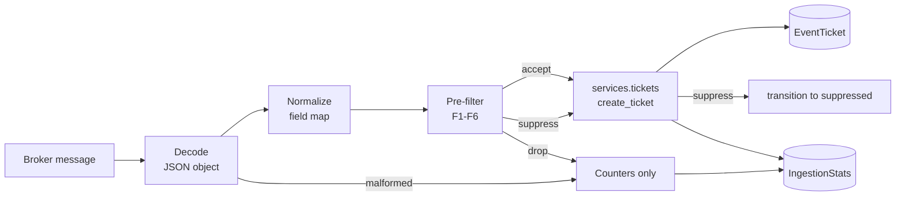

# Phase 2 — Ingestion

!!! warning "Draft — not yet approved"
    This is the execution spec for Phase 2. Section 13 lists the calls made while writing it that most need a second opinion — in particular 13.1, which asks for approval of the one new runtime dependency the phase needs. Nothing in this spec has been implemented.

Phase 1 is implemented and merged; this spec builds on it and cites its rules by number (S1–S5, C1–C3) rather than restating them.

## 1. Scope

Phase 2 makes tickets arrive on their own. It delivers the broker abstraction, the consumer process that runs the loop, the deterministic pre-filter that decides what becomes a ticket, and the counters that make the whole thing observable.

**Phase 2 is still AI-free.** The pre-filter is rules and arithmetic. No module under `nautobot_event_tracker/ingestion/` imports `litellm` or any provider SDK, and no code path calls a model. LLM triage sits immediately behind the pre-filter and is Phase 3; section 8.4 specifies the seam it will plug into, and nothing more.

In scope:

- An `EventConsumer` interface with Kafka and Redis implementations ([ADR 0004](../decisions/0004-pluggable-event-broker-consumers.md)).
- A `nautobot-server eventconsumer` management command ([ADR 0005](../decisions/0005-standalone-consumer-process.md)).
- Normalization: broker bytes to a typed event, driven by declarative per-topic configuration.
- The deterministic pre-filter: topic, severity floor, event-type enablement, match rules, rate limit.
- `IngestionStats`, plus read-only UI, REST and GraphQL access to it.

Explicitly out of scope: LLM triage, the enrichment resolver (see 13.2), agents, MCP, RAG, usage records, and the analytics dashboard. Phase 2 tickets carry their raw event in `payload` and no attached objects.

## 2. The pipeline

One message travels this path. Every stage is deterministic, and every stage that discards something increments a counter naming the reason.



New modules:

| Module | Holds |
| --- | --- |
| `ingestion/consumers/base.py` | `BrokerMessage`, `EventConsumer` |
| `ingestion/consumers/kafka.py` | `KafkaEventConsumer` |
| `ingestion/consumers/redis.py` | `RedisEventConsumer` |
| `ingestion/normalize.py` | `NormalizedEvent`, path lookup, template rendering, severity mapping |
| `ingestion/prefilter.py` | `Decision`, the pre-filter rules F1–F6, the rate limiter |
| `ingestion/pipeline.py` | `handle_message()` — the one place a message becomes a ticket |
| `ingestion/stats.py` | `StatsRecorder` — in-memory counters and their flush |
| `ingestion/config.py` | Configuration access and startup validation |
| `management/commands/eventconsumer.py` | The process: signals, the loop, the exit code |

The pipeline calls `services.tickets`. It does not import `EventTicket` for writing, and Phase 1's criterion 3 static guard is extended to cover `ingestion/` (section 11).

## 3. Configuration

All ingestion settings live under an `ingestion` key in the app's `PLUGINS_CONFIG` entry, and every one of them is in `app-config-schema.json`. Broker credentials are the exception: they are not settings, they come from an `ExternalIntegration` (see 3.3).

```python
PLUGINS_CONFIG = {
    "nautobot_event_tracker": {
        "attachable_object_types": [...],       # Phase 1
        "ingestion": {
            "consumer": "kafka",                # or "redis"
            "consumer_name": "",                # blank: "{hostname}:{pid}"
            "max_payload_bytes": 65536,
            "event_type_cache_seconds": 60,
            "max_retries": 5,
            "poll_timeout_seconds": 1.0,
            "stats_bucket_seconds": 300,
            "stats_flush_seconds": 10,
            "stats_retention_days": 30,
            "kafka": {
                "bootstrap_servers": ["kafka-1:9092", "kafka-2:9092"],
                "group_id": "nautobot-event-tracker",
                "external_integration": "",     # name of an ExternalIntegration, optional
            },
            "redis": {
                "external_integration": "",
                "url": "redis://localhost:6379/2",
            },
            "topics": {
                "network.events": {...},        # section 3.2
            },
        },
    },
}
```

`topics` is the only required key. A deployment that configures no topics consumes nothing, which is the correct default for an app that ships with ingestion installed but unconfigured.

### 3.1 Startup validation

The command validates the whole configuration **before it opens a socket**, and exits 1 with a list of every problem it found rather than the first:

- `consumer` names an implementation that exists.
- Every topic has a `field_map` with at least `event_type` and `title`.
- Every value in a `severity_map`, and every `defaults.severity`, is a member of `SeverityChoices`.
- Every regex in every rule compiles.
- Every rule has a `name` (used as a counter key) and an `action` of `drop` or `suppress`, and names are unique within a topic.
- Every `defaults.event_type` names an `EventType` that exists in the database.

A bad regex or a misspelled severity is a configuration error, and a configuration error found at startup costs a restart. The same error found lazily on the first matching message costs an outage at 03:00, in a process nobody is watching.

### 3.2 Per-topic configuration

```python
"network.events": {
    "field_map": {
        "event_type": "event.type",
        "severity": "event.severity",
        "title": "message",
        "description": "detail",
        "occurred_at": "timestamp",
    },
    "defaults": {"event_type": "Unclassified", "severity": "minor"},
    "severity_map": {
        "0": "critical", "1": "critical", "2": "critical", "3": "major",
        "4": "warning", "5": "minor", "6": "info", "7": "info",
    },
    "dedup_key_template": "{event.type}:{host}:{interface}",
    "minimum_severity": "info",
    "unknown_event_type": "default",            # or "drop"
    "rate_limit": {"per_minute": 120, "burst": 240},
    "rules": [
        {"name": "lab-estate", "action": "drop",
         "when": {"host": "^lab-"}},
        {"name": "known-flapper", "action": "suppress",
         "when": {"event.type": "^Interface Down$", "host": "^edge-rtr-07$"}},
    ],
},
```

**Paths.** `event.type` walks nested objects: `payload["event"]["type"]`. A missing path yields `None`, never an exception. Non-object intermediates (`payload["event"]` is a string) yield `None` too. A literal dot inside a key is not addressable, which is a limitation worth knowing and not worth an escaping syntax.

**Templates.** `dedup_key_template` is rendered by the app's own resolver over the same path syntax, **not** by `str.format` — under `str.format`, `{event.type}` means attribute access on an argument named `event`, which is not what an operator reading this configuration will expect. If any path in the template resolves to `None`, the rendered key is empty: the event opens its own ticket rather than joining an arbitrary one, and a warning is logged, rate-limited to once per topic per stats bucket so a misconfigured template cannot itself become the flood. A template that never resolves is also visible in the ticket list, as a stream of near-identical tickets whose event count never leaves 1.

### 3.3 Credentials

When `external_integration` names a Nautobot `ExternalIntegration`, the consumer takes its remote URL and its `SecretsGroup` from that object: broker address, and SASL username and password or TLS material, resolved through Nautobot's secrets machinery at connect time. When it is blank, the plain `bootstrap_servers` or `url` is used, which suits a lab and nothing else.

This mirrors [ADR 0006](../decisions/0006-litellm-service-layer-and-credential-storage.md)'s rule for LLM providers — credentials belong in Nautobot objects an operator can rotate, not in a settings file rendered by configuration management. ADR 0006 is scoped to LLM credentials, so applying it here is an extension; see 13.8.

## 4. Data model

One new model, in `nautobot_event_tracker/models.py`.

### 4.1 `IngestionStats`

Base class `BaseModel` only, with `@extras_features("graphql")`. Deliberately **not** `ChangeLoggedModel` and not a `PrimaryModel`: a counter row is rewritten every few seconds, so change-logging it would write an `ObjectChange` per flush and swamp the change log with a record of arithmetic. It is derived data, not a record of anyone's intent. Same reasoning as `TicketUpdate` in the Phase 1 spec, arrived at from the opposite direction.

| Field | Type | Notes |
| --- | --- | --- |
| `consumer_name` | `CharField(max_length=CHARFIELD_MAX_LENGTH, db_index=True)` | Which process |
| `topic` | `CharField(max_length=CHARFIELD_MAX_LENGTH, db_index=True)` | Topic or channel |
| `bucket_start` | `DateTimeField(db_index=True)` | Floor of the window, `stats_bucket_seconds` wide |
| `received` | `PositiveIntegerField(default=0)` | Messages pulled from the broker |
| `errored` | `PositiveIntegerField(default=0)` | Undecodable or unmappable |
| `dropped` | `PositiveIntegerField(default=0)` | Discarded by the pre-filter |
| `tickets_opened` | `PositiveIntegerField(default=0)` | `create_ticket` opened a ticket |
| `tickets_joined` | `PositiveIntegerField(default=0)` | S5 joined an existing one |
| `suppressed` | `PositiveIntegerField(default=0)` | Accepted, then suppressed by a rule |
| `drops_by_reason` | `JSONField(default=dict, blank=True)` | Reason to count, one key per rule or filter |
| `last_message_at` | `DateTimeField(null=True, blank=True)` | Broker timestamp of the newest message |

`Meta.ordering = ["-bucket_start", "consumer_name", "topic"]`, and a `UniqueConstraint` on `(consumer_name, topic, bucket_start)` — the row a flush targets.

**The counting invariant**, asserted by a test:

```
received == errored + dropped + tickets_opened + tickets_joined
```

`suppressed` is not a term in it: a suppressed event still opens or joins a ticket, so it is counted there as well, and `suppressed` records how many of those arrived through a suppression rule. `drops_by_reason` sums to `dropped`.

Field names avoid `created` and `last_updated`, which `BaseModel`'s change-logged siblings use; `tickets_opened` also reads better than `created` on a counter row that itself has a creation time.

### 4.2 Migration

`0003_ingestionstats.py`, generated by `makemigrations`, hand-checked for the unique constraint and the three indexes. No data migration: an empty stats table is the correct state for a deployment that has not started a consumer.

## 5. The broker layer

### 5.1 The interface

`ingestion/consumers/base.py`. Small on purpose — per ADR 0004, the interface expresses only what both brokers can honestly do, and states what they cannot.

```python
@dataclass(frozen=True)
class BrokerMessage:
    topic: str
    value: bytes
    key: str | None = None
    offset: int | None = None
    timestamp: datetime | None = None       # broker-assigned, not payload-derived


class EventConsumer(ABC):
    supports_replay: bool = False

    def __init__(self, *, config, topics): ...

    @abstractmethod
    def connect(self) -> None: ...

    @abstractmethod
    def poll(self, timeout: float) -> BrokerMessage | None: ...

    @abstractmethod
    def acknowledge(self, message: BrokerMessage) -> None: ...

    @abstractmethod
    def close(self) -> None: ...
```

`poll()` returning `None` on timeout, rather than an iterator that blocks, is what lets the loop notice a shutdown signal, flush stats on a timer, and roll a stats bucket while no traffic is arriving. An iterator would park in C code with no way to reach any of that.

`supports_replay` is a class attribute a caller can read, per ADR 0004's requirement that an implementation declare the property rather than leave callers to guess. Phase 2 only reports it — in the startup banner and on the stats page — since nothing yet offers to seek.

### 5.2 Kafka

`supports_replay = True`. The reference implementation.

- Auto-commit is **off**. `acknowledge()` commits the offset of that message, and the loop calls it only after the ticket transaction has committed (rule I1).
- `group_id` comes from configuration, so several instances share a group and Kafka assigns partitions between them. That is the supported way to scale throughput, and it is the only one.
- A rebalance mid-message is safe: the offset is uncommitted, so the message is redelivered to whichever instance takes the partition, and S5 makes the duplicate harmless.
- Connection loss is retried with exponential backoff (1s doubling to 60s) forever. A broker outage should not require an operator to restart every consumer.

That this differs from rule I5, which exits on a database failure, is deliberate: an unreachable broker means no messages are arriving and nothing is at stake in waiting, while an unreachable database means messages are arriving with nowhere to put them.

### 5.3 Redis

`supports_replay = False`. For development and lab use, and the documentation says why in plain terms: Redis pub/sub delivers to whoever is listening at that moment. Messages published while the consumer is down are gone, and no amount of interface tidiness changes that.

- `acknowledge()` is a no-op with a docstring explaining that there is nothing to acknowledge to.
- Every instance receives every message, so running two duplicates work. S5 makes that harmless rather than correct, and the admin guide says so.
- Channels are the configured topic names. Pattern subscriptions are not supported: a message's channel is the key into per-topic configuration, and a pattern would leave the configuration lookup ambiguous.

Redis adds no dependency — Nautobot already requires `redis` for its cache and Celery broker. Kafka does; see 13.1.

## 6. Normalization

`ingestion/normalize.py`. Turns bytes into the typed thing the rest of the pipeline handles.

```python
@dataclass(frozen=True)
class NormalizedEvent:
    topic: str
    event_type_name: str
    title: str
    severity: str
    description: str
    dedup_key: str
    occurred_at: datetime
    payload: dict
```

The steps, in order:

1. **Decode.** `json.loads` over the message value, which must yield a JSON **object**. A list, a scalar, or invalid JSON is an `errored` message (rule I4).
2. **Map fields.** Each `field_map` entry resolves a path; a missing path falls back to `defaults`, and `title` falls back to the event type name so that a ticket is never titled with an empty string.
3. **Severity.** The mapped raw value is looked up in `severity_map` **as a string**, so `4` and `"4"` behave the same — syslog severities arrive as both. A value already equal to a `SeverityChoices` member passes through. Anything unmapped falls back to `defaults.severity`, then to the event type's `default_severity`.
4. **Timestamp.** `occurred_at` is parsed from the mapped value with `django.utils.dateparse`, treated as UTC when naive. An unparseable or absent value falls back to the broker timestamp, then to now. This feeds `first_seen` and `last_seen` through Phase 1's `create_ticket(occurred_at=...)`.
5. **Dedup key.** Rendered per section 3.2.
6. **Payload.** The decoded object, subject to the cap: when its JSON encoding exceeds `max_payload_bytes`, the ticket stores `{"_truncated": true, "_size_bytes": n, "_preview": "<first 1024 characters>"}` instead. A 4 MB telemetry frame should not become a 4 MB row, and silently storing it would make the ticket table grow in a way nobody predicted.

Normalization is pure: it takes configuration and a message and returns a value, touching neither the database nor the clock beyond the fallbacks above. That is what makes section 12's table of payload cases cheap to write.

## 7. The pre-filter

`ingestion/prefilter.py` — named for what it does rather than `filters.py`, which at app level already means Nautobot filtersets. Rules run in this order, cheapest first, and the first one that decides wins.

| Rule | Question | Cost | On refusal |
| --- | --- | --- | --- |
| **F1** | Is this topic configured? | dict lookup | drop, `unknown_topic` |
| **F2** | Does the payload name an event type we know? | cached lookup | per `unknown_event_type` |
| **F3** | Is that event type enabled? | cached lookup | drop, `event_type_disabled` |
| **F4** | Is the severity at or above the floor? | integer compare | drop, `below_severity_floor` |
| **F5** | Does a match rule fire? | regex per clause | drop or suppress, named by the rule |
| **F6** | Is the topic within its rate limit? | token bucket | drop, `rate_limited` |

The result:

```python
@dataclass(frozen=True)
class Decision:
    action: str          # "accept" | "suppress" | "drop"
    reason: str = ""     # counter key: a rule name or a filter constant
```

**F2/F3 and the event-type cache.** Both need `EventType` rows, and doing that per message would put two queries in front of every event. The catalogue is ten rows that change monthly at most, so it is cached in-process for `event_type_cache_seconds` (default 60). The consequence is stated rather than hidden: disabling an event type takes up to a minute to take effect on a running consumer.

`unknown_event_type` chooses what happens when the payload names a type the catalogue does not hold: `default` maps it to `defaults.event_type` (recommended — an unclassified ticket is better than a silent hole), or `drop` refuses it.

**F4** compares through `SEVERITY_WEIGHTS`, the Phase 1 constant, so "at or above `major`" cannot be re-derived here and drift.

**F5 match rules.** Each rule's `when` is a mapping of path to regex; a rule fires when **every** clause matches (`re.search`, so anchor with `^` when you mean the whole value). Rules are tried in configured order and the first to fire decides. `action: drop` discards the event entirely — it never becomes a ticket, and only the counter records that it happened. `action: suppress` accepts it and then puts it in `suppressed`, which is what that state exists for: noise that stays on the record. Open question 11.3 of the Phase 1 spec asked whether `suppressed` earns its place; this rule is the answer.

**F6 rate limit.** A token bucket per topic, `per_minute` tokens refilling continuously to a ceiling of `burst`. It exists for the flapping-link case, where dedup collapses repeats into one ticket but the consumer still pays a database round trip per event. Two consequences, both stated in the admin guide: the limit is per process, so N instances admit N times as many; and a drop during a burst is a recurrence that never got counted, so `event_count` under-reports during a storm. Both are preferable to an unbounded write rate, and neither is discovered rather than documented.

## 8. Handling a message

`ingestion/pipeline.py`, one function, `handle_message(message, *, recorder, config) -> Decision`.

### 8.1 The ticket call

An accepted event becomes exactly one call:

```python
ticket = ticket_service.create_ticket(
    title=event.title,
    event_type=event_type,
    source=TicketSourceChoices.SYSTEM,
    severity=event.severity,
    description=event.description,
    dedup_key=event.dedup_key,
    payload=event.payload,
    occurred_at=event.occurred_at,
)
```

`ticket.was_created` — the flag Phase 1 added for the transports — decides which counter moves, `tickets_opened` or `tickets_joined`. Nothing in the pipeline reads or writes `ticket.status`.

### 8.2 Suppression

When the decision is `suppress` **and** the call opened a new ticket, the pipeline transitions it:

```python
ticket_service.transition(
    ticket=ticket, to_status=TicketStatusChoices.SUPPRESSED,
    source=TicketSourceChoices.SYSTEM,
    message=f"Suppressed by ingestion rule '{decision.reason}'.",
)
```

`new -> suppressed` is a legal edge, so this needs no new graph entry.

When the call **joined** an existing ticket, the pipeline does not transition it, whatever the ticket's current status. A person may have triaged that ticket and started work; a matching rule firing on a later event is not grounds for the consumer to yank it out from under them. The suppression rule governs what a ticket starts as, not what it stays.

### 8.3 Rules

**I1 — At-least-once, acknowledged last.** `acknowledge()` runs only after the database transaction has committed. A crash in between redelivers the message, and S5 turns the duplicate into a recurrence rather than a second ticket. This ordering is the whole reason ADR 0004 could accept at-least-once delivery.

**I2 — One message, one transaction.** Everything a message causes — the ticket, its `created` update, a suppression transition and its `status_change` — commits together or not at all. The service's own `transaction.atomic()` blocks nest as savepoints inside it.

**I3 — Graceful shutdown.** `SIGTERM` and `SIGINT` set a flag. The loop finishes the message in flight, acknowledges it, flushes stats, closes the consumer, and exits 0. A second signal exits immediately with 1, because an operator who signals twice means it.

**I4 — A poison message never blocks the queue.** Undecodable JSON, a non-object payload, or a normalization failure is logged once with topic and offset, counted as `errored`, acknowledged, and discarded. It is never retried: a message that cannot be parsed will not parse on the second attempt, and a consumer that retries it forever stops consuming anything else. There is no dead-letter topic in this phase (13.10).

**I5 — A database failure is retried, then fatal.** A transient database error retries the message with exponential backoff up to `max_retries` (default 5). If it still fails, the process logs and exits 2 **without acknowledging**. Exiting is the honest response: the message is still on the broker, a supervisor will restart the process, and the alternative — acknowledging a message whose ticket was never written — loses data quietly. This is the one place where an unhealthy consumer is meant to stay down rather than limp.

**I6 — The consumer is `system`.** Every service call passes `source=TicketSourceChoices.SYSTEM` and no `user`, satisfying rule S4 and C3's actor clause. Nothing the consumer does can be attributed to a person.

**I7 — Counters are in memory.** `StatsRecorder` accumulates in a dict and flushes every `stats_flush_seconds`, on bucket rollover, and at shutdown. The database write rate is bounded by the flush interval regardless of the message rate. A flush is `get_or_create` on the bucket row followed by an `update()` with `F()` expressions, so two flushes never lose each other's increments; different instances write different rows anyway, since `consumer_name` is part of the key. Up to one flush interval of counts is lost in a hard kill, which is the right trade for a counter.

**I8 — Deterministic only.** Nothing under `ingestion/` writes `EventTicket` or `TicketUpdate` directly, and nothing under it imports an LLM library. Both are asserted by static guards (section 11).

Bucket rollover also prunes: rows older than `stats_retention_days` are deleted, at most once per bucket. Retention needs no scheduled job of its own when the process that writes the rows can clean up behind itself.

### 8.4 The Phase 3 seam

Phase 3 inserts LLM triage between F6 and the ticket call, as a function with the same shape as the pre-filter — event in, `Decision` out — whose `action` may additionally be `attach` (add to an existing ticket rather than open one). Phase 2 defines `Decision` and the call site; it defines nothing else about triage, and adds no configuration key for it. The seam is a specified place to stand, not a partial implementation.

## 9. The command

```
nautobot-server eventconsumer [--consumer kafka|redis] [--topics a,b]
                              [--max-messages N] [--dry-run]
```

| Option | Effect |
| --- | --- |
| `--consumer` | Override the configured implementation |
| `--topics` | Consume a subset of the configured topics |
| `--max-messages` | Exit cleanly after N messages — smoke tests and the test suite |
| `--dry-run` | Run decode, normalize and filter; log the decision per message; write no ticket, no counter, and acknowledge nothing |

`--dry-run` is how an operator tunes a filter against live traffic without consequences: because it acknowledges nothing, a Kafka consumer group's offsets do not move, and the same messages are there afterwards.

Exit codes: **0** clean shutdown, **1** invalid configuration or a second shutdown signal, **2** unrecoverable runtime failure (I5).

On startup the process logs one banner line naming the implementation, whether it supports replay, the topics, the consumer name, and the group ID. That line is what an operator pastes into a ticket when something is wrong.

The admin guide gains a **Running the consumer** section with a systemd unit and a container example, both running it as a supervised long-lived process alongside Nautobot's web and worker units, per ADR 0005.

## 10. UI, API and permissions

`IngestionStats` is read-only everywhere. There is no create, edit or delete route in the UI or the API — the same posture as `TicketUpdate`, for the same reason: nothing outside the consumer has any business writing it.

- **UI.** `IngestionStatsUIViewSet` restricted to list and detail, with a table of the counters and a fields panel, per [ADR 0008](../decisions/0008-ui-component-framework-only.md). A nav item under Event Tracker, gated on `view_ingestionstats`. `drops_by_reason` renders as a key-value panel, since "which rule is eating my events" is the question the page exists to answer.
- **REST.** `ingestion-stats/` with `http_method_names = ["get", "head", "options"]`.
- **GraphQL.** A type in `graphql/types.py`, as for `TicketUpdate`, since this is not a `PrimaryModel`.
- **Filters.** `IngestionStatsFilterSet` — `q` over `consumer_name` and `topic`, plus `consumer_name`, `topic`, `bucket_start`.

Permissions are Django's four defaults. `add`, `change` and `delete` grant nothing through any shipped route; they exist because Django generates them, and `delete` is what an operator would need for a manual cleanup through the ORM or a future admin action.

## 11. Acceptance criteria

1. **Schema.** `IngestionStats` exists as specified, `makemigrations --check --dry-run` is clean, migrations apply to an empty PostgreSQL database, and `nautobot-server check` passes.
2. **The service layer is still the only writer.** No module under `ingestion/` or `management/` assigns to `ticket.status` or calls `EventTicket.objects.create()` / `TicketUpdate.objects.create()`. The Phase 1 static guard is extended to cover both directories, and a second guard asserts that no module under `ingestion/` imports `litellm` or a provider SDK.
3. **Interface conformance.** Kafka and Redis implementations both satisfy `EventConsumer`, both declare `supports_replay` honestly, and a shared conformance test runs against all three implementations including the test fake.
4. **At-least-once.** A message whose ticket transaction fails is not acknowledged. A redelivered message produces a recurrence, not a second ticket, and `event_count` reflects it.
5. **Filtering.** Each of F1–F6 drops or suppresses exactly what section 7 says, in the specified order, and increments the named counter. A suppression rule produces a ticket in `suppressed` with a `status_change` update whose source is `system`; the same rule firing on a recurrence leaves the ticket's status alone.
6. **Counters.** After a mixed run of accepted, deduplicated, dropped, suppressed and malformed messages, one bucket row holds the expected values, `received == errored + dropped + tickets_opened + tickets_joined` holds, and `drops_by_reason` sums to `dropped`.
7. **Process behaviour.** `SIGTERM` finishes the in-flight message and exits 0 with counters flushed. An invalid configuration exits 1 having connected to nothing, listing every problem. `--dry-run` writes no ticket and no counter row. `--max-messages` exits after exactly that many.
8. **Read-only surfaces.** `ingestion-stats/` rejects `POST`, `PATCH` and `DELETE`; the UI offers no add, edit or delete control; the model is queryable through GraphQL; the app still ships no page template.

## 12. Test plan

Tests extend `nautobot_event_tracker/tests/`. Everything except the two broker implementations runs against `FakeEventConsumer`, an in-memory `EventConsumer` in `tests/fixtures.py` that yields a scripted list of `BrokerMessage` and records what was acknowledged. No test in CI needs a broker.

| File | Covers | Criteria |
| --- | --- | --- |
| `test_ingestion_consumers.py` | The shared conformance suite over fake, Kafka and Redis; `supports_replay` values; Kafka commits only on `acknowledge()`; Redis acknowledges as a no-op | 3 |
| `test_ingestion_normalize.py` | A table of payloads: nested paths, missing paths, non-object intermediates, numeric and string severities, unmapped severities, absent and unparseable timestamps, an unresolvable dedup template, an oversize payload | — |
| `test_ingestion_prefilter.py` | F1–F6 individually and in order — including a payload that would fail two rules, asserting which reason is recorded; the rate limiter's refill over a controlled clock | 5 |
| `test_ingestion_pipeline.py` | Accept, dedup join, suppress-on-create, suppress-on-join leaving status alone, drop, malformed; that every ticket-writing path goes through the service; rollback on a forced database failure leaves neither ticket nor update | 2, 4, 5 |
| `test_ingestion_stats.py` | Flush arithmetic under repeated flushes; the counting invariant; bucket rollover; retention pruning; two consumer names writing disjoint rows | 6 |
| `test_ingestion_command.py` | Startup validation failures (each of the section 3.1 checks, and that all are reported at once); exit codes; `--max-messages`; `--dry-run` writing nothing; `SIGTERM` handling with a fake that blocks | 7 |
| `test_models.py` | `IngestionStats` fields, ordering, the unique constraint | 1 |
| `test_api.py`, `test_views.py`, `test_filters.py`, `test_graphql.py` | Read-only surfaces, the stats table and detail page, the filterset, the GraphQL type | 8 |

The Kafka implementation is tested against a stub client that records calls, not a live broker; one integration test connects to a real broker and skips unless `NAUTOBOT_EVENT_TRACKER_TEST_KAFKA` is set. The Redis implementation is tested against the Redis instance the Nautobot test settings already require.

Timing is injected, never slept on: the rate limiter and the stats bucket both take a clock function, so a test advances time by assigning to it. A test suite that sleeps to test a token bucket is a test suite that is flaky on a loaded CI runner.

## 13. Open questions

Each states a proposed reading, so that silence can be taken as agreement. **13.1 needs an explicit answer before implementation starts.**

**13.1 The Kafka client is a new dependency.** *Resolved: `confluent-kafka`, as an optional extra.* `pip install nautobot-event-tracker[kafka]` installs it; a deployment using Redis, or not using ingestion at all, installs nothing new, and the Kafka module imports without it and raises `ImproperlyConfigured` naming the extra when it is missing. It is the only new runtime dependency in the phase.

**13.2 The enrichment resolver's phase.** *Resolved: it stays in Phase 4.* The architecture's phasing table puts it there; the Phase 1 spec's section 4.2 called it "the Phase 2 enrichment resolver", and that wording is corrected. The cost is worth naming: until Phase 4, an ingested ticket says "Interface Down on edge-rtr-07" without linking to that device, so an operator still searches by hand. Adding it later means a resolution-rules section here and a `related_objects` argument on the `create_ticket` call in 8.1; nothing else in this phase changes.

**13.3 Redis pub/sub rather than Redis Streams.** ADR 0004 specifies pub/sub. Streams would give consumer groups, acknowledgement and replay — the properties pub/sub lacks — from a dependency the deployment already has. *Proposed reading:* implement pub/sub as the ADR says, and record Streams as a candidate third implementation rather than reopening the ADR now. The interface admits it without change.

**13.4 The field map is declarative only.** A payload the path syntax cannot describe — a value needing arithmetic, a list to search — has no escape hatch in this design. *Proposed reading:* declarative only for Phase 2, and if real payloads defeat it, add a per-topic `normalizer` dotted path resolving to a callable. Adding it later costs one configuration key; adding it now invites a codebase of per-site normalizers nobody reviews.

**13.5 `IngestionStats` is not change-logged.** Section 4.1 argues a counter row should not write an `ObjectChange` per flush. *Proposed reading:* as written. *Cost:* it departs from the Nautobot convention that models are change-logged, and a reviewer will notice.

**13.6 The rate limit is per process.** With three instances and `per_minute: 120`, the estate admits 360. *Proposed reading:* accept it and document it. A shared limit needs Redis-backed coordination, which is a distributed rate limiter — real work, and a strange thing to build before anyone has hit the limit.

**13.7 Suppression does not re-suppress a joined ticket (8.2).** *Proposed reading:* as written; a rule governs what a ticket starts as, not what it stays, and the alternative lets a rule pull a ticket out from under someone working it. *Cost:* a ticket triaged by mistake and then matched by a suppression rule stays open until a person suppresses it.

**13.8 Broker credentials in an `ExternalIntegration` (3.3).** This generalizes ADR 0006's rule beyond LLM credentials. *Proposed reading:* do it, and add a sentence to ADR 0004 rather than writing ADR 0009 — it is the same decision applied to a second kind of credential, not a new one.

**13.9 The payload cap defaults to 64 KiB (section 6).** *Proposed reading:* keep a cap, because an uncapped `JSONField` fed by telemetry is a table that grows unpredictably. The number is a guess; if typical events are larger, raise it in configuration rather than removing the cap.

**13.10 No dead-letter topic.** A poison message is logged, counted and dropped (I4). *Proposed reading:* enough for Phase 2 — the counter and the log line make it visible, and republishing failures to a broker topic is a second producer path with its own failure modes. If operators need the messages themselves, a dead-letter topic is a small addition later.


## 14. What the implementation changed

Recorded here rather than left to a reader to discover by diffing the spec against the code.

- **`poll_timeout_seconds` moved to the top of the `ingestion` block**, out of the Kafka block. Both implementations poll, and the timeout is also how often the loop can notice a shutdown signal — which has nothing to do with which broker is in use.
- **The unresolvable-dedup-template case is logged rather than counted** (section 3.2). Counting it in `drops_by_reason` would have broken that field's invariant, since the event is not dropped. The log line is rate-limited to once per topic per stats bucket, so a misconfigured template cannot itself become the flood.
- **Retention pruning covers every consumer's rows**, not only the pruning process's own. An instance that has stopped running would otherwise leave its counters behind forever.
- **A database failure drops the connection before retrying**, but only when not inside an enclosing transaction. Retrying on a connection the server has already closed just fails again; a connection inside someone else's transaction is not ours to close.
- **`IngestionStats` gained a filter form** alongside its filterset, so the list page filters the way every other list page in the app does.
- **The payload cap applies on the write path, not during normalization** (sections 6 and 8.1). Serializing a payload to measure it is the most expensive thing in the per-message path, and most messages in a filtered stream never become a ticket; it also means a match rule sees what the device sent rather than a truncation marker.
- **The severity fallback lives in `services/tickets.py`** and is called by both the service and the pre-filter, rather than being restated in `normalize.py`. It decides what a ticket is written with, so it belongs with the writer - the same argument that keeps the transition graph behind `get_allowed_transitions()`.
- **Every configuration fault is found in one pass**, including the consumer name and the empty-topics case, which section 3.1 requires but an earlier arrangement checked in the command after `load()` had already raised.
- **A dry run is given a recorder that counts nothing**, rather than a flag the pipeline re-checks at each counter call site.
- **Kafka's `security_protocol` and `sasl_mechanism` are real settings**, in the defaults, the schema and the admin guide. They were read from the settings block before being declared anywhere, so nothing could have set them.
