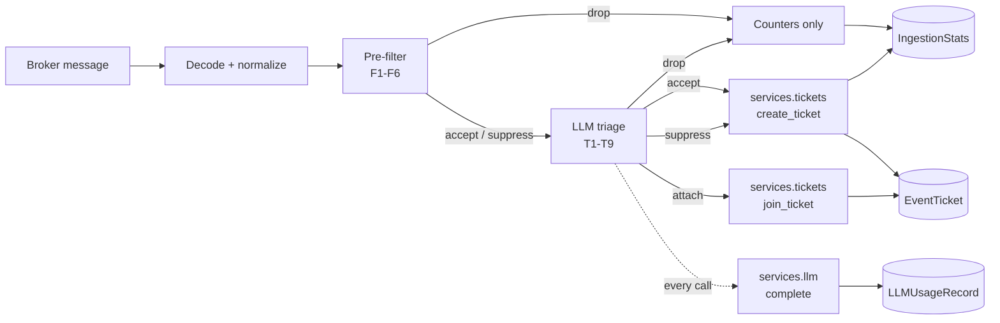

# Phase 3 — LLM Service Layer and Triage

!!! warning "Draft — not yet approved"
    This is the execution spec for Phase 3. Section 12 lists the calls made while writing it that most need a second opinion — in particular 12.2, which accepts a synchronous model call in the consumer's message loop, and 12.5, which lets a model drop an event outright. Nothing in this spec has been implemented.

Phases 1 and 2 are implemented and merged; this spec builds on them and cites their rules by number (S1–S5, C1–C3, F1–F6, I1–I8) rather than restating them. [ADR 0006](../decisions/0006-litellm-service-layer-and-credential-storage.md) made the load-bearing decisions for this phase; this spec executes them.

## 1. Scope

Phase 3 gives the app a model to think with, and the bookkeeping to afford it. It delivers the LLM service layer on litellm, the `LLMProvider`/`LLMModel` registry an operator manages in the UI, the `LLMUsageRecord` accounting that prices every call, and LLM triage in the consumer — the step that decides, for each event the pre-filter accepted, whether it deserves a new ticket, belongs on an existing one, or is noise.

**The service layer is the only code that calls a model.** Everything the app ever asks an LLM goes through `services/llm.py`, which is also the only module that imports litellm and the only writer of `LLMUsageRecord`. No module imports a provider SDK. All three statements are enforced by static guards, the same way ADR 0001's sole-writer rule is.

The work lands as two PRs:

- **PR A** — this spec, the service layer, the registry models, usage accounting, and their UI/REST/GraphQL surface. After PR A the app can call a model and account for it; nothing yet does.
- **PR B** — triage in the consumer: the seam Phase 2 section 8.4 reserved, filled.

In scope:

- `services/llm.py`: one `complete()` function wrapping `litellm.completion` (ADR 0006), with rules L1–L8.
- `LLMProvider` and `LLMModel` registry models; credentials via `ExternalIntegration` and `SecretsGroup`.
- `LLMUsageRecord` with a retention policy — the debt ADR 0006 explicitly deferred to this phase.
- `ingestion/triage.py`: the pre-filter-shaped triage step, with rules T1–T9, and its `attach` outcome.
- Triage counters on `IngestionStats`.

Explicitly out of scope: agents, MCP tooling, the enrichment resolver (Phase 4); RAG, embeddings, pgvector, the analytics dashboard (Phase 5); spend caps and budgets (12.6); prompt redaction maps (12.3); async or concurrent triage (12.2).

## 2. The pipeline, one stage longer

Triage inserts exactly where Phase 2 section 8.4 said it would: between the pre-filter's decision and the ticket write, as a function with the same shape — event in, `Decision` out — whose action may additionally be `attach`.



New modules and model additions:

| Module | Holds |
| --- | --- |
| `services/llm.py` | `complete()`, `get_model()`, `LLMResponse`, usage recording, retention — rules L1–L8 |
| `services/exceptions.py` | The `LLMError` family, beside the ticket service's exceptions |
| `ingestion/triage.py` | `TriageFilter`, `TriageResult` — rules T1–T9 (PR B) |
| `models.py` | `LLMProvider`, `LLMModel`, `LLMUsageRecord`; triage counters on `IngestionStats` (PR B) |
| `filters.py` / `forms.py` / `tables.py` / `views.py` / `api/*` / `graphql/types.py` | The registry and usage surface |

## 3. Configuration

Two blocks. The `llm` key is new and holds the service layer's own settings — which, deliberately, is almost nothing: providers, models and credentials are registry objects, not settings (ADR 0006). The `triage` block lives inside `ingestion`, because triage is a property of the consumer, and arrives in PR B.

```python
PLUGINS_CONFIG = {
    "nautobot_event_tracker": {
        "attachable_object_types": [...],       # Phase 1
        "llm": {
            "usage_retention_days": 90,         # section 5.4
        },
        "ingestion": {
            ...,                                # Phase 2 keys, unchanged
            "triage": {                         # PR B
                "enabled": False,
                "provider": "",                 # LLMProvider.name — required when enabled
                "model": "",                    # LLMModel.name on that provider — required when enabled
                "timeout_seconds": 15,
                "max_output_tokens": 256,
                "max_context_chars": 4000,      # payload cap into the prompt (T7)
                "attach_candidates": 5,         # shortlist size (section 6.4)
            },
            "topics": {
                "network.events": {..., "triage": True},   # per-topic participation, default True
            },
        },
    },
}
```

Defaults for the keys inside `llm` and `triage` are applied in `services/llm.py` and `ingestion/config.py` respectively, not in `default_settings`, for the Phase 2 section 3 reason: Nautobot merges `PLUGINS_CONFIG` one top-level key at a time. Both blocks appear in `app-config-schema.json`, extended in each PR (the schema is hand-curated; the generator cannot produce its descriptions and constraints).

The model is named by two keys, `provider` and `model`, rather than one joined string: model names like `meta-llama/Llama-3.1-70B` already contain every separator a joined form might choose.

### 3.1 Startup validation

`ingestion/config.py` extends its two-halved validation (Phase 2 section 3.1), reporting every problem rather than the first:

- Settings alone: `triage.enabled` implies non-empty `provider` and `model`; `timeout_seconds`, `max_output_tokens`, `max_context_chars` and `attach_candidates` are positive numbers; every per-topic `triage` is a boolean.
- Database (`database_problems()`): when triage is enabled, the named provider and model exist and both are enabled — checked through `services.llm.get_model()`, which imports no litellm.

### 3.2 Credentials

An `LLMProvider` points at an `ExternalIntegration`, which carries the endpoint (`remote_url`) and a `SecretsGroup` holding the API key — the same pattern the broker consumers use, and the same place every other credential in the deployment is rotated. The service reads the key at call time under access type `generic`, preferring secret type `token` and falling back to `secret`. A provider with no key configured sends none: an on-premises endpoint without auth is normal, and one that wants a key will refuse the call itself, which the usage record then shows.

Nothing key-shaped appears in `PLUGINS_CONFIG`, on any app model, or in any log line.

## 4. Data model

### 4.1 LLMProvider

A `PrimaryModel` — registry entries are operator intent, and belong in the change log.

| Field | Type | Notes |
| --- | --- | --- |
| `name` | Char, unique | Natural key |
| `description` | Char, blank | |
| `provider_type` | Choice | `openai`, `anthropic`, `openai_compatible` (default) |
| `external_integration` | FK `extras.ExternalIntegration`, PROTECT | Endpoint and credentials; required |
| `enabled` | Boolean, default True | Rule L8's switch |

`clean()` requires a `remote_url` on the integration when the type is `openai_compatible`: a self-hosted protocol has no well-known endpoint to fall back to.

### 4.2 LLMModel

A `PrimaryModel`, unique on `(provider, name)` — the natural key. `name` is the identifier sent on the wire.

| Field | Type | Notes |
| --- | --- | --- |
| `provider` | FK `LLMProvider`, PROTECT | |
| `name` | Char | e.g. `gpt-4o-mini`, `llama-3.1-70b` |
| `description` | Char, blank | |
| `enabled` | Boolean, default True | Rule L8's other switch |
| `input_cost_per_million` | Decimal(10,4), default 0 | USD per 1M prompt tokens |
| `output_cost_per_million` | Decimal(10,4), default 0 | USD per 1M completion tokens |
| `max_output_tokens` | PositiveInteger, null | Default completion cap |
| `default_parameters` | JSON, default `{}` | Passed through on every call; the call's own arguments win |

### 4.3 LLMUsageRecord

A `BaseModel` with `graphql` only — deliberately neither a `PrimaryModel` nor change-logged, for the `IngestionStats` reason: a busy consumer writes one per surviving event, and an `ObjectChange` per model call would bury the change log under bookkeeping. Written only by `services/llm.py` (L1); no UI or API route offers a write method.

| Field | Type | Notes |
| --- | --- | --- |
| `model` | FK `LLMModel`, PROTECT | Accounting outlives registry edits |
| `ticket` | FK `EventTicket`, SET_NULL, null | Spend history survives ticket deletion |
| `purpose` | Choice, indexed | `triage` for now; Phase 4+ append |
| `request_id` | Char, blank | The provider's response id |
| `prompt_tokens` / `completion_tokens` | PositiveInteger, default 0 | As the provider reported them |
| `cost` | Decimal(12,6), default 0 | Computed by L5 |
| `latency_ms` | PositiveInteger, default 0 | |
| `success` | Boolean, indexed | |
| `error` | Text, blank | Capped at 1000 characters by the service |
| `called_at` | DateTime, default now, indexed | Ordering and retention key |

### 4.4 Migrations

PR A: `0004_llm_registry.py` — the three models. PR B: `0005_ingestionstats_triage_counters.py` — `triaged`, `triage_attached` and `triage_errors` on `IngestionStats`, all memo counters outside the `accounted_for` invariant, like `suppressed`.

## 5. The LLM service layer

`services/llm.py` exposes `get_settings()`, `get_model(provider_name, model_name)`, `link_usage_records(record_ids, ticket)`, and the one function every model call in the app goes through:

```python
complete(*, model, messages, purpose, ticket=None, max_tokens=None,
         timeout=None, response_format=None, client=None) -> LLMResponse
```

`LLMResponse` carries the text, the token counts, the computed cost, the latency, the provider's request id, and the usage record itself. `client` is the test seam — a callable with `litellm.completion`'s shape — and nothing outside a test supplies one.

### 5.1 The rules

- **L1 — Every call is recorded.** `complete()` writes exactly one `LLMUsageRecord` per call, success or failure, before the caller sees the result or the error. Failures record `success=False`, the error text capped at 1000 characters, and the latency spent finding out. Recording happens in the service so a new caller cannot forget it (ADR 0006); a retry storm against a broken endpoint is visible in the table.
- **L2 — One import site.** litellm is imported only in `services/llm.py`, lazily, inside the default client; a deployment without the `llm` extra gets `ImproperlyConfigured` naming the extra, not an import error at startup. No module anywhere imports a provider SDK. Both halves are asserted by static guards (section 8).
- **L3 — Credentials live in Nautobot.** Endpoint and key resolve at call time per section 3.2 and are passed straight to litellm, never stored, never logged.
- **L4 — One exception family.** A failed call raises `LLMCallError`; an unusable response raises `LLMResponseError`; a refused configuration raises `LLMConfigurationError`. All extend `LLMError` and carry the usage record written for the attempt, when one was. No litellm or provider exception escapes the service.
- **L5 — Cost is computed here.** `prompt_tokens × input_cost + completion_tokens × output_cost`, per million, from the registry's numbers — not litellm's price tables, which know nothing of an on-premises deployment's economics. A response with no usage block records zeros, never a guess.
- **L6 — Every call has a timeout.** The caller's, or 30 seconds. There is no unbounded wait in any path that calls a model.
- **L7 — Records are pruned.** Rows older than `llm.usage_retention_days` (default 90) are deleted by the service itself after a write, at most once per process per day — the `StatsRecorder._prune()` pattern, answering the retention debt ADR 0006 named. No scheduled job; a deployment that never calls a model never pays for one.
- **L8 — Disabled means disabled.** A call against a disabled provider or model raises `LLMConfigurationError` before any network I/O — and writes no record, because L1 covers calls and a refusal never left the process. The operator's off switch works everywhere at once.

### 5.2 Failure before the wire

Two refusals happen before anything is attempted and therefore record nothing: L8's disabled check, and L2's missing package. Everything after — timeout, connection failure, provider refusal, contentless response — happened to a real call and lands on the record.

## 6. Triage (PR B)

`ingestion/triage.py` holds `TriageFilter`, shaped like `PreFilter`: constructed once with the loaded configuration, `decide()` called per event. It returns a `TriageResult` — the same `Decision` the pre-filter produces, plus the attach target, the usage record ids to link after the write, and whether the model actually ran.

### 6.1 The rules

- **T1 — Only survivors cost a token.** Triage runs only on events the pre-filter accepted. Drops and rule-suppressions never reach the model; "noise never costs a token" still holds.
- **T2 — Recurrences are free.** An event whose dedup key matches an open ticket skips the model entirely and joins through S5, exactly as in Phase 2. One indexed existence query per event, in exchange for a token per recurrence — and at-least-once redelivery (ADR 0004) of a committed message costs nothing, because its ticket is there to match.
- **T3 — Constrained output.** The model answers JSON: `{"action": "accept"|"attach"|"suppress"|"drop", "reason": "...", "ticket": <shortlist index>}`. Anything unparsable, any action outside the vocabulary, any index outside the app-built shortlist: `accept`. The model never supplies a raw ticket ID, so it can never point the pipeline at a ticket it was not shown.
- **T4 — Fail open, never crash.** Any triage failure — timeout, provider error, unusable response — yields `accept` and increments `triage_errors`. An event wrongly ticketed is recoverable; an event wrongly dropped is lost. The database is load-bearing (I5); the model is advisory.
- **T5 — No model call inside a transaction, and a retry never pays twice.** `decide()` runs before `_write_ticket()`'s `transaction.atomic()`, so no transaction ever spans a network call. The runner's database retry (I5) re-enters `handle_message` for the same message; a one-entry memo keyed on `(topic, offset)` returns the decision already paid for.
- **T6 — Attribution.** Triage acts as `source=ai` with no user, exactly as S4 requires. The ticket write itself stays `source=system` — the deterministic pipeline still did the writing — while the actions the *model decided* carry `source=ai`: the suppression transition, and the attach join, each with a message naming the model's reason. Triage has no Nautobot account and no API token; section 9 reconciles this with the install guide's service-account stub.
- **T7 — Bounded, secret-free prompts.** The prompt carries the normalized event (payload JSON capped at `max_context_chars`) and the shortlist: index, title, event type, severity, last seen. No settings, no credentials, no ticket histories, nothing else.
- **T8 — Every outcome is counted.** `triaged` counts events the model actually judged; `triage_attached` counts its attaches (which also count as `joined`); `triage_errors` counts T4 fallbacks; triage drops land in `drops_by_reason` under the fixed key `llm_triage` — the model's free-text reason must not become an unbounded set of counter keys. The Phase 2 invariant `received == errored + dropped + opened + joined` holds untouched.
- **T9 — A dry run spends nothing.** `--dry-run` skips triage entirely: a dry run writes nothing, L1 forbids an unrecorded call, so the model cannot be consulted. The printed decision says `accept (triage skipped: dry run)`.

### 6.2 The decision order

1. Topic opted out (`triage: False`) → pass the pre-filter's decision through.
2. T2's dedup short-circuit → pass through; S5 will join.
3. T5's memo hit → return the memoized result.
4. Build the shortlist (6.4); build the messages (T7); call `complete()` with `response_format={"type": "json_object"}`, the configured timeout and token cap, `purpose="triage"`.
5. On `LLMError`: T4. Otherwise parse and validate per T3.
6. Memoize and return.

### 6.3 Applying the decision

`handle_message()` gains a `triage` collaborator (None in a dry run) and calls it between the pre-filter dispatch and the write. In `_write_ticket`'s dispatch:

- **accept** — unchanged: `create_ticket(source=system)`.
- **suppress** — the ticket write is unchanged; the suppression transition carries `source=ai` and the model's reason when triage decided it, `source=system` when a Phase 2 rule did.
- **attach** — `services.tickets.join_ticket(ticket=target, source=ai, occurred_at=..., message="Attached by LLM triage: <reason>")`, counted as `joined` plus `triage_attached`. If the target vanished or reached a terminal status between shortlist and write (S3 raises `TicketImmutableError`), fall back to accept: a ticket too many beats an event lost.
- **drop** — counted under `llm_triage`, nothing written.

After the transaction commits, `services.llm.link_usage_records()` points the call's records at the ticket. Linking after, not inside: a rolled-back ticket write must leave the usage record standing (L1) with `ticket=None` — the money was spent either way.

### 6.4 The attach shortlist and `join_ticket`

The shortlist is the open, non-terminal tickets of the event's event type, newest `last_seen` first, capped at `attach_candidates`; when the type has none, the newest open tickets overall. Bounded and boring on purpose: a prompt that grows with the backlog is a cost leak, and the model chooses only among tickets the app chose to show it (T3).

`attach` reuses Phase 1's recurrence semantics rather than inventing new ones. The S5 dedup-join body in `create_ticket` is extracted into a public `join_ticket(*, ticket, source, user=None, occurred_at=None, message="", related_objects=None)`: S3/S4 checks, one transaction, `event_count` incremented, `last_seen` kept monotonic, exactly one `recurrence` update (S1), attachments applied. `create_ticket`'s dedup branch calls it, so there is still one implementation of "this event is that ticket again". This is the one amendment Phase 3 makes to a Phase 1 surface, and there is no new `UpdateTypeChoices` value: an attach *is* a recurrence, decided by a model instead of a key.

## 7. UI, API and GraphQL

Per ADR 0008, everything is `NautobotUIViewSet` and UI Component Framework panels; the app still ships no templates.

- **LLM Providers** and **LLM Models**: full CRUD viewsets, filter sets, forms, tables, nav items with add buttons. A provider's page lists its models; a model's page lists its recent usage.
- **LLM Usage**: list and detail only — the `IngestionStats` posture — plus a read-only REST endpoint (`GET`/`HEAD`/`OPTIONS`; anything else is 405 regardless of permissions) and a GraphQL type. A nav item without an add button.
- **The ticket page** gains an "LLM Usage" panel (weight 600, full width) showing the calls made about that ticket. Empty until PR B lands; shipping it in PR A means PR B touches no UI.
- Permissions are Django's defaults. Write permissions on `LLMUsageRecord` grant nothing through any shipped route, as for `TicketUpdate` and `IngestionStats`.

## 8. Guards

The Phase 2 AI-free guards are narrowed, not removed:

- `test_the_ingestion_package_imports_no_language_model` stands: nothing under `ingestion/` or the consumer command imports litellm or a provider SDK. Triage imports `services.llm`, never litellm, so PR B changes nothing here.
- New: `test_litellm_is_imported_only_in_the_llm_service` — an app-wide AST sweep; litellm may appear in `services/llm.py` alone, provider SDKs nowhere.
- The packaging guard splits: no provider SDK in the runtime dependencies, and litellm present exactly once, marked optional, behind the `llm` and `all` extras.
- New sole-writer guard: no `LLMUsageRecord` manager write or direct construction outside `services/` (the model's own test module excepted, as for `TicketUpdate`).

## 9. The AI service account, reconciled

`docs/admin/install.md` has carried a stub since Phase 1 describing a future AI service account. Phase 3 deliberately does not create one: triage runs inside the consumer process, which already has ORM access, and S4 *requires* `ai` actions to carry no user — an account would violate the rule the domain model was built around. The stub is reworded in PR B: in-process triage needs no account; the service account remains ahead of Phase 4's agents, which will reach Nautobot over REST/MCP, where a token must authenticate the *transport* even though the recorded actor stays `ai` with no user.

## 10. Acceptance criteria

1. **Registry and schema.** `LLMProvider`, `LLMModel` and `LLMUsageRecord` exist per section 4, with UI, REST and GraphQL surfaces per section 7, and `app-config-schema.json` covers the `llm` and `triage` blocks.
2. **One import site.** The section 8 guards pass: litellm only in `services/llm.py`, provider SDKs nowhere, litellm optional in packaging.
3. **Every call recorded.** `complete()` writes exactly one usage record per call including failures (L1), with cost computed per L5, and only `services/llm.py` writes them.
4. **Credentials never in settings.** The key and endpoint resolve from `ExternalIntegration`/`SecretsGroup` at call time (L3); no secret is stored on an app model, in settings, or logged.
5. **Triage maps to the four actions.** Accept, attach, suppress and drop each do what section 6.3 says, with attach going through `join_ticket()` as `source=ai` and one `recurrence` update.
6. **Fail open.** Every triage failure yields accept (T4); a malformed model answer yields accept (T3); the consumer survives all of it.
7. **Counted and invariant.** The three new counters flush correctly and `received == errored + dropped + opened + joined` still holds; triage drops appear under `llm_triage`.
8. **Free where it must be free.** A dedup recurrence and a dry run each make zero model calls (T2, T9), asserted with a client that fails the test if invoked.

## 11. Test plan

| File | Covers | Criteria |
| --- | --- | --- |
| `test_llm_service.py` (new) | L1–L8 against an injected fake client: recording, cost arithmetic, capped errors, credential resolution with TOKEN→SECRET fallback, timeouts, parameter pass-through, disabled refusals, missing-package message, retention pruning, `link_usage_records` | 2, 3, 4 |
| `test_models.py` (extend) | Field defaults, constraints, natural keys, `clean()` rules, PROTECT/SET_NULL behaviour, not-change-logged | 1 |
| `test_guards.py` (extend) | Section 8 | 2, 3 |
| `test_api.py` / `test_views.py` / `test_filters.py` / `test_graphql.py` (extend) | CRUD on the registry; 405s on usage writes; the ticket panel; filter sets; GraphQL types | 1 |
| `test_ingestion_triage.py` (new, PR B) | All four actions; T3's rejections; T4's fallback; T2 skipping the call; per-topic opt-out; T5's memo; shortlist and payload capping | 5, 6, 8 |
| `test_ingestion_pipeline.py` (extend, PR B) | Attach through `join_ticket` with counters; ai-sourced suppression; triage drops; vanished-target fallback; usage linking surviving rollback; retry paying once | 5, 6, 7 |
| `test_ingestion_stats.py` / `test_ingestion_config.py` / `test_ingestion_command.py` (extend, PR B) | Counter flush and invariant; validation reporting every fault; dry-run spending nothing; the banner | 7, 8 |
| `test_services.py` (extend, PR B) | `join_ticket` directly: S3/S4, monotonic `last_seen`, exactly one update | 5 |

House rules hold: clocks injected, no test sleeps, no test opens a network connection — the `client` seam is the boundary, and no test mocks litellm internals.

## 12. Open questions

Each states a proposed reading, so that silence can be taken as agreement.

**12.1 Retention default.** *Proposed reading:* 90 days, against `IngestionStats`' 30 — usage rows are money and the input to Phase 5's analytics. *Cost:* a busy deployment stores ~90 days × its triage rate in rows; they are small.

**12.2 A synchronous model call in the message loop.** One call of 1–3 seconds serializes the consumer; a burst backs up behind it. *Proposed reading:* accept for Phase 3. F6 rate-limits the flood, T2 makes recurrences free, and Kafka partitions already scale consumers horizontally. Concurrency inside one process is real work and belongs to a phase with evidence it is needed. *Cost:* triage latency bounds throughput at roughly `1/timeout` events per second per process, worst case.

**12.3 Payload privacy.** The capped payload goes to whatever model is configured. *Proposed reading:* acceptable, because on-premises endpoints are first-class (ADR 0006) and a topic can opt out with `triage: False`. A redaction map is named future work, not designed here.

**12.4 Shortlist scope.** *Proposed reading:* same event type first, newest open tickets as fallback, `attach_candidates` either way. A bounded prompt beats a clever one. *Cost:* the model cannot attach across event types when the type has open tickets of its own.

**12.5 May triage drop outright?** Suppression leaves a ticket on the record; drop leaves only a counter. *Proposed reading:* yes — `drop` exists for pure noise, is visible under `llm_triage`, and a conservative deployment simply prompts the model to prefer suppress. *Cost:* a wrong drop loses the event; T4 and T3 confine that to cases where the model affirmatively chose it.

**12.6 Spend caps.** *Proposed reading:* none in Phase 3. A cap needs shared state across processes (the Phase 2 section 13.6 distributed-limiter argument), and `LLMUsageRecord` already makes spend visible. Deferred to the analytics phase.

**12.7 The litellm pin.** *Proposed reading:* `>=1.74.0,<2.0.0` — the tested floor, the semver ceiling. litellm releases fast; the upstream-testing workflow is the early-warning system ADR 0006 asked for.

**12.8 No triage comment on accepted tickets.** *Proposed reading:* an accept writes nothing extra. A per-ticket AI comment is timeline noise and a second write per event; the model's reasoning surfaces where it acted — in the suppress and attach messages — and its cost surfaces in the usage panel.

## 13. What the implementation changed

Appended as each PR lands, per the Phase 2 precedent.

### PR A

- `LLMProviderForm` exposes `default_parameters` as a JSON field; the UI usage-record filter form omits a model picker (the field name would collide with Nautobot's filter-form `model` attribute) — the filterset still accepts `model=`, and the model detail page links to its usage pre-filtered.
- `complete()` lets `ImproperlyConfigured` (the missing-extra refusal) propagate rather than wrapping it in `LLMCallError`: a deployment fault is not a failed call, and nothing left the process (section 5.2).
