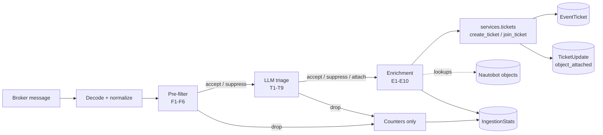

# Phase 4A — The Enrichment Resolver

!!! info "Implemented"
    Phase 4A is implemented and merged. Section 11's eight questions were decided as each
    proposed, and now read as the decisions taken rather than as open ones. Section 12 records
    where the implementation departed from what is written here.

Phases 1, 2, 2.5 and 3 are implemented and merged; this spec builds on them and cites their rules
by number (S1–S5, F1–F6, I1–I8, L1–L8, T1–T9) rather than restating them.

The architecture's phasing table gives Phase 4 two deliverables: the enrichment resolver, and
agents with MCP tooling and approval gates. They are separable, and only one of them is small.
This spec covers the first. Phase 4B — agents, the MCP registry, the approval gate and the
tool-calling extension `services/llm.py::complete()` does not have today — is specified
separately, after this ships.

## 1. Scope

Phase 4A answers a question a ticket cannot answer today: **what is this event about?**

A ticket that says `Interface ethernet-1/1 is down` on `leaf-01` carries the device name as a
string inside a JSON payload. Nautobot knows that device. It knows the interface, the cable on the
other end of it, the addresses configured on it and the circuit it terminates. The ticket knows
none of that, because nothing has ever looked. The resolver looks: it reads configured paths out
of the payload, finds the Nautobot objects they name, and attaches them through the surface
Phase 1 built for exactly this and Phase 2 left unused — `create_ticket(related_objects=...)`.

The result is that the attachment panel on a ticket detail page fills in by itself, that a person
reading a ticket at 03:00 reaches the device in one click rather than one search, and that
Phase 5's similarity surfacing has structure to compare on rather than free text.

In scope:

- `services/enrichment.py`: the rule dataclass, the lookup, and its cache — rules E1–E10.
- A per-topic `resolve` block in `ingestion/config.py`, validated at startup like everything else.
- The pipeline calling the resolver and passing `related_objects` to the writes it already makes.
- Two counters on `IngestionStats`, and their migration.
- `app-config-schema.json`, the admin guide, and the lab's own configuration using it.

Explicitly out of scope: agents, MCP and approval gates (Phase 4B); RAG, embeddings, pgvector and
the analytics dashboard (Phase 5); a backfill command for tickets opened before the rules existed
(11.3); resolution driven by a model rather than by configuration (11.6); and any change to what
`attach_object()` permits — the Phase 1 section 3.5 allowlist stands as written.

**No new writer.** The resolver reads. Everything it finds reaches a ticket through
`services/tickets.py`, which stays the only code that writes `EventTicket` or `TicketUpdate`
(ADR 0001). Phase 4A adds nothing to that rule and takes nothing from it.

## 2. The pipeline, one stage longer

Resolution sits between triage's verdict and the ticket write, which is the last place it can sit
and the cheapest.



| Module | Gains |
| --- | --- |
| `services/enrichment.py` | New. `ResolveRule`, `Resolver`, `Resolution` — rules E1–E10 |
| `ingestion/config.py` | The `resolve` block, its validation, and two cache settings |
| `ingestion/pipeline.py` | One resolver call; `related_objects` on three existing service calls |
| `ingestion/stats.py` / `models.py` | `enriched` and `enrichment_misses` counters |
| `tables.py` / `views.py` / `api/serializers.py` | The two counters on the stats surfaces |

Nothing else moves. There is no new model, no new dependency, no new process and no new API route.

## 3. Configuration

Resolution is per topic, because a payload shape is per topic. The block is a list, not a mapping,
because the rules are ordered: a later rule may scope its lookup on an earlier one's result.

```python
"ingestion": {
    ...,
    "resolve_cache_seconds": 300,        # how long a lookup's answer is trusted (E8)
    "resolve_cache_entries": 2000,       # how many answers are held at once (E8)
    "topics": {
        "network.events": {
            ...,                          # Phase 2 and Phase 3 keys, unchanged
            "resolve": [
                {
                    "name": "device",
                    "path": "host",
                    "model": "dcim.device",
                    "field": "name",
                },
                {
                    "name": "interface",
                    "path": "interface",
                    "model": "dcim.interface",
                    "field": "name",
                    "scope": {"device": "device"},
                },
            ],
        },
    },
},
```

Defaults are applied in `ingestion/config.py`, not in `default_settings`, for the Phase 2
section 3 reason: Nautobot merges `PLUGINS_CONFIG` one top-level key at a time. `resolve` defaults
to `[]` — an empty list, meaning the resolver is not merely disabled but has nothing to do, so a
topic that says nothing about resolution costs no query.

### 3.1 What a rule is

| Key | Required | Meaning |
| --- | --- | --- |
| `name` | yes | Unique within the topic. It is the scope reference and the log key |
| `path` | yes | A dotted path into the payload, read with `resolve_path()` — the same syntax `field_map`, `dedup_key_template` and match rules already use |
| `model` | yes | An `app_label.model` string. Must be on the `attachable_object_types` allowlist (E4) |
| `field` | yes | The field to look the value up by. Must be a concrete field on that model |
| `scope` | no | `{field on this rule's model: name of an earlier rule}` |

`scope` is the design's one genuinely hard part, and it is worth saying why it exists rather than
hiding it behind an inference. An interface name is unique **per device**, not globally: every
switch in the estate has an `ethernet-1/1`, and a lookup by name alone matches all of them.
Nothing in the payload says which device except the field an earlier rule already resolved. So a
scoped rule names it: `{"device": "device"}` reads as *filter `Interface.device` by whatever the
rule named `device` found*. The key and the value often coincide, because the field on the child
and the name of the rule that finds the parent are usually the same word; they are two different
things and the configuration keeps them apart.

A rule may only scope on a rule defined **before** it in the list. That is not a limitation worth
lifting: it makes cycles impossible by construction rather than by detection, and reading the
block top to bottom is reading the order it runs in.

### 3.2 Startup validation

`ingestion/config.py` extends its two-halved validation (Phase 2 section 3.1), reporting every
problem rather than the first. All of these are answerable from the settings and the model
registry alone, so all of them belong in `load()` and none needs a database:

- `resolve` is a list of mappings; every rule has a non-empty `name`, `path`, `model` and `field`;
  names are unique within the topic.
- `model` resolves through `apps.get_model()`, and its `app_label.model` label appears in
  `attachable_object_types`.
- `field` is a field on that model — `_meta.get_field()` says so, and a typo becomes a refusal to
  start rather than a rule that silently never matches.
- Every `scope` key is a field on this rule's model; every `scope` value names a rule defined
  earlier in the same topic.
- `resolve_cache_seconds` and `resolve_cache_entries` are positive integers.

`database_problems()` gains nothing. There is no lookup to pre-flight: an object the rules will
name may not exist yet, and that is a normal state, not a fault — the estate changes, and a
consumer must not refuse to start because a device has not been onboarded.

## 4. The resolver

`services/enrichment.py` exposes three things:

```python
@dataclass(frozen=True)
class ResolveRule:
    name: str
    path: str
    model: str          # "app_label.model"
    field: str
    scope: tuple = ()   # ((field, rule name), ...)

@dataclass(frozen=True)
class Resolution:
    objects: tuple = ()  # in rule order, each object once
    misses: tuple = ()   # ((rule name, reason), ...)

class Resolver:
    def __init__(self, *, ttl_seconds, max_entries, clock=time.monotonic): ...
    def resolve(self, payload, rules) -> Resolution: ...
```

Constructed once with the loaded configuration and called per event, the shape `PreFilter` and
`TriageFilter` already have. It holds a cache and nothing else; two consumers of the same
configuration are independent and correct.

**Why `services/` and not `ingestion/`.** The dependency runs one way: `ingestion` imports
`services`, and `services` never imports `ingestion`. This is the arrangement Phase 2 already
chose for `effective_severity()`, which lives in `services/tickets.py` and is called by the
pre-filter (Phase 2 section 14). It costs nothing now and buys two things later: a "re-resolve
this ticket" action in the UI reaches the same code without moving it, and Phase 4B's agents can
ask what an event is about without importing the consumer.

### 4.1 The rules

- **E1 — Resolution runs after triage and before the write.** After triage, so an event the model
  dropped costs no query — the same economy T1 applies to tokens. Before the write, so the
  attachments go in with the ticket rather than as a second mutation after it. Unlike triage
  (T9), **a dry run resolves**: it spends no money, and enrichment rules are precisely what an
  operator wants to tune against live traffic. `--dry-run` prints what it would have attached.
- **E2 — Rules are declarative, ordered, and per topic.** No code, no hooks, no import path in a
  setting. What a payload means is deployment knowledge, and deployment knowledge belongs in
  `PLUGINS_CONFIG` where an operator can read it, an ADR can constrain it, and startup can refuse
  it.
- **E3 — The lookup is a service.** `services/enrichment.py` reads and returns; it writes nothing
  and imports nothing from `ingestion`.
- **E4 — Only attachable types resolve, and startup is where that is enforced.** A rule naming a
  model outside the Phase 1 section 3.5 allowlist is a configuration fault reported before the
  first message. This is not belt-and-braces with `attach_object()`'s own check — it is the only
  place the check can usefully happen. `attach_object()` raises `ValidationError`, and by then the
  call is inside `_write_ticket()`'s transaction: a refused attachment would roll back **the
  ticket**, turning a misconfigured enrichment rule into lost events. The resolver never hands the
  service layer an object the service layer will refuse.
- **E5 — Nothing found is a counter, never an exception.** A path that does not resolve, a value
  that matches no row, an ambiguous match, a model whose table is momentarily unreachable: each
  counts a miss, logs, and returns nothing. The ticket is written either way. Enrichment is
  advisory in exactly the sense triage is (T4): a ticket without its device attached is a ticket;
  an event lost because a lookup failed is an event lost.
- **E6 — Ambiguity attaches nothing.** Two rows matching one value is not a reason to pick one and
  it is not a reason to attach both. Attaching both puts a second device on somebody's outage;
  picking one picks it by primary-key order, which is to say arbitrarily. The miss is counted and
  logged at warning with the candidate count, because two devices named the same thing is a fact
  about the estate that somebody should hear about.
- **E7 — An absent path is a fault; an empty value is an answer.** A rule whose `path` is not in
  the payload is a miss: the rule and the payload disagree, and the operator should see it. A path
  that resolves to an empty string or `None` is a **skip**, counted as nothing at all: the
  producer said "there is no interface in this message", which is a normal thing for a message
  about a BGP session to say. The lab's bridge writes exactly this distinction on purpose
  (`classify.lua` sets `interface` to `""` rather than omitting it), and the resolver honours it.
  A rule whose `scope` did not resolve is also a skip, not a miss, for the reason `load()` already
  gives about "no topics are configured": a consequence of another fault is not a second fault,
  and reporting both misleads.
- **E8 — The cache is bounded, and holds misses too.** Keyed on `(model, field, value, scope
  keys)`, held for `resolve_cache_seconds` (default 300), evicting least-recently-used beyond
  `resolve_cache_entries` (default 2000). Two properties matter. **Misses are cached**, because
  the Phase 3 review's lesson is that a cache that stores only hits makes the failing case the
  expensive one — an unknown hostname arriving 10,000 times must not be 10,000 queries. And the
  cache is **bounded by entry count**, because unlike `EventTypeCache` — which holds a table of
  ten rows an operator maintains — this one is keyed on values out of the payload, which whoever
  emits the events controls. An unbounded dict keyed on attacker-supplied strings is a memory
  leak with a trigger.
- **E9 — The service layer attaches.** The resolver's objects reach the ticket as
  `related_objects=` on the `create_ticket()` and `join_ticket()` calls the pipeline already
  makes. `_attach_all()` skips what is already attached, so a recurrence pollutes no timeline. No
  new writer, no new update type: `object_attached` already means this.
- **E10 — Every rule evaluation is counted.** `enriched` counts events that attached at least one
  object; `enrichment_misses` counts rule evaluations that found nothing they should have found.
  Both are memo counters outside the Phase 2 invariant, which holds untouched:
  `received == errored + dropped + opened + joined`.

### 4.2 The lookup

For each rule, in order:

1. Read `path` out of the payload with `resolve_path()`. Empty or absent decides per E7.
2. Build the scope from the rules already resolved in this event. Any unresolved scope: skip.
3. Consult the cache. A hit — including a cached miss — answers here.
4. Otherwise query: `model.objects.filter(**{f"{field}__iexact": value}, **scope)[:2]`.

Two rows are fetched rather than counted, because "is there exactly one" and "which one" are the
same question and one query answers both.

The match is case-insensitive. A device logs its hostname in whatever case its configuration
happens to hold, and `LEAF-01` is not a different switch from `leaf-01`; a resolver that thinks it
is would silently attach nothing across an entire estate whose naming convention differs from
Nautobot's by one shift key. The cost is stated in 11.4 and it is small: two objects whose names
differ only in case become ambiguous and neither is attached, which is E6 behaving correctly about
an estate that has a problem of its own.

The value is stringified before the lookup, so a payload carrying a VLAN id as a number and one
carrying it as a string behave the same — the reason `_severity()` already looks up by string.

### 4.3 Applying the result

`handle_message()` calls the resolver once, between triage and `_apply()`, and passes
`resolution.objects` to whichever write happens:

- **accept** — `create_ticket(related_objects=...)`. On a dedup join this forwards to
  `join_ticket()`, which already applies attachments to the joined ticket.
- **suppress** — the same write, unchanged. A suppressed ticket is still about a device.
- **attach** (triage) — `_attach()` passes them to `join_ticket()` alongside the AI-sourced
  recurrence message.
- **drop** — nothing is written and the resolver never ran (E1).

Attachments carry the source of the mutation they arrive with: `system` for the ordinary write,
`ai` for a triage attach. See 11.5, which is the one place this spec is uneasy about its own
answer.

An object deleted between the cache write and the attachment is not a failure: `TicketUpdate`
stores a content type and a UUID rather than a foreign key, and `get_related_objects()` already
skips rows whose target is gone.

## 5. Data model

No new model. Two fields on `IngestionStats`, both `PositiveIntegerField(default=0)`, both memo
counters outside `accounted_for`, exactly as the Phase 3 triage counters are:

| Field | Meaning |
| --- | --- |
| `enriched` | Messages that attached at least one resolved object |
| `enrichment_misses` | Rule evaluations that found nothing they should have found (E5, E6, E7) |

Migration `0007_ingestionstats_enrichment_counters.py`. `Counts` in `ingestion/stats.py` gains the
same two, `record()` gains two keyword arguments, and the flush adds them with `F()` like the
rest.

## 6. UI, API and GraphQL

Almost nothing, which is the point of having built Phase 1 the way it was built.

- The ticket detail page's grouped attachment panel is unchanged and starts filling in.
- The two counters join the `IngestionStats` table, detail panel, REST serializer and GraphQL
  type. Writes stay 405 everywhere.
- No new nav item, no new view, no new form. Resolution rules are settings, not objects — see
  11.1.

## 7. Guards

`tests/test_guards.py` gains two, in the style of the existing ones:

- **`services/enrichment.py` writes nothing.** No manager write, no `save()`, no `create()`, no
  `delete()` anywhere in the module. It is a reader, and the guard is what keeps it one.
- **`services/` imports nothing from `ingestion/`.** An AST sweep asserting the dependency
  direction E3 states. This is a rule the codebase has always followed and never checked, and the
  cheapest moment to check it is the phase that first gives somebody a reason to break it.

The Phase 2 and Phase 3 guards stand unchanged: the resolver imports no language model, and it is
not a ticket writer.

## 8. The lab is the acceptance test

Phase 2.5 built the lab so that this phase would have evidence rather than a fixture, and said so
at the time: *"The device names in Nautobot match the hostnames the devices put in their syslog
messages. That is the whole reason to bother: it is what makes the Phase 4 enrichment resolver's
job real rather than hypothetical"* (Phase 2.5 spec, section 6).

So the acceptance check is a real one, not a mock:

```bash
invoke lab-up
invoke lab-break --kind interface
```

The resulting ticket must carry `leaf-01` **and** its `ethernet-1/1` as attached objects on the
detail page, resolved out of a syslog line a real SR Linux node emitted, through a bridge that was
written before this spec existed. The lab's own `nautobot_config_lab.py` gains the `resolve` block
from section 3 as part of this phase, and `test_lab_configuration.py` — which already holds the
lab's fabric and the command's fabric together — gains a check that every path the resolve rules
read is a path the bridge actually produces.

No unit test replaces this, and it is the reason the lab exists.

## 9. Acceptance criteria

1. **Declarative and validated.** A `resolve` block is parsed per topic; every fault in section
   3.2 is reported at startup, all of them at once, and a consumer with a bad rule does not start.
2. **Scoped lookups work.** An interface resolves inside the device an earlier rule found, and the
   same interface name on a second device does not.
3. **Attached through the service layer.** Resolved objects reach tickets only as
   `related_objects=` on `create_ticket()`/`join_ticket()`; no new code writes a `TicketUpdate`,
   and the section 7 guards pass.
4. **Failure is never the ticket's failure.** A miss, an ambiguity, an empty value, a deleted
   object and a rule whose scope failed each leave a ticket written and a counter moved. No path
   through the resolver can raise into `_write_ticket()`'s transaction.
5. **Bounded and cached.** A repeated hostname costs one query; a repeated *unknown* hostname also
   costs one query; the cache never exceeds `resolve_cache_entries`.
6. **Counted.** `enriched` and `enrichment_misses` flush correctly and the Phase 2 invariant still
   holds.
7. **Idempotent.** A recurrence re-resolves and attaches nothing new — no duplicate
   `object_attached` rows on the timeline.
8. **Real.** Section 8's lab check produces a ticket carrying the device and the interface.

## 10. Test plan

| File | Covers | Criteria |
| --- | --- | --- |
| `test_services_enrichment.py` (new) | The lookup: hit, miss, ambiguity, scope, case-insensitivity, stringified values, skip-vs-miss (E7), the cache's TTL and its bound, misses cached | 2, 4, 5 |
| `test_ingestion_config.py` (extend) | Every section 3.2 fault, reported together; unknown model; field typo; non-attachable model; forward and self scope references; cache settings | 1 |
| `test_ingestion_pipeline.py` (extend) | Objects reaching `create_ticket`, the dedup join and triage's attach; counters; a dry run resolving and writing nothing; a resolver that raises never losing a ticket | 3, 4, 6, 7 |
| `test_ingestion_stats.py` (extend) | The two counters through the flush; the invariant | 6 |
| `test_guards.py` (extend) | Section 7 | 3 |
| `test_models.py` / `test_api.py` / `test_views.py` (extend) | The counters on the stats surfaces; writes still 405 | 6 |
| `test_lab_configuration.py` (extend) | Every resolve path is a path the bridge produces | 8 |

House rules hold: clocks injected, no test sleeps, no network. The resolver's seam is the ORM, so
its tests create real objects — there is nothing to fake and faking it would test nothing.

## 11. Decisions taken

Each of these was raised as an open question with a proposed reading, and each was decided as
proposed. They are kept here as the record of what was decided and what it costs.

**11.1 Rules in settings, not in the database.** Every other operator-facing knob added since Phase
3 — providers, models — became a model with a UI. Resolution rules do not. *Decided:* keep them in
`PLUGINS_CONFIG`, beside `field_map`, `severity_map` and the match rules they are cousins of. A rule
is meaningless without the topic's field map, and splitting one payload's interpretation across a
settings file and a database table means two places to look and two things to keep in step. *Cost:*
changing a rule needs a configuration change and a consumer restart, where an `LLMModel` can be
disabled from the UI in 60 seconds.

**11.2 Does a recurrence re-resolve?** *Decided:* yes, every event resolves, including one joining
an existing ticket. The cache makes it cheap, `_attach_all()` makes it idempotent, and a recurrence
can genuinely implicate an object the first occurrence did not name — which is exactly why
`join_ticket()` accepts `related_objects` at all. *Cost:* a busy dedup key pays a handful of cache
hits per event forever.

**11.3 No backfill in this phase.** Tickets opened before the rules existed stay unenriched.
*Decided:* leave them. A backfill is a management command that walks tickets, re-reads payloads and
writes attachments through the service layer as `source=system` — an afternoon's work, and one
better specified once the rules have run against live traffic and been corrected twice. Named as
future work, not designed here.

**11.4 Case-insensitive matching, always.** No `match` option, no per-rule choice. *Decided:*
`iexact` everywhere, per section 4.2. *Cost:* two objects whose names differ only in case are
ambiguous under E6 and neither attaches. If evidence says a deployment needs exact matching, a
`match: "exact"` key is a small, additive change.

**11.5 The source recorded on a triage attach's attachments.** The objects were resolved
deterministically, but they arrive inside a `join_ticket()` call whose source is `ai`, so the
timeline will say the AI attached the device. *Decided:* accept it. The actor on an attachment row
is the actor of the mutation it arrived with, and a ticket's history stays readable when one event
is one actor. The alternative — a second transaction relabelling those rows `system` — puts the
attachment outside the join's atomicity for a cosmetic gain. This is the weakest argument in the
spec and the most likely to be overruled.

**11.6 Deterministic lookups only.** The resolver never asks a model which device an event is about.
*Decided:* keep it that way in 4A. The payload either names the object or it does not; a model
guessing at it produces attachments nobody can audit, and rule E4's whole safety argument rests on
knowing what will be attached before the write. Model-assisted enrichment, if it is ever wanted, is
a Phase 4B agent with a tool and an approval gate — which is what that phase is for.

**11.7 One value, one object.** A `path` resolving to a list attaches nothing. *Decided:* a miss,
counted and logged. Lists are a real payload shape and supporting them means deciding what an
ambiguous element does, which multiplies E6 by the list's length. If a deployment needs it, the
honest form is an explicit `many: true` on the rule, and it can be added without changing anything
here.

**11.8 Cache defaults of 300 seconds and 2000 entries.** *Decided:* both, chosen for the same reason
`event_type_cache_seconds` is 60 — long enough to matter, short enough that an onboarded device
starts resolving within an operator's patience. 2000 entries holds a mid-sized estate's device and
interface names at a few hundred kilobytes.

## 12. What the implementation changed

- **`resolve_path()` moved and grew an argument.** Rule E7 needs "the path is absent" and "the
  path is there and empty" to be different answers, and the function returned `None` for both. It
  now takes a `default`, and the resolver passes a sentinel. It also moved out of
  `ingestion/normalize.py` into a new top-level `payloads.py`: two packages read payload paths,
  and leaving it where it was would have made `services` import `ingestion` — the one thing rule
  E3 and its new guard forbid.
- **`handle_message()` returns an `Outcome`, not a `Decision`.** A dry run resolves (E1), and what
  it resolved is the output the rules are tuned against — which an action and a counter key cannot
  carry. The dry-run line names the objects rather than counting them, because a rule pointing at
  the wrong field attaches something plausible and a number would not show that.
- **A scope field must be a relation**, which section 3.2 did not say. Scoping on a character
  field parses fine and fails at query time with a message about the ORM rather than about the
  configuration. One line, checked where every other fault is.
- **The allowlist is checked before the model is resolved**, so a typo'd `dcim.devise` is reported
  as "may not be attached, permitted types are …" rather than "does not exist". The list is the
  answer to the typo, so it is the better message even though it is the less literal one.
- **The tests' settings helper starts from the app's `default_settings`.** Nautobot fills a
  missing key from those when it loads an app, so a real `PLUGINS_CONFIG` always carries
  `attachable_object_types`; `override_settings` does not, and every resolve rule in the suite was
  refused against an installation that cannot exist. Found by the lab configuration test, which is
  the one place a real `resolve` block met the validation.
- **A failed lookup is not cached.** E8 says misses are held, and an error is not a miss: whatever
  it was, it was not an answer, and holding it would extend a transient database fault by the
  cache's TTL.
