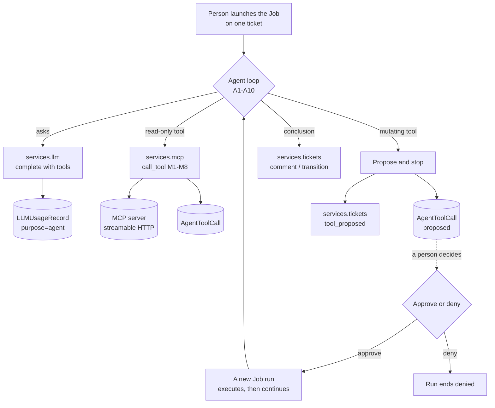

# Phase 4B — Agents, MCP Tooling and the Approval Gate

!!! info "Implemented"
    Phase 4B is implemented and merged, in the two PRs section 1 describes. Section 13's nine
    questions were decided as each proposed, and now read as the decisions taken rather than as
    open ones. Section 14 records where the implementation departed from what is written here.

Phases 1, 2, 2.5, 3 and 4A are implemented and merged; this spec builds on them and cites their
rules by number (S1–S5, F1–F6, I1–I8, L1–L8, T1–T9, E1–E10) rather than restating them.
[ADR 0007](../decisions/0007-mcp-tools-streamable-http-and-default-deny.md) made the security
decisions for this phase and [ADR 0009](../decisions/0009-agent-runs-are-jobs-that-end-at-the-gate.md)
makes the runtime one; this spec executes both.

## 1. Scope

Everything before this phase *watched*. Triage judged an event and wrote a verdict; the resolver
found the objects an event named. Neither ever asked a question. Phase 4B is where the app can go
and look: an agent that works one ticket, calls tools an operator has explicitly allowed, writes
what it found onto the ticket, and stops dead at anything that would change the network.

The reason to be careful is in the shape of the thing. The prompt carries a payload whoever emits
the events controls (Phase 3, 12.3a), and this time the model has hands. Every control in this
spec is placed on that assumption: the allowlist is a database table rather than an instruction,
the gate is a row rather than a sentence in a system prompt, and the transcript is stored so that a
person can read exactly what the model was told.

The work lands as two PRs:

- **PR A** — the MCP registry and client: `MCPServer`, `MCPTool`, discovery, `services/mcp.py`,
  and their UI, REST and GraphQL surface. After PR A an operator can register a server and enable
  its tools; nothing calls one.
- **PR B** — the agent: `services/agent.py`, the Job, the approval gate, `AgentRun` and
  `AgentToolCall`, the tool-calling extension to `complete()`, and the ticket panel.

In scope:

- `services/mcp.py`: the one module that speaks MCP — rules M1–M8.
- `services/agent.py`: the loop, called by the Job — rules A1–A10.
- `jobs.py`: `EventTicketAgentJob`, the first Job this app has ever shipped.
- The approval gate: proposal, decision, execution, and all three on the ticket's trail.
- `complete(tools=...)`, returning the tool calls a model asked for.

Explicitly out of scope: RAG, embeddings, pgvector and the analytics dashboard (Phase 5); agents
that start themselves (13.2); multi-ticket or estate-wide agents; anything that writes to a device
without a human pressing a button; and spend caps, which Phase 3 deferred (12.6) and 13.6 keeps
deferred for a reason.

**No new writer.** The agent's conclusions reach a ticket through `services/tickets.py`, which
stays the only code that writes `EventTicket` or `TicketUpdate` (ADR 0001). The gate's three trail
entries are three new functions *in that module*, not a second writer beside it.

## 2. The shape of a run



New modules and model additions:

| Module | Holds |
| --- | --- |
| `services/mcp.py` | `discover()`, `call_tool()`, the MCP client seam — rules M1–M8 (PR A) |
| `services/agent.py` | `run_agent()`, `resume_agent()`, the transcript — rules A1–A10 (PR B) |
| `services/tickets.py` | `record_tool_proposal()`, `record_tool_decision()`, `record_tool_result()` (PR B) |
| `jobs.py` | `EventTicketAgentJob` (PR B) |
| `models.py` | `MCPServer`, `MCPTool` (PR A); `AgentRun`, `AgentToolCall` (PR B) |
| `choices.py` | Run and call statuses, three update types, `LLMPurposeChoices.AGENT` |

## 3. Configuration

One new block. Providers, models, servers and tools are registry objects, not settings — the
ADR 0006 rule, extended to MCP by ADR 0007 — so this block holds only the shape of a run.

```python
PLUGINS_CONFIG = {
    "nautobot_event_tracker": {
        ...,                                    # Phases 1-4A, unchanged
        "agent": {
            "enabled": False,                   # off until somebody turns it on
            "provider": "",                     # LLMProvider.name — required when enabled
            "model": "",                        # LLMModel.name on that provider
            "max_iterations": 8,                # model calls in one run (A2)
            "max_tool_calls": 20,               # tool calls across a run and its resumptions (A2)
            "max_tool_result_chars": 8000,      # per result, before truncation (M8)
            "max_context_chars": 8000,          # payload cap into the prompt
            "max_transcript_chars": 60000,      # the whole stored transcript (A2)
            "timeout_seconds": 60,              # per model call
            "tool_timeout_seconds": 30,         # per tool call (M8)
        },
    },
}
```

Defaults are applied in `services/agent.py`, not in `default_settings`, for the Phase 2 section 3
reason. `app-config-schema.json` gains the block.

**Why `enabled` when the Job is manual anyway.** A Job is visible in the Jobs list to anyone with
`run` on it, and "we have not configured this yet" should be a refusal with a sentence in it rather
than a stack trace from a model call that was never going to work. The Job refuses to start when
the block is off, in the same voice `ingestion/config.py` refuses a bad topic.

## 4. Data model

### 4.1 MCPServer (PR A)

A `PrimaryModel`: registering a server is operator intent, and belongs in the change log.

| Field | Type | Notes |
| --- | --- | --- |
| `name` | Char, unique | Natural key |
| `description` | Char, blank | |
| `external_integration` | FK `extras.ExternalIntegration`, PROTECT | Endpoint, headers, TLS and timeout; required |
| `enabled` | Boolean, default True | The server-level off switch |
| `last_discovered_at` | DateTime, null | When its tool list was last read |

The integration is read the way Phase 3's provider integration is read after the PR #7 follow-up:
`render_remote_url()`, `render_headers()`, `verify_ssl`, `ca_file_path` and `timeout` all apply.
There is one code path in this app for "an outbound HTTP thing an operator configured", and this
is it.

### 4.2 MCPTool (PR A)

A `PrimaryModel`, unique on `(server, name)`.

| Field | Type | Notes |
| --- | --- | --- |
| `server` | FK `MCPServer`, CASCADE | A tool cannot outlive its server |
| `name` | Char | The tool name on the wire |
| `description` | Text, blank | As the server advertised it |
| `input_schema` | JSON, default `{}` | The JSON Schema the server advertised |
| `mutating` | Boolean, default **True** | Whether calling it changes something. Set by a person, never by discovery |
| `enabled` | Boolean, default **False** | Rule M4's switch |
| `advertised_read_only` | Boolean, null | What the server's own `readOnlyHint` claims. Recorded and shown; decides nothing |
| `definition_fingerprint` | Char, blank | Digest of the advertised description **and** schema (M5) |
| `last_seen_at` | DateTime, null | When discovery last saw it |

**Both defaults are the load-bearing part.** A newly discovered tool is disabled, so a server
advertising forty tools grants forty times nothing. And it is `mutating=True` until a person says
otherwise, because the failure of guessing wrong in that direction is an unapproved change to the
network, and the failure of guessing wrong in the other is one extra click.

MCP's own `readOnlyHint` annotation is **recorded and never acted on**. `mutating` is the only
input to the approval gate, and the party who would be setting it is the party the gate exists to
constrain: a server that could mark its own `push_config` read-only would land it in the half of
the list an operator enables in bulk, needing no Nautobot permission at all. The MCP specification
says a client must never make tool-use decisions from annotations received from the server they
describe. The claim is kept in `advertised_read_only` and shown beside the operator's own
classification, because a disagreement between the two is worth a reviewer's attention — which is
a reason to look, not a reason to believe.

**The fingerprint covers the description too, not only the schema.** The description is half of
what a reviewer read when deciding whether a tool mutates — a schema of `{"device": "string"}`
rarely says — and in an agent's prompt it *is* the tool's semantics. A server changing a tool's
meaning while leaving its arguments alone is the case a schema-only digest waves through.

### 4.3 AgentRun (PR B)

A `BaseModel` with `graphql`, not change-logged — the `IngestionStats` and `LLMUsageRecord`
posture, for the same reason: it is a record of what happened, not of what anyone meant.

| Field | Type | Notes |
| --- | --- | --- |
| `ticket` | FK `EventTicket`, CASCADE | A run is about exactly one ticket |
| `status` | Choice, indexed | `running`, `waiting_approval`, `completed`, `denied`, `failed`, `abandoned` |
| `started_by` | FK `users.User`, SET_NULL, null | The person who launched it. Not the actor: the actor is AI (S4) |
| `job_result` | FK `extras.JobResult`, SET_NULL, null | The Nautobot-side record of the same run |
| `parent` | FK `self`, SET_NULL, null | The run this one resumed |
| `transcript` | JSON, default `[]` | Every message, tool call and result (A7) |
| `iterations` | PositiveInteger, default 0 | Model calls spent |
| `error` | Text, blank | Capped, as the LLM service caps its own |
| `started_at` / `finished_at` | DateTime | |

### 4.4 AgentToolCall (PR B)

A `BaseModel` with `graphql`. Written only by `services/`, like every other record of this kind.

| Field | Type | Notes |
| --- | --- | --- |
| `run` | FK `AgentRun`, CASCADE | |
| `tool` | FK `MCPTool`, PROTECT | The record outlives a registry edit |
| `arguments` | JSON, default `{}` | What the model asked for, as it asked |
| `status` | Choice, indexed | `proposed`, `approved`, `denied`, `executed`, `failed` |
| `decided_by` | FK `users.User`, SET_NULL, null | Who approved or denied. Required to decide (7.3) |
| `decided_at` | DateTime, null | |
| `result` | JSON, default `{}` | What came back, capped per M8 |
| `error` | Text, blank | |
| `latency_ms` | PositiveInteger, default 0 | |
| `called_at` | DateTime, null | |

A read-only call is written straight to `executed` (or `failed`) and never has a decider. That is
the whole difference between the two kinds, in one column.

### 4.5 Choices and migrations

`UpdateTypeChoices` gains `tool_proposed`, `tool_decided` and `tool_executed`;
`LLMPurposeChoices` gains `agent`. PR A: `0008_mcp_registry.py`. PR B:
`0009_agent_runs.py`, plus the choice additions, which are code rather than schema.

## 5. The MCP client

`services/mcp.py` exposes two functions and one seam:

```python
discover(server) -> DiscoveryReport
call_tool(*, tool_call, timeout=None, client=None) -> AgentToolCall
```

`client` is the test seam — a callable with the MCP client's shape — and nothing outside a test
supplies one. No test opens a socket.

### 5.1 The rules

- **M1 — One import site.** The MCP client library is imported only in `services/mcp.py`, lazily,
  behind an optional `mcp` extra. A deployment without it gets `ImproperlyConfigured` naming the
  extra, not an import error at startup. Exactly litellm's arrangement (L2), and asserted the same
  way.
- **M2 — Streamable HTTP, and no other transport.** ADR 0007. There is no setting for this, because
  a setting is how stdio comes back. No module in this app imports `subprocess`, and a guard says
  so.
- **M3 — Credentials live in Nautobot.** Endpoint, headers, TLS and timeout come from the server's
  `ExternalIntegration` at call time, never from settings, never logged (L3's rule, same code
  shape).
- **M4 — Default-deny, checked here.** `call_tool()` refuses a tool that is not enabled, on a
  server that is not enabled, before any network I/O — and refuses it whatever the prompt, the
  model or the caller said. The allowlist is a table; the model never sees a tool that is not on
  it, and could not call one if it invented the name.
- **M5 — Discovery never grants, and believes nothing.** `discover()` creates new tools disabled
  and `mutating=True` whatever the server claims about them, refreshes descriptions and schemas,
  and marks tools the server no longer advertises. It never enables anything and never writes
  `mutating` at all — not on a new tool, not on an old one. A tool whose **definition** changed
  since it was approved, in its description or its schema, is **disabled again** and reported: the
  thing an operator allowed is not the thing the server is now offering. The whole pass is one
  transaction, and a tool the registry cannot hold — a duplicated name, a name past the column —
  is an `MCPCallError` rather than a half-written registry.
- **M6 — A mutating tool needs an approved call.** `call_tool()` requires `status=approved` on the
  `AgentToolCall` when the tool is mutating, and refuses otherwise. One gate, in the layer that
  owns the rule — the argument `join_ticket` already makes about where a check belongs.

    **The gate reads `mutating`, and reads nothing else.** Not `advertised_read_only`, which the
    server wrote; not the tool's name; not what the model said the call was for. One boolean, set
    by a person, is the whole test. A second input would be a second thing to get wrong, and the
    only candidate for it is the field 4.2 already refuses to act on.

    **An approved call re-checks the definition it was approved against.** The `AgentToolCall`
    stores the tool's `definition_fingerprint` at proposal, and `call_tool()` refuses when the
    stored digest no longer matches the tool. M5 disabling a changed tool covers most of this, and
    not all of it: discovery can change a definition, M5 can disable the tool, an operator can
    review the *new* definition and re-enable it, and the proposal an approver is looking at was
    written against the old one. The approver approved a call on the tool as it read then. This is
    that sentence, enforced.
- **M7 — Every call is recorded.** Success or failure, the `AgentToolCall` carries the arguments,
  the result, the latency and the error before the caller sees any of them. L1's rule, applied to
  the other kind of call this app makes.
- **M8 — Bounded in both directions.** Every call has a timeout (`tool_timeout_seconds`), and every
  result is capped at `max_tool_result_chars` before it is stored or shown to a model. A tool that
  returns forty megabytes of interface counters must not become a prompt, and must not become a
  row either.

### 5.2 Discovery

`discover(server)` lists the server's tools — following the pagination `tools/list` defines, so a
paged server is registered whole — and returns a `DiscoveryReport`: added, updated,
`definition_changed` (disabled by M5), and `missing`. It is reachable from the server's detail page as
an action, and from a management command for a deployment that would rather cron it. It writes
`MCPTool` rows and nothing else — no ticket, no run.

## 6. The agent

`services/agent.py` holds the loop. The Job holds nothing but the Job's own concerns: input,
logging and the `JobResult`.

### 6.1 The rules

- **A1 — A run is a Job over one ticket.** ADR 0009. Launched by a person, recorded as an
  `AgentRun`, bounded by the Job's `time_limit`.
- **A2 — Every run is bounded, in four ways.** `max_iterations` model calls, `max_tool_calls` tool
  calls across the whole chain of resumptions, `max_tool_result_chars` per result and
  `max_transcript_chars` overall. Reaching any of them ends the run `completed` with what it has
  and a line saying which limit it hit. An unbounded agent is a bill and a liability, and "the
  model usually stops" is not a bound.
- **A3 — The loop ends at the first mutating proposal.** It never waits (ADR 0009). The proposal
  is written, the ticket's trail says so, the run finishes `waiting_approval`, and the worker slot
  goes back.
- **A4 — Ticket mutations go through the service layer as `source=ai` with no user.** S4 is not
  relaxed for agents: the person who launched the run is `started_by` on the run, and is not the
  actor on anything the model decided. An agent working a resolved ticket is refused by S3, like
  triage.
- **A5 — An agent may comment, attach and move a ticket forward, but may not end one.** Its
  permitted transitions are `triaged` and `in_progress`; `resolved` and `closed` are a person's
  call (13.1).
- **A6 — Fail closed, not open.** Triage fails open because a missing verdict costs a ticket that
  should not exist (T4); an agent fails *closed* because a half-finished investigation reported as
  a finished one is worse than no investigation. A failed run ends `failed`, says why on the
  ticket, and proposes nothing.
- **A7 — The transcript is the record.** Every system prompt, model message, tool call and tool
  result is stored on the run. Resumption needs it, and a person asking "why did it want to do
  *that*" needs it more.
- **A8 — The prompt is hostile input and is treated as such.** The ticket's payload was written by
  whoever emits the events. Nothing in the prompt is a control: the tool list is a table (M4), the
  gate is a row (M6), the ticket rules are the service layer (A4, A5). What the prompt *can* do is
  steer the agent's conclusions and its read-only calls, and section 11 says so plainly rather than
  leaving it implied.
- **A9 — One live run per ticket.** A second launch against a ticket with a `running` or
  `waiting_approval` run is refused with a message pointing at that run. `is_singleton` is the
  wrong tool: it is one run per *Job*, estate-wide, which would serialize every ticket in the
  deployment.
- **A10 — Every model call is accounted.** `purpose=agent`, linked to the ticket, through
  `complete()` — so an agent's cost lands in the same table and the same panel as triage's, and
  the two are comparable.

### 6.2 The loop

1. Refuse unless `agent.enabled`, the model resolves (L8) and A9 holds.
2. Open the `AgentRun`, `running`.
3. Build the prompt: the ticket, its recent trail, its attached objects (Phase 4A put them there),
   the capped payload, and the enabled tools' schemas.
4. `complete(tools=..., purpose="agent")`.
5. No tool calls → the model's answer becomes a ticket comment; run `completed`.
6. Read-only tool calls → execute (M4, M7), append results to the transcript, back to 4.
7. A mutating tool call → propose it and stop (A3).
8. Any `LLMError`, `MCPError` or exhausted bound → A6 or A2.

### 6.3 The Job

```python
class EventTicketAgentJob(Job):
    class Meta:
        name = "Investigate an Event Ticket"
        has_sensitive_variables = False   # a ticket id is not a credential
        soft_time_limit = 600
        time_limit = 660

    ticket = ObjectVar(model=EventTicket)
```

`has_sensitive_variables = False` deliberately: it is what lets an operator schedule the Job or put
a Nautobot Approval Workflow in front of it, and the only input is a ticket. `time_limit` is above
`soft_time_limit`, or Nautobot kills the Job silently and logs a warning about it — which is
exactly the failure A6 is trying not to have.

A **Job Button** on the ticket detail page launches it, which is where a person is standing when
they want it.

### 6.4 The AI service account, reconciled again

`docs/admin/install.md` has carried a stub since Phase 1 describing a future AI service account,
and Phase 3 narrowed it to "ahead of Phase 4's agents, which will reach Nautobot over REST/MCP,
where a token must authenticate the transport". ADR 0009 removes that need too: the agent runs
inside a Nautobot Job, in the application context, with ORM access — so it calls the ticket service
directly, exactly as triage does from the consumer.

The stub is therefore not fulfilled by this phase either; it is **retired**. No part of this app
authenticates to Nautobot as itself. The account an operator does want is the one behind the *MCP
servers*, which is a credential on somebody else's system, held in an `ExternalIntegration` and its
secrets group (M3) — and that is a different thing wearing the same name.

## 7. The approval gate

### 7.1 Proposing

The agent writes an `AgentToolCall` in `proposed` and calls
`services.tickets.record_tool_proposal()`, which appends one `tool_proposed` update naming the
tool, the server and the arguments. The run ends `waiting_approval`. Nothing has been called.

### 7.2 Deciding

**Apps → Event Tracker → Agent Runs**, and the ticket's own agent panel, both show proposals with
an Approve and a Deny button; the REST API has the same two actions. A decision writes
`decided_by`, `decided_at`, the status, and one `tool_decided` update through the service layer.

Approving enqueues a resumption run. Denying ends the chain: the run's status becomes `denied` and
the agent is not invited to try again with a different argument (13.8).

### 7.3 The rules of a decision

- A decision needs a **user**. The AI cannot approve its own proposal — not by policy, but because
  the function refuses a decision without a user, exactly as S4 refuses a human action without one.
- It needs a **distinct permission**, `approve_agenttoolcall`, which `change_agenttoolcall` does not
  imply.
- It is **once**. A call that has been decided cannot be decided again, and the trail already says
  what happened.
- The **arguments are frozen** at proposal. Approving approves what was proposed, byte for byte;
  an operator who wants different arguments denies and says so in the ticket.
- The **tool is frozen** at proposal too, per M6: a call whose tool has been re-advertised since
  the proposal was written is refused at execution rather than run against a definition nobody
  approved.

### 7.4 Executing

The resumption run executes the approved call through `call_tool()` (M6 re-checks the status on the
row it is holding), writes the result, appends one `tool_executed` update, adds the result to the
transcript, and carries on from step 4. If the tool was disabled or the server turned off between
the approval and the resumption, the call fails per M4 and the run continues with that failure in
its transcript, which is the honest thing for the model to see.

## 8. The tool-calling extension to `complete()`

`services/llm.py` gains two arguments and one field, and no new rule:

```python
complete(*, model, messages, purpose, ticket=None, tools=None, tool_choice=None, ...) -> LLMResponse
```

`LLMResponse` gains `tool_calls`: a tuple of `(id, name, arguments)`, parsed defensively. A model
that returns unparsable JSON arguments raises `LLMResponseError` — the L4 family, on the record
like everything else (L1). `tools` is a list of OpenAI-shaped tool definitions, which litellm
translates per provider; the app builds them from `MCPTool.input_schema` and never from anything a
model said.

L1 through L8 are untouched. One call is still one usage record; a call that asked for tools and a
call that did not are priced the same way.

## 9. UI, API and GraphQL

Per ADR 0008, `NautobotUIViewSet` and UI Component Framework panels throughout; still no templates.

- **MCP Servers** and **MCP Tools**: full CRUD, filtersets, tables, nav items. The server's page
  lists its tools with their enabled and mutating state, and carries the **Discover Tools** action.
  The tool list's bulk edit is the one that matters — ADR 0007 admitted onboarding is tedious in
  proportion to tool count, and bulk enable is the only place that is answerable.
- **Agent Runs**: list and detail, read-only, with the transcript rendered readably and the run's
  tool calls beneath it. No add form: a run is started by the Job.
- **The ticket page** gains an **Agent** panel: the runs for this ticket, any proposal waiting on
  somebody, and the Approve and Deny buttons.
- REST: full CRUD on the registry; read-only on runs and calls, plus `approve/` and `deny/`
  actions on a tool call. Writes to `AgentRun` are 405 whatever the permissions say, as for
  `TicketUpdate`.

## 10. Guards

Extending section 8 of the Phase 3 spec and section 7 of Phase 4A:

- **One MCP import site.** The client library appears in `services/mcp.py` alone.
- **No subprocess, anywhere.** An AST sweep for `subprocess`, `os.system`, `os.popen`, `pty` and
  `Popen` across the app package. ADR 0007 rejected stdio because it means process execution driven
  by database rows; this is that decision, asserted.
- **Sole writers.** `AgentRun` and `AgentToolCall` are written only under `services/`, like
  `LLMUsageRecord`.
- **`services/agent.py` writes no `TicketUpdate` directly.** The existing sole-writer guard exempts
  everything under `services/`, so this one names the module and checks it — the gate's three trail
  entries belong in `services/tickets.py` with every other one.
- The Phase 3 and 4A guards stand: no provider SDK anywhere, litellm only in `services/llm.py`,
  `services/` imports nothing from `ingestion/`.

## 11. What this does not protect against

Stated here rather than left implied, in the register Phase 3's 12.3a used.

The ticket payload is written by whoever can put a line on a consumed topic. An agent reading it
can be steered. What the controls in this spec bound is the *blast radius*, not the *reasoning*:

- An attacker cannot make the agent call a tool nobody enabled (M4), or execute a mutating tool
  without a human pressing Approve (M6, A3).
- An attacker **can** attempt to steer which read-only tools get called and with what arguments,
  and to influence the comment the agent leaves on the ticket. A read-only tool is not a harmless
  tool if it reads something sensitive: enabling one is a decision about what an event's author may
  cause to be read.
- An attacker **can** attempt to make a mutating proposal look reasonable to a tired approver at
  03:00. The gate is only as good as the person reading it, which is why the proposal names the
  server, the tool and the exact arguments rather than the model's summary of them.

A deployment that cannot accept the third of these enables no mutating tools at all, which is a
supported and sensible configuration.

## 12. Acceptance criteria

1. **Default-deny holds.** A tool that is not enabled cannot be called by any path, including a
   model naming it directly, and no unapproved mutating call ever reaches a server.
2. **Discovery grants nothing.** New tools arrive disabled and mutating; a changed schema disables
   an approved tool and reports it.
3. **A run always ends.** No run blocks on a human; the gate is reached by ending, and every bound
   in A2 terminates a run cleanly with its findings.
4. **The gate is auditable.** Proposal, decision, approver and result each appear on the ticket's
   append-only trail, and a decision without a user is refused.
5. **Attribution.** Every ticket mutation an agent makes is `source=ai` with no user, and `S3`
   still refuses a resolved ticket.
6. **Accounted.** Every model call in a run writes an `LLMUsageRecord` with `purpose=agent` linked
   to the ticket.
7. **One import site, no subprocess.** The section 10 guards pass.
8. **Failure is closed.** A model error, a tool error and a bound each end the run visibly; none
   leaves a partial investigation looking finished.

## 13. Open questions

Each carries a proposed reading.

**13.1 An agent may not resolve or close a ticket.** *Proposed reading:* restrict it to `triaged`
and `in_progress`. Closing is the judgement that the problem is over, and it is the one judgement
whose being wrong is invisible — a wrongly closed ticket looks exactly like a solved one. *Cost:*
an agent that has genuinely fixed something still needs a person to say so.

**13.2 Runs are started by a person, never by an event.** *Proposed reading:* manual only in 4B. A
job hook on ticket creation is four lines and a cost multiplier: every event that opens a ticket
would start a model loop with tools. Automatic triggering deserves its own spend controls and its
own phase. *Cost:* nothing is automatic, which is half of what people want agents for.

**13.3 Approval is per call.** No "approve all like this", no session-level trust. *Proposed
reading:* keep it per call in 4B. A remembered approval is an allowlist entry that nobody wrote
down, and it is the exact mechanism by which gates quietly stop existing. *Cost:* a multi-step
change is genuinely tedious — ADR 0009 says so in its own consequences.

**13.4 Read-only tools execute without approval.** *Proposed reading:* yes, per ADR 0009. A gate in
front of reading makes investigation impossible and trains people to click Approve. *Cost:* section
11's second bullet — enabling a read-only tool is a real decision.

**13.5 Resumption re-runs the model from the transcript.** *Proposed reading:* yes; the transcript
is replayed as messages and the model continues. The alternative — storing the model's own
continuation state — is provider-specific and would not survive a provider change. *Cost:* a long
run re-sends its history and pays for it, bounded by `max_transcript_chars`.

**13.6 Per-run caps, not spend caps.** *Proposed reading:* A2's four bounds, and no budget. A
cross-process budget needs shared state (Phase 2, 13.6; Phase 3, 12.6) and the answer has not
changed; what *has* changed is that a run is now expensive enough to want bounding individually,
which A2 does. *Cost:* a deployment can still spend a great deal by launching many runs.

**13.7 The `mcp` SDK rather than hand-rolled HTTP.** *Proposed reading:* take the dependency,
optional and behind an extra, exactly as litellm is. MCP's streamable HTTP transport has session
handling and reconnection semantics that are somebody's job to maintain, and it should not be ours.
*Cost:* a second optional dependency to track, and its release cadence to watch.

**13.8 A denial ends the run.** *Proposed reading:* yes. Letting the agent respond to a denial by
proposing something slightly different is how an approver ends up negotiating with a model. A
person who wants a different call denies, says why in a ticket comment, and launches a fresh run.
*Cost:* the model never learns from the denial within that run.

**13.9 `mutating` defaults to True and MCP's `readOnlyHint` only pre-fills it.** *Proposed
reading:* per 4.2. The hint is written by the server author, and the boundary it would be deciding
is ours. *Cost:* every read-only tool needs a person to say it is one.

## 14. What the implementation changed

Appended as each PR lands, per the precedent Phases 2, 3 and 4A set.

### PR A

- **`call_tool()` moved to PR B.** Section 5 put it in this PR, and it does not belong here: rules
  M6 and M7 are both written on the `AgentToolCall` row, which PR B introduces. Shipping a
  callable mutating-tool path with its gate arriving one PR later is not a thing to leave in a
  tree, even when nothing calls it. PR A ships `discover()`, the connection plumbing and the
  client seam; M4's refusal lands with the call it refuses.
- **The client library is pinned to `mcp` 2.x**, and the spec's sketch was written against 1.x
  names. 2.0 renamed the transport to `streamable_http_client`, made the session take a two-tuple
  of streams, moved the tool fields to snake_case (`input_schema`, `read_only_hint`), and took
  headers and TLS off the transport call and onto an `httpx2.AsyncClient` the caller builds. Every
  one of those was found by reading the installed package rather than by trusting the spec.
- **The credential is presented as `Authorization: Bearer <secret>`**, which section 4.1 did not
  say. An integration whose own headers already carry an Authorization wins, so a server that
  authenticates some other way needs no code here.
- **Discovery needs two permissions**, `change_mcpserver` and `add_mcptool`. It writes both kinds
  of row. The first restricts the view's queryset and is what `get_required_permission()` returns;
  the second goes in `additional_permissions`, which `ObjectPermissionRequiredMixin` checks without
  using it to restrict anything. A user holding only `change_mcpserver` gets a 403.
- **`mutating` is never written from a server's answer**, on a new tool or an old one, and the
  hint is recorded in `advertised_read_only` instead. Section 4.2 originally said the hint
  *pre-fills* the field for a tool nobody has classified, which contradicted M5 in the same
  document and would have let a hostile server file a config-push tool under "safe to enable in
  bulk". Both sections now say the same thing, and it is the safe one.
- **The fingerprint covers the description as well as the schema**, and the report's bucket is
  named `definition_changed` accordingly. A schema-only digest let a server rewrite the sentence
  that becomes a tool's semantics in a prompt and be reported as "1 updated".
- **A disabled server is not discovered at all.** Reading its tool list is harmless, but an
  operator who switched a server off should not find its registry changing underneath them.
- **The list page counts tools twice**, total and enabled, because the gap between them is the
  default-deny rule being visible. The second count is a plain annotated column rather than a
  second `LinkedCountColumn`: two of those on one relation collide in django-tables2 with
  "already seen with a different queryset".
- **The Discover Tools control is a `PostButton`.** A plain `Button` renders an anchor, which
  issues a GET, and the view accepts POST only - so the one documented way to run discovery from
  the UI returned 405. The tests posted to the URL directly and never rendered the page, which is
  why a full green suite said nothing; there is now a test that reads the rendered page.
- **`tools/list` is read to the end.** It is a paginated request, and reading one page would leave
  the rest unregistered - so unreviewable - and would report every tool after page one as "no
  longer offered" on every run, which is the one signal an operator is meant to act on.
- **The session's HTTP client follows redirects and reads on a longer deadline than it writes.**
  The transport keeps a server-sent-event stream open, so a flat timeout from the integration cuts
  it mid-answer; an endpoint that redirects `/mcp` to `/mcp/` simply failed. Both match what the
  SDK's own client factory documents.
- **`httpx2` is declared**, rather than relied on as one of `mcp`'s dependencies. It is imported
  directly here, and the day it stops arriving transitively the failure would name the wrong extra.
- **`require_client()` is called by the management command.** It was written for exactly this and
  shipped unused: without it, a scheduled run on a deployment installed without the extra reported
  a traceback where the documentation promises a sentence.
- **An unchanged tool is not rewritten.** `MCPTool` is change-logged, and stamping `last_seen_at`
  on every pass filed one `ObjectChange` per tool per night recording that nothing had happened.

### PR B

- **`abandoned` became `superseded`.** Section 4.3 listed a run status nothing could set: a run is
  only ever left `running` by a process that died, and no code inside a dead process marks its own
  row. What does happen, several times a day in a deployment that uses the gate, is a
  `waiting_approval` run whose approved call is taken over by a resumption. That run did not
  complete and was not abandoned - it handed over - and it now says so.
- **One tool call is executed per turn.** Section 6.2 did not say what happens when a model asks
  for three at once. The answer is that the first runs and the others are told, in the transcript,
  that they were not executed; a model that still wants them asks again next turn. The alternatives
  were a gate holding several proposals at once, or a run making two changes from one approval, and
  neither is a thing to build. It also keeps the message sequence valid, since every tool call in
  an assistant message must be answered before the next request.
- **A tool call that fails does not fail the run.** Step 8 listed `MCPError` beside `LLMError` as a
  thing that ends a run, and section 7.4 said the opposite in the specific case it cared about. The
  narrower reading won: a tool that was reached and refused, or that answered badly, is a fact about
  the world the model should see, and the run carries on with that in its transcript. What ends a
  run is the app being unable to continue - a model error, a ticket that will not take a write, or a
  fault nobody anticipated. Nothing is hidden either way: the failure is on the `AgentToolCall`, on
  the ticket's trail, and in the transcript. `max_tool_calls` bounds a model that keeps retrying.
- **A5's "attach" half is not exercised.** An agent comments and moves a `new` ticket to `triaged`,
  and that is the whole of what it does to a ticket. Attaching would need either a tool that
  returns Nautobot object identifiers or a second parsing contract on the model's prose, and Phase
  4A already attaches what an event names. The permission is not withheld - `attach_object` is
  reachable through the same service - it is simply not something this loop does yet.
- **The `agent` block's defaults are validated at first use, not at startup.** `ingestion.config`
  validates the consumer's settings before the consumer starts because the consumer is a long-lived
  process that would otherwise crash-loop. A Job is not: the Job's first act is to read the block,
  and a fault there is one message in a JobResult, on the run somebody just started.
- **The Job's input stays one ticket, and "start or resume" is the service's decision.** Section
  6.3 gives the Job a single `ObjectVar`, and 7.2 says approving enqueues a resumption - which
  would have needed a second input naming the approved call. It does not: `run_agent()` looks for a
  waiting run with an approved call on the ticket and continues it, or starts fresh. That keeps
  `has_sensitive_variables = False` honest, keeps the Job schedulable, and means the button on the
  ticket page does the right thing whichever state the ticket is in.
- **A resolved ticket is refused before the model is called.** A4 said S3 refuses an agent working a
  resolved ticket, which was true and expensive: the refusal would have arrived on the first ticket
  write, after a model call somebody paid for. It is checked with the other refusals now, before a
  run row exists.
- **The gate reads `mutating` and re-checks the definition.** Both were questions the Phase 4B
  review left for this PR, and both are now written into M6 rather than settled in code alone. The
  gate's only input is the operator's boolean; and an `AgentToolCall` stores the tool's
  `definition_fingerprint` at proposal, which `call_tool()` re-checks before the call runs. M5
  covers most of the second one already - a changed definition disables the tool - and not the case
  where an operator reviews the new definition and re-enables it while an older proposal is still
  waiting.
- **Approving over REST does not enqueue the resumption.** The UI does, because a person who
  pressed Approve is sitting in front of the page. A REST client is not, and running the agent is a
  Job with its own endpoint and its own permission; a decision endpoint that silently started a
  billable loop would be a surprise.
- **The Investigate control is a link to the Job's run form**, not a button that enqueues the Job.
  Nautobot ships a modal button component for exactly this and it is private, experimental and
  outside the `nautobot.apps` surface this app otherwise keeps to. The run form is also the better
  page: it shows the Job, its description and its time limit before anything starts.
- **`complete()` reports an unusable answer as itself.** Section 8 said unparsable arguments raise
  `LLMResponseError`, which they do. What the sketch did not cover is that a model asking for a tool
  sends no message content - so the pre-existing "the response carried no message content" error had
  to learn that a tool call is a complete answer, and the two faults had to be told apart on the
  usage record rather than collapsed into one message pointing somewhere unhelpful.

