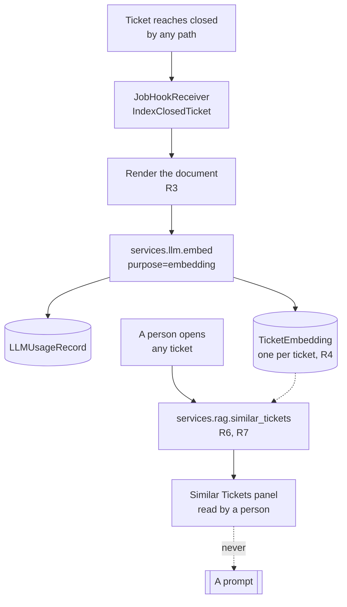

# Phase 5A — RAG over Closed Tickets

!!! info "Implemented"
    Phase 5A is implemented. Section 12's seven questions were decided as each proposed, and now
    read as the decisions taken rather than as open ones. Section 13 records where the
    implementation departed from what is written here — including two places this spec was simply
    wrong about what was possible.

Phases 1, 2, 2.5, 3, 4A and 4B are implemented and merged; this spec builds on them and cites
their rules by number (S1–S5, F1–F6, I1–I8, L1–L8, T1–T9, E1–E10, M1–M8, A1–A10) rather than
restating them. [ADR 0003](../decisions/0003-postgresql-with-pgvector-only.md) made the database
decision this phase finally spends.

The architecture's phasing table gives Phase 5 two deliverables: RAG indexing on close with
similarity surfacing, and the analytics dashboard. They share almost nothing — the dashboard needs
no vector work and no new dependency — so this spec covers the first, and Phase 5B is specified
separately after it ships.

## 1. Scope

A ticket arrives at three in the morning. Somebody solved this exact thing in March, wrote down
what they did, and closed it. Nobody now on shift knows that.

Phase 5A is the app remembering. When a ticket closes it becomes a document: what happened, and
what was done about it. New tickets are matched against those documents, and the closest few are
shown on the ticket page — with their resolutions, and links to read them in full.

**Closed tickets only.** The corpus is problems somebody finished, not open speculation. A ticket
still being worked has no resolution to learn from, and half the value here is the resolution.

In scope:

- `services/rag.py`: the one module that speaks to pgvector — rules R1–R9.
- `services/llm.py::embed()`: the twin of `complete()`, for the other kind of model call.
- `TicketEmbedding`: one row per indexed ticket.
- A Job Hook that indexes on close, and a management command that backfills.
- A **Similar Tickets** panel on the ticket page.

Explicitly out of scope: the analytics dashboard (5B); embedding anything other than a closed
ticket; and — the one that matters most — **putting any of this into a prompt**. Section 9 says
why at length.

**No new writer.** Nothing here writes `EventTicket` or `TicketUpdate` (ADR 0001), and nothing
here writes `LLMUsageRecord` except through `services/llm.py` (L1). `TicketEmbedding` is written
only by `services/rag.py`, and a guard says so.

## 2. The shape of it



That dotted line is the design. Everything else here is plumbing.

## 3. Before anything: pgvector

ADR 0003 has required PostgreSQL since Phase 1 and pgvector "from Phase 5 onward". This is Phase 5,
and the extension is not there — the development stack runs `postgres:17-alpine`, whose
`pg_available_extensions` has no vector entry at all.

Three things follow.

**The development image changes** to a pgvector-bearing PostgreSQL 17. That is a one-line change to
`development/docker-compose.postgres.yml` and a rebuild.

**A migration creates the extension**, with a custom operation rather than
`django.contrib.postgres.operations.CreateExtension`. The stock one issues the statement
unconditionally; this one looks in `pg_extension` first and attempts creation only when the
extension is genuinely absent, so the managed-PostgreSQL case where a DBA pre-created it is a
no-op rather than a permission error.

**And the migration will fail on some deployments anyway**, which the install guide has to say
before an operator discovers it. `CREATE EXTENSION` requires superuser or the `pg_database_owner`
role, and a managed PostgreSQL frequently grants the application user neither. Those operators must
create the extension themselves, once, before upgrading. The migration is written to succeed when
they already have.

Naming this now rather than in section 12 after somebody hits it: a migration that cannot run is
the worst kind of upgrade failure, because it strands the database halfway.

## 4. Configuration

One new block, applied in `services/rag.py` for the reason `ingestion/config.py` documents.

```python
PLUGINS_CONFIG = {
    "nautobot_event_tracker": {
        ...,                                  # Phases 1-4B, unchanged
        "rag": {
            "enabled": False,                 # off until somebody turns it on
            "provider": "",                   # LLMProvider name - required when enabled
            "model": "",                      # an LLMModel of kind `embedding` on it
            "max_document_chars": 8000,       # what gets embedded, capped
            "similar_count": 5,               # how many neighbours the panel shows
            "max_distance": 0.6,              # beyond this, "no, we have not seen this"
            "timeout_seconds": 30,
        },
    },
}
```

`app-config-schema.json` gains the block.

**There is no `dimensions` setting**, and section 13 explains why the first draft of this spec had
one. The column holds any width, and what a row actually stored is recorded on the row. Section
12.4 is about what happens when an operator changes embedding model.

## 5. Data model

### 5.1 TicketEmbedding

A `BaseModel`, not change-logged — the `IngestionStats` / `LLMUsageRecord` / `AgentRun` posture, for
the same reason: it is derived data, not a record of what anyone meant.

| Field | Type | Notes |
| --- | --- | --- |
| `ticket` | OneToOne `EventTicket`, CASCADE | One row per ticket (R4) |
| `embedding` | `VectorField(dimensions=None)` | The vector. No fixed width: see section 13 |
| `document` | Text | Exactly what was embedded, stored so a person can see why two tickets matched |
| `model` | FK `LLMModel`, PROTECT | Which model produced it. A vector is only comparable with its own model's vectors |
| `dimensions` | PositiveInteger | What this row actually stored, so a mismatch is detectable without reading the vector |
| `document_fingerprint` | Char | Digest of `document`. Re-closing a ticket whose document did not change costs no model call |
| `indexed_at` | DateTime | |

A OneToOne rather than a foreign key: R4 is "one embedding per ticket", and the database should
hold that rather than the service remembering to.

### 5.2 LLMModel gains a kind

`LLMModel` today is chat-shaped: `output_cost_per_million`, `max_output_tokens`, and an
`ALLOWED_PARAMETERS` tuple written for generation. An embedding model has no output tokens and no
completion cost.

A `kind` field (`chat` default, `embedding`), and `services/llm.py` refuses a mismatch in both
directions: `complete()` will not call an embedding model, `embed()` will not call a chat one. That
is rule L8's posture — the operator's classification, enforced before any network traffic — applied
to a new axis. It also stops the likelier mistake, which is not calling the wrong endpoint but
*configuring* triage with an embedding model and getting a baffling error at three in the morning.

`LLMPurposeChoices` gains `embedding`. No migration: choices are code.

## 6. The rules

- **R1 — pgvector's query surface lives in `services/rag.py` alone.** The distance functions and
  the query construction are confined to that module and asserted to be. Unlike litellm (L2) and
  the MCP client (M1), the library itself is a required dependency rather than a lazy optional
  one — `models.py` needs the field type at import time, and section 13 explains why that is not a
  choice.
- **R2 — a vector is only ever compared with vectors from its own model.** Similarity search
  filters on `model` and `dimensions`. Cosine distance between vectors from two different embedding
  models is a number, and it is meaningless; returning it as "similar" would be the most
  confidently wrong thing this app could do.
- **R3 — what is embedded is a rendered document, not the raw payload.** The title, event type,
  severity, the resolution, and the human-authored comments. The raw payload is deliberately
  excluded: it is machine noise, it is the half an attacker writes, and by volume it would dominate
  the vector — two unrelated tickets from the same noisy device would look alike because their
  payloads do.
- **R4 — one embedding per ticket, replaced rather than accumulated.** A reopened and re-closed
  ticket has a different resolution and gets a new vector. The `document_fingerprint` makes a
  re-close that changed nothing free.
- **R5 — indexing never blocks a close.** Any failure is logged and counted; the ticket closes
  regardless. The Phase 4A resolver's posture (E5) and triage's (T4), restated for a third path.
  A close is a person finishing work, and it must not fail because a model endpoint is down.
- **R6 — retrieval is a read, and respects permissions.** `similar_tickets()` returns tickets the
  *requesting user* may view, restricted through Nautobot's own queryset restriction. A panel that
  surfaced a ticket somebody cannot open would be an information leak dressed as a feature.
- **R7 — distance is a threshold, not a ranking.** Beyond `max_distance` the answer is "we have not
  seen this before", and the panel says so. A nearest-neighbour search always returns a nearest
  neighbour; showing the five least-unlike tickets in the database as "similar" trains people to
  ignore the panel.
- **R8 — every embedding call is accounted.** Through `embed()`, `purpose=embedding`, linked to the
  ticket. One usage record per call (L1), in the same table triage's and the agent's land in.
- **R9 — nothing retrieved reaches a prompt.** See section 9. Enforced by a guard, not by
  convention.

## 7. Indexing on close

A `JobHookReceiver` on `EventTicket`, firing on change, acting only when the ticket has reached
`closed`.

**Why a Job Hook rather than a call from `services/tickets.py`.** Three reasons, in order of
weight. It catches a close made by *any* path — the UI, the REST transition action, `walk_to_status`
from a management command, a future agent that is allowed to close. It keeps the ticket service
free of any knowledge that RAG exists, which is the dependency direction every other phase has
kept. And it runs outside the closing transaction, which a network call has to.

**Backfill.** `nautobot-server indexclosedtickets` for the corpus that closed before this phase
existed, and for after an operator changes embedding model (12.4). Same shape as
`discovermcptools`: `--limit`, `--reindex`, and it reports what it did rather than only the first
failure.

## 8. Retrieval and the panel

`services/rag.py` exposes one function the UI cares about:

```python
similar_tickets(ticket, *, user, limit=None) -> list[SimilarTicket]
```

`SimilarTicket` carries the ticket, the distance, and the resolution. The panel renders the ticket
as a link, the resolution as text, and the distance as a human word rather than a float — an
operator does not want `0.412`.

Computed at render time, not cached. A ticket's neighbours change as the corpus grows, and a cached
answer would be stale in exactly the case the feature is for. If that turns out to cost too much,
12.1 is where it gets revisited.

The panel appears on the ticket detail page for open tickets. A closed ticket showing tickets
similar to itself is of no use to anybody.

## 9. What this does not protect against — and the one thing it refuses to do

Section 11 of the Phase 4B spec is the register for this, and this phase adds a paragraph to it.

The corpus is built from tickets whose payloads were written by whoever can put a line on a consumed
topic. That was already true of a single ticket. What RAG changes is *reach*: a document that is
merely read by a model on one ticket becomes, once indexed, a document that can be retrieved for
every future ticket that resembles it.

**So nothing retrieved is ever put into a prompt.** Not triage's, not the agent's. A person reads
the panel and decides what it is worth.

This is a real capability given up, and it should be recorded as such rather than presented as free.
An agent that knew how this was fixed last time would be a better agent. The reason not to is that
the alternative has a shape nobody can bound: an attacker who gets one poisoned ticket closed — by
being noisy enough that somebody closes it to clear the board — has written a document that steers
every similar investigation afterwards, and neither the operator nor the model can see that it
happened. The panel keeps a person in the loop for the price of them having to read it.

R9 is enforced mechanically: a guard asserts that neither `ingestion/triage.py` nor
`services/agent.py` imports `services.rag`.

## 10. Guards

`tests/test_guards.py` gains three, in the style of the existing ones:

- **One pgvector import site.** The library appears in `services/rag.py` alone (R1).
- **Nothing retrieved reaches a prompt.** An AST sweep asserting that `ingestion/triage.py` and
  `services/agent.py` import nothing from `services.rag` (R9). This is the mechanical half of
  section 9, and the only one that survives somebody deciding it would be nice to try.
- **`TicketEmbedding` is written only under `services/`**, like `LLMUsageRecord`, `AgentRun` and
  `AgentToolCall`. The guard is the one strengthened after the Phase 4B review, so it catches
  `.objects.filter(...).update()` and related-manager writes as well as the two obvious shapes.

The existing guards stand: no provider SDK anywhere, litellm only in `services/llm.py`, the MCP
client only in `services/mcp.py`, `services/` imports nothing from `ingestion/`.

## 11. Acceptance criteria

1. **The extension problem is handled honestly.** The migration succeeds whether or not the
   extension already exists, and the install guide tells an operator without superuser what to do
   before upgrading.
2. **Closing a ticket indexes it**, by whatever path it closed, and a failure to index never
   prevents the close.
3. **Vectors are only compared within a model.** Two embedding models in the registry produce two
   corpora that never mix.
4. **Retrieval respects permissions.** A user sees no ticket in the panel they could not open.
5. **Nothing is similar to everything.** Above `max_distance` the panel says it has not seen this
   before.
6. **Accounted.** Every embedding call writes an `LLMUsageRecord` with `purpose=embedding`.
7. **No retrieved text reaches a prompt**, and the guard proves it.
8. **The lab shows it working**: two similar tickets closed, a third opened, and the panel surfaces
   the first two with their resolutions.

## 12. Open questions

Each carries a proposed reading.

**12.1 Retrieval runs at render time.** *Proposed reading:* yes. A pgvector similarity query over a
corpus of realistic size is a few milliseconds with an index, and the ticket page already does more
work than that. *Cost:* a very large corpus without an appropriate index would make the ticket page
slow, and the fix — an IVFFlat or HNSW index — needs a row count to be tuned against.

**12.2 The panel is on open tickets only.** *Proposed reading:* yes; a closed ticket's neighbours
are of historical interest at best. *Cost:* somebody reviewing how a class of problem was handled
loses a view they might have wanted.

**12.3 Only `closed`, not `resolved`.** *Proposed reading:* closed only, matching the architecture.
A resolved ticket may still be reopened, and re-indexing on every state change is churn. *Cost:* a
deployment that treats `resolved` as terminal and rarely closes anything gets an empty corpus, and
will not immediately see why.

**12.4 Changing embedding model orphans the corpus.** *Proposed reading:* R2 makes it safe rather
than silent — old vectors are simply never compared with new ones, so the panel goes quiet instead
of going wrong — and `indexclosedtickets --reindex` is how an operator fixes it. *Cost:* the quiet
is confusing until you know the rule, so the model page should say how many embeddings it holds.

**12.5 The document excludes AI-authored comments.** *Proposed reading:* include human comments and
the resolution; exclude the agent's own investigation notes and triage's reasons. The corpus should
be what people concluded, not what a model said, or the app slowly starts learning from itself.
*Cost:* an agent that did genuinely useful analysis contributes nothing to the corpus.

**12.6 No re-ranking, no hybrid search.** *Proposed reading:* cosine distance alone in 5A. Adding
keyword search and fusing the rankings is a real improvement and a whole second retrieval path.
*Cost:* a ticket whose wording differs from a past one but whose device name matches exactly will
not be found.

**12.7 `dimensions` is configuration rather than derived.** *Proposed reading:* configuration, and
validated at startup against the registered model where the provider reports it. Deriving it means
a network call before the first migration can run. *Cost:* an operator who sets it wrong gets a
refusal on the first embedding rather than at startup.

## 13. What the implementation changed

- **`pgvector` is a required dependency, not an optional extra.** Section 3 and rule R1 both said
  "behind an optional `rag` extra, imported lazily", by analogy with litellm and the MCP client.
  The analogy does not hold: those two are only ever *called*, so a deployment without them runs
  fine until something tries. `TicketEmbedding` uses `VectorField`, which Django needs at import
  time on every start — there is no lazy way to declare a model field. ADR 0003 already makes
  PostgreSQL-with-pgvector the only supported database, so this asks for nothing new; the extra
  was simply the wrong shape. R1 now guards the *query* surface, which is genuinely confined to
  `services/rag.py`, with `models.py` and the migrations exempt for the field type.
- **The vector column has no fixed width, and `dimensions` left the configuration block.** The
  spec made `dimensions` a setting, which would have baked one embedding model's width into the
  schema: changing model would then need a migration and a rewrite of every row. `VectorField`
  accepts `dimensions=None`, giving a bare `vector` column that holds any width — and R2's
  same-model filter already guarantees that any two vectors being compared came from one model and
  therefore have one width. What was actually stored is recorded per row instead. This also
  resolves 12.7, which asked whether `dimensions` should be configuration or derived: it is
  neither, it is observed.
- **The document excludes AI-authored comments**, as 12.5 proposed, and the filter is on
  `source=human` rather than on anything cleverer. An agent's investigation notes are exactly the
  material that would make the app learn from itself.
- **`LLMModel.kind` is enforced in both directions**, not only against the indexer. Section 5.2
  argued the likelier mistake is configuring triage with an embedding model, so `complete()`
  refuses a non-chat model as firmly as `embed()` refuses a non-embedding one.
- **The default `max_distance` was wrong by a factor of four, and the lab caught it.** The spec
  proposed 0.6 on no evidence. Measured against `nomic-embed-text` with real tickets, a genuinely
  related problem scores 0.09-0.10 and complete nonsense - a broken coffee machine in London,
  against a corpus of network faults - scores 0.22-0.24. At 0.6 the panel would have shown the
  coffee machine and labelled it "very similar". The default is now 0.15, the `closeness` bands
  are rescaled to match, and `docs/admin/rag.md` carries the measurements and the procedure for
  finding the number on a different model. This is precisely the check no unit test replaces, and
  the reason the lab exists.
- **Nautobot's OPTIONS test caught the new choice field.** `choices_fields` on the LLMModel API
  test has to name `kind`, which is the generic suite insisting that a field with choices be
  advertised by the API rather than quietly omitted. Worth recording because it is the kind of
  thing that looks like a test being awkward and is in fact the test being right.
