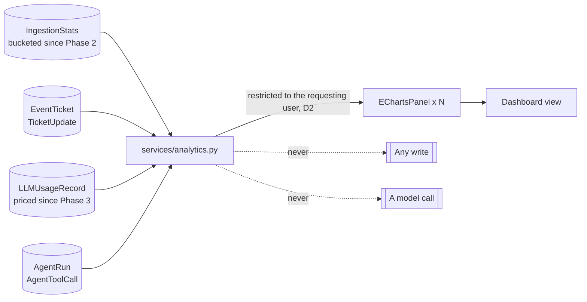

# Phase 5B — The Analytics Dashboard

Phases 1, 2, 2.5, 3, 4A, 4B and 5A are implemented and merged; this spec builds on them and cites
their rules by number (S1–S5, F1–F6, I1–I8, L1–L8, T1–T9, E1–E10, M1–M8, A1–A10, R1–R9) rather than
restating them. Section 12 records where the implementation departed from what is written here.

The architecture's phasing table gives Phase 5 three deliverables: RAG indexing on close,
similarity surfacing, and the analytics dashboard. [Phase 5A](phase-5a-rag.md) shipped the first
two. This is the third, and it is the last thing Phase 5 owes.

## 1. Scope

The app has been recording for four phases and showing almost none of it back. Every counter this
dashboard needs already exists: `IngestionStats` has been bucketing the ingestion funnel since
Phase 2, `LLMUsageRecord` has priced every model call since Phase 3, and `AgentRun` has recorded
every investigation since Phase 4B. What is missing is a page that answers the questions an
operator actually asks — *is ingestion healthy, what is this costing me, and is any of it working*
— without writing a GraphQL query by hand.

In scope:

- A **dashboard view** at `/plugins/event-tracker/dashboard/`, built from the UI Component
  Framework's `EChartsPanel`.
- Four groups of panels: **ingestion health**, **ticket flow**, **model cost**, and **agent
  activity**.
- A time-window control, and a small settings block for the defaults.
- `services/analytics.py`: the queries, in one module, so the view holds no ORM.

Explicitly out of scope:

- **Any new model, counter or migration.** See section 3 — this phase reads.
- **Any LLM call.** The dashboard describes what happened; it does not narrate it (rule D7).
- Export, scheduled reports, and alerting. A chart you can read is the whole of 5B.
- Per-user or per-team leaderboards. Section 11.3 says why.

**No new writer.** Nothing here writes `EventTicket` or `TicketUpdate` (ADR 0001), nothing writes
`LLMUsageRecord` (L1), and nothing writes `TicketEmbedding` (R1). This phase adds no writer at all,
which is a first, and a guard says so.

## 2. The shape of it

Both dotted lines are the design. Everything else is aggregation.

## 3. There is no new model

This is the shortest data-model section in the set, because the answer is nothing.

| Question the dashboard answers | Where the number already lives |
| --- | --- |
| Is ingestion keeping up, and what is it dropping? | `IngestionStats`, bucketed per consumer and topic, with `drops_by_reason` |
| How many tickets, in what state, of what severity? | `EventTicket` |
| How long do tickets take to resolve? | `EventTicket.created` / `closed_at` |
| Who or what is doing the work — human, AI, system? | `TicketUpdate.source` |
| What is the LLM costing, by model and by purpose? | `LLMUsageRecord.cost`, `.purpose`, `.model` |
| How often do model calls fail, and how slow are they? | `LLMUsageRecord.error`, `.latency_ms` |
| Are agents being approved or denied? | `AgentToolCall.status` |
| How much of the corpus is indexed? | `TicketEmbedding` against closed `EventTicket` |

A `DashboardSnapshot` cache table is the obvious thing to reach for and this spec refuses it. It
would be a new writer, on a branch whose whole architecture is "one writer per kind of row", and it
would be stale in exactly the case somebody is staring at the page — during an incident. If the
queries are too slow the answer is an index or a narrower default window, not a second copy of the
truth. Section 8 sets the budget that decides.

## 4. Configuration

A `dashboard` block, with per-key defaults applied in `services/analytics.py` rather than in
`default_settings`, for the reason `ingestion.config` documents — Nautobot merges `PLUGINS_CONFIG`
one top-level key at a time.

| Key | Default | Meaning |
| --- | --- | --- |
| `enabled` | `True` | Whether the dashboard view and its menu item exist at all. On by default: it reads what is already there and costs nothing until somebody opens it. |
| `default_window_days` | `7` | The window the page opens on. |
| `max_window_days` | `90` | The largest window a user may ask for. A bound, not a preference — see section 8. |
| `query_timeout_seconds` | `10` | Past this a panel renders an apology rather than a page that never returns. |

`enabled` defaults to `True` where every other phase's block defaults to `False`. The difference is
that the others reach a network or spend money on first use and this one runs four `GROUP BY`
queries against tables the deployment already has.

## 5. The rules

Referenced by number from code comments, as every phase does.

- **D1** — The dashboard writes nothing. No model, no migration, no counter, no cache row.
- **D2** — **Every aggregate is computed over a queryset restricted to the requesting user.** A
  count is an oracle: it answers "how many exist" without returning one of them. Section 7.
- **D3** — Charts are `EChartsPanel` from `nautobot.apps.ui` and nothing else. No charting
  dependency, no hand-written template (ADR 0008).
- **D4** — Every query is bounded by an explicit time window, and the window is bounded by
  `max_window_days`. There is no "all time".
- **D5** — Money comes from `LLMUsageRecord.cost` and is never recomputed from token counts. The
  service layer priced it once, at call time, against the registry as it stood then (L5).
- **D6** — `services/analytics.py` holds every query; the view holds none. The view assembles
  panels.
- **D7** — **No LLM call.** The dashboard shows numbers a person reads. It does not summarize them
  with a model, and a guard asserts `services/analytics.py` imports nothing from `services/llm.py`.
- **D8** — Slow is a bug, not a tuning problem. Section 8 gives the budget and what happens when a
  panel misses it.

D2 and D7 are the two with teeth. The rest are hygiene.

## 6. The panels

Four groups, each an `EChartsPanel` or a small `KeyValueTablePanel`, on one `ObjectDetailContent`-
style layout.

**Ingestion health.** A line chart of `received` / `tickets_opened` / `dropped` per bucket, from
`IngestionStats`, and a pie of `drops_by_reason` for the window. This is the panel that answers
"the consumer is running, but is it doing anything".

**Ticket flow.** A bar chart of tickets opened and closed per day; a pie of open tickets by
severity; a single figure for median time-to-close over the window. Time-to-close is the number
most likely to be asked for in a review and least likely to be reconstructable afterwards.

**Model cost.** A bar chart of `LLMUsageRecord.cost` summed per day, split by `purpose` (triage,
agent, embedding); a table of cost per model for the window; a failure rate. Cost is why the LLM
registry records prices at all, and until now the only way to see it was the usage list view.

**Agent activity.** A bar of runs per day by terminal status, and the approve/deny split from
`AgentToolCall`. Phase 4B's approval gate is a control; this is how anybody knows whether it is
being used or rubber-stamped.

## 7. Aggregates and permissions — the thing this phase must not get wrong

Phase 5A got R6 wrong in a way worth learning from rather than repeating. Retrieval respected
permissions in the panel, which is where the rule was written, and did not respect them in the REST
viewset, the UI list view, or the GraphQL type — because the rule had been written about a *panel*
rather than about the *model*. Three surfaces, one rule, one place it was enforced.

An analytics dashboard is that mistake's natural habitat, and worse, because **an aggregate leaks
without returning anything.** A user constrained by an ObjectPermission to one tenant's tickets,
shown a count of 4,812 open tickets, has just learned the size of the estate they were scoped out
of. A severity pie tells them the shape of it. A cost-per-model chart tells them what the
deployment spends. None of those responses contains a single record they were forbidden to see, and
every one of them is a disclosure.

So D2 is stated as a property of the module, not of a panel:

- Every function in `services/analytics.py` takes `user` as a keyword argument. Not optional, not
  defaulted, not `None` for "internal use" — there is no internal use.
- Every queryset it aggregates over starts `.restrict(user, "view")`.
- For models whose visibility follows a parent — `TicketUpdate`, `LLMUsageRecord`, `AgentRun`,
  `TicketEmbedding` — the restriction follows the parent as well, exactly as
  `rag.visible_embeddings` does. A usage record names its ticket; a cost chart built from
  unrestricted usage records is a ticket-existence oracle with a price attached.
- A test asserts, for each function, that a user with no permissions gets zeroes rather than
  totals — and that a user constrained to a subset gets that subset's numbers, not the estate's.

The last point is the one that catches the real bug. Asserting "anonymous gets nothing" is easy and
proves little; asserting "constrained gets *their* numbers" is what fails when somebody aggregates
over `objects.all()`.

## 8. Performance, and what "too slow" means

The dashboard runs several `GROUP BY` queries per render against tables that grow forever.
`IngestionStats` is already bucketed and small. `EventTicket` and `LLMUsageRecord` are not.

The budget: **the whole page renders in under two seconds against a corpus of 100,000 tickets and
1,000,000 usage records.** That is the number the acceptance criteria test against, and it is a
budget rather than an aspiration — a panel that misses it is a defect in that panel.

Three things keep it there, in order of preference:

1. **The window.** `default_window_days` of 7 means the common render touches a week. `D4` makes
   every query bounded, so no panel can accidentally scan the table.
2. **Indexes.** `LLMUsageRecord` and `EventTicket` need indexes supporting `(created, ...)` range
   scans for these groupings. Adding an index is a migration, which section 3 said this phase would
   not need — this is the one exception, and it is a schema addition rather than a new model.
3. **Nothing else.** Not a cache table (section 3), not a materialized view, not a Celery
   pre-aggregation job. If 1 and 2 are not enough, that is a finding for 5C and should be recorded
   as one rather than solved by inventing a writer.

`AssertNoRepeatedQueries` from `nautobot.apps.testing` pins the query count, because the failure
mode here is not one slow query, it is forty fast ones.

## 9. Guards

`tests/test_guards.py` gains three, in the style of the existing ones:

- **The dashboard writes nothing.** An AST sweep asserting `services/analytics.py` contains no
  `.save(`, `.create(`, `.update(`, `.delete(`, or `bulk_` call — the strengthened form the Phase
  4B review produced, which catches related-manager writes too.
- **The dashboard calls no model (D7).** `services/analytics.py` imports nothing from
  `services/llm.py`, `services/agent.py`, or `services/rag.py`. The temptation this forecloses is
  "summarize this month's incidents", which is a different phase and a different argument.
- **Every analytics function takes `user`.** A signature check over the module's public functions,
  because D2 is only enforceable if there is no way to call one without saying who is asking.

The existing guards stand: no provider SDK anywhere, litellm only in `services/llm.py`, the MCP
client only in `services/mcp.py`, pgvector only in `services/rag.py`, `services/` imports nothing
from `ingestion/`.

## 10. Acceptance criteria

1. **The page answers the four questions** in section 1 without anybody writing a query.
2. **Nothing is written.** The guard passes, and no migration adds a model.
3. **A constrained user sees their own numbers**, not the deployment's — asserted per function,
   including the parent-following cases.
4. **No model is called.** The guard passes.
5. **The budget holds**: under two seconds and a pinned query count at the stated corpus size.
6. **Every chart is an `EChartsPanel`** from the public API; no template is added.
7. **Turning it off removes it**: `enabled: False` leaves no view, no route and no menu item.

## 11. Open questions

Each carries a proposed reading, as every spec here does.

**11.1 The dashboard is a UI view, not a model detail page.** Nautobot's UI Component Framework is
built around objects, and this page has no object. *Proposed reading:* a plain `View` assembling
`ObjectDetailContent`-style panels, which is what the framework supports for object-less pages.
*Cost:* it sits slightly outside the `NautobotUIViewSet` pattern ADR 0008 otherwise mandates, and
that deserves a sentence in the ADR rather than silence.

**11.2 Time-to-close uses `closed_at`, which only closed tickets have.** *Proposed reading:* median
over tickets closed *within the window*, not tickets opened within it — otherwise a long-running
incident never appears and the number flatters. *Cost:* the two readings differ most exactly when
things are going badly, which is when somebody is looking.

**11.3 No per-user breakdown.** *Proposed reading:* none in 5B. A chart of tickets closed per
person is a performance-management tool wearing an operations hat, and this app has no mandate for
that. *Cost:* "who knows about this device" is a real question that this refuses to answer.

**11.4 Should `enabled` default to `True`?** *Proposed reading:* yes, per section 4. *Cost:* it is
the first block in the app that is on by default, which is a small inconsistency an operator may
trip over when they go looking for the switch.

**11.5 Does the cost chart need a currency?** *Proposed reading:* no — `LLMUsageRecord` stores a
`Decimal` with no unit, because the registry's prices have none. Show the number, label it "cost",
and let the deployment know what it registered. *Cost:* a deployment mixing providers priced in
different currencies gets a meaningless sum, and nothing warns them.

**11.6 What happens to the dashboard when a panel's query times out?** *Proposed reading:*
`query_timeout_seconds` applies per panel, and a panel that exceeds it renders a short "this took
too long" rather than failing the page — the posture `similar_tickets` takes. *Cost:* a
persistently slow panel becomes invisible furniture rather than an error somebody fixes.

## 12. What the implementation changed

- **Retention shortens the window, which section 8 did not account for.** `StatsRecorder._prune()`
  deletes `IngestionStats` after `ingestion.stats_retention_days` (30 by default) and
  `services.llm._maybe_prune` deletes `LLMUsageRecord` after `llm.usage_retention_days` (90). With
  `max_window_days` at 90, an unclamped ingestion chart would have drawn sixty days of zeroes and
  presented deletion as quiet — the one failure mode a health panel must not have. Each panel now
  clamps its window to the retention of the table it reads and reports the real range under its
  title. `Window.clamped` and `Window.label` carry it; section 8's three preferences are otherwise
  unchanged.

- **11.5 has an answer in the model, not a judgement call.** `LLMUsageRecord.cost.help_text` has
  said "USD, computed from the model's registered costs" since Phase 3. The proposed reading —
  show the number and label it "cost" — was written without that. The charts say "cost (USD)". The
  stated cost stands: a deployment mixing currencies still gets a meaningless sum and nothing warns
  it.

- **11.1 cost an amendment to ADR 0008 and a change to a guard, not a sentence.** The ADR did not
  merely mandate the framework; `TemplateGuardTest` asserted the app shipped no `.html` file at
  all. Nautobot 3.2 has no core template that renders a bare list of panels, and every object-less
  page in core ships one of its own, so the page needed a template and the guard had to change.
  `TemplateGuardTest` is now a one-file allowlist that also asserts the allowed file extends
  `base.html` alone, which is the coupling the ADR was really about. ADR 0008 carries an amendment
  section saying so.

- **The analytics module may not import the two modules whose retention it needs.** Rule D7 forbids
  importing `services.llm`, and the service layer imports nothing from `ingestion`. So
  `services/analytics.py` reads both retention settings out of `PLUGINS_CONFIG` directly, with
  defaults of its own, and a test asserts those defaults still equal the ones in `ingestion/
  config.py` and `services/llm.py`. `visible_embeddings` could not be reused for the same reason,
  so the parent-following helpers repeat its shape. Both duplications are the price of the import
  direction and both are covered.

- **A malformed neighbouring setting draws the chart anyway.** A `stats_retention_days` this module
  cannot read means "no clamp" rather than an exception. The owning block validates itself and will
  say so; taking the dashboard down over somebody else's key would report the wrong fault.

- **The guard about signatures became two.** Section 9 asked for a check that every analytics
  function takes `user`. That alone would pass a function taking it positionally with a default of
  `None`, which is the shape section 7 explicitly refuses. The second guard asserts the four panel
  functions take it keyword-only and without a default.

- **`get_settings` and `window_choices` are exempt from that guard**, because they touch no
  queryset. `window_choices` exists so the window control's offer and `max_window_days` cannot
  disagree, which is rule D4 at the form rather than at the query.

- **The budget is asserted as a query count, not a wall clock.** Section 8 named two seconds at
  100,000 tickets and 1,000,000 usage records. Building that corpus in a unit test costs minutes,
  and a clock assertion in CI fails for reasons unrelated to this code. The suite pins the query
  count with `AssertNoRepeatedQueries` and asserts the count does not grow when the corpus does,
  which is the defect — aggregating in a loop — the budget was really about. The full-size
  measurement is a documented manual step in `docs/admin/dashboard.md`.

- **Two indexes, as section 8.2 allowed.** `EventTicket.created` and `EventTicket.closed_at`, in
  `0011_analytics_indexes`. Nothing else needed one: `IngestionStats.bucket_start`,
  `LLMUsageRecord.called_at`, `AgentRun.started_at` and `AgentToolCall.proposed_at` all already
  carried `db_index=True`.

- **Only `EventTicket` has a `created` column.** Every other model the dashboard reads is a
  `BaseModel` with no change-logging, so the buckets are `bucket_start`, `called_at`, `started_at`
  and `proposed_at`. Section 3's table named the fields but not this constraint, which decides
  every `TruncDate` on the page.

- **The median is computed in the database.** `PERCENTILE_CONT` as a Django `Aggregate`, rather
  than pulling every closed ticket's timestamps into the process to sort them — which would have
  been the forty-fast-queries failure mode rule D8 exists to prevent. PostgreSQL only, which ADR
  0003 already commits to.

- **`drops_by_reason` is summed in Python.** It is a `JSONField` with operator-supplied keys and
  there is no clean SQL aggregate for it. Safe because the window is bounded and the table is
  already bucketed; noted because it is the one aggregation on the page the database does not do.

- **The results are a context object, not a cache on the request.** Nine panels are drawn from
  four results, and the framework renders each panel independently — `KeyValueTablePanel` asks for
  its data twice on its own, once to decide whether to render and once to render. Existing custom
  panels cache on `context["object"]` because they render inside a core view whose context they
  cannot add to. This view owns its context, so an `AnalyticsResults` holder goes in it. That is
  the one thing 11.1's choice actually costs at runtime, and it costs less than it first looked.

- **The chart subtitle is computed at render time.** `EChartsBase.header` is fixed when the panel is
  constructed and the window is not, so `DashboardChart` overrides `get_config()` to write the
  window label — or the timeout apology — into `title.subtext`. Without it, no panel could report
  its own clamp.

- **The corpus-coverage figure from section 3's table is not a panel.** Section 6 does not make it
  one and section 1's four questions do not ask for it. `TicketEmbedding` against closed
  `EventTicket` remains a GraphQL query for anybody who wants it.

- **Nine panels, not ten.** Seven charts and two key/value tables. The first draft of this section
  and of the changelog both said ten.

The following came out of the cleanup pass run against the finished branch, and each is a change
the first implementation should have made:

- **The template includes core's grid rather than copying it.** The first draft's body was a
  verbatim fork of `components/layout/two_over_one.html`. It passed the guard, extended `base.html`
  alone, and was still exactly the drift ADR 0008 exists to prevent: core changes its layout, every
  other page in the deployment moves, and the fork does not. The guard now also asserts the allowed
  template emits no grid or table markup of its own, because "extends the base" turned out not to
  be the same claim as "draws no layout".

- **`Tab.panels_for_section()` does the panel ordering.** The first draft reimplemented it, with a
  docstring admitting as much. Section 11.1's argument is that `Tab` cannot *render* without an
  object; its sorting needs no object, and copying it stated the ordering twice.

- **`model_cost` makes one aggregate pass instead of three.** Grouping by day, purpose and model at
  once and pivoting in Python, rather than three scans of the fastest-growing table the page reads
  — each of which carried the whole permission subquery with it.

- **`urls.py` and `navigation.py` call `is_enabled()`, not `get_settings()`.** Both run at import.
  `get_settings()` is strict, so a typo in `query_timeout_seconds` would have raised inside the
  URLConf and taken every route in the installation down over one broken dashboard key — the exact
  opposite of the posture `_retention_days` takes about a *neighbouring* block two hundred lines
  away. `get_settings()` still runs in the view and the form, where the page can report it.

- **One more index than section 8.2 anticipated.** The severity split asks which tickets are open
  right now, so it is the one query on the page with no time bound and nothing to bound it by.
  Without `(status, severity)` it scans the whole table on every render, growing without limit
  while the two bounded queries stay flat. It was the query that would have missed the budget
  first.

- **`ChoiceSet.as_dict()` and `.values()` already existed.** The first draft hand-rolled both.
  Nautobot's versions unpack grouped choices, so they also survive a choice set that later grows an
  optgroup, where `dict(CHOICES)` would have produced silent nonsense.

- **The schema-agreement suite is shared with Phase 5A's.** It was copied wholesale, which also
  falsified that suite's docstring claim that the `rag` block was the only one covered. Both are
  now subclasses of one base in `tests/fixtures.py`.

- **The `statement_timeout` reset is guarded on `in_atomic_block`.** Outside an enclosing
  transaction the commit has already discarded the setting, so the reset did nothing but spend a
  round trip and draw a PostgreSQL warning, four times per render.
