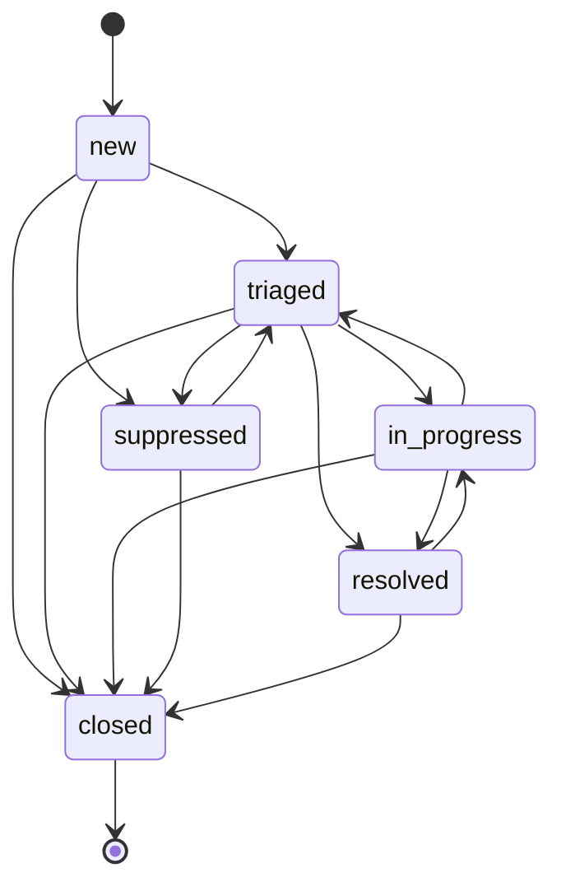

# Using the App

Event Tracker turns network events into tickets that carry their own history. This page walks through the ticket lifecycle: the states a ticket can be in, who may move it between them, and why some things that look like ordinary fields are not editable.

## The ticket lifecycle

A ticket is always in exactly one of six states.

| State | Meaning |
| --- | --- |
| **New** | Opened, nobody has looked at it yet. |
| **Triaged** | Assessed as real and worth working. |
| **In Progress** | Somebody is actively working it. |
| **Suppressed** | Judged to be noise. Kept on the record, not worked. |
| **Resolved** | Fixed, pending confirmation. |
| **Closed** | Finished. Terminal. |

Not every move between them is allowed:

Three things follow from this diagram, and they are worth knowing before you start:

**Closed is final.** Nothing leaves it. If a ticket was closed by mistake, open a new one — you cannot reopen it. This is the price of a simple, dependable rule about what AI actors may touch, and it is a deliberate trade.

**Resolved is not final.** A resolved ticket can go back to In Progress if the fix did not hold. Reopening clears the resolution and the resolved timestamp, so the ticket reads as genuinely open again rather than carrying a stale answer.

**You cannot skip straight from New to Resolved.** A ticket has to be triaged or worked first. If an event turns out to be nothing, Suppress it or Close it rather than resolving it.

## Moving a ticket

Use the **Transition** menu on the ticket page. It only offers the moves that are legal from the ticket's current state — if you cannot see the button you want, that move is not permitted from where the ticket is now.

Resolving a ticket requires a resolution. The form will not let you through without one, because a resolved ticket with no explanation is not much use to whoever reads it next month.

### Why Status is not on the edit form

Status is missing from the ticket edit form, and a REST `PATCH` that tries to set it is rejected with an error rather than quietly ignored. This is intentional.

Every status change has to leave an entry in the trail, has to follow the diagram above, and — once event triage arrives — has to be blocked for AI actors on finished tickets. Those guarantees only hold if there is exactly one way to change a status. So there is one: the transition control, and the API endpoint behind it.

The same applies to Resolved At, Closed At, Resolution and Event Count. They are set for you as a side effect of transitions.

Severity and assignee work the other way round: you edit them on the ticket as you would any other field, and the app records the change in the trail for you. Whether the edit comes from the form or from a REST `PATCH`, the entry says who changed it and what it was before.

Neither appears in the UI's bulk edit form. Nautobot applies a bulk edit by writing to each object directly, with nowhere for the app to record what changed, so a bulk severity change would be the one edit that left no trace. To change either across many tickets at once, use the REST API's bulk `PATCH`, which does record every one.

### Permissions

Transitioning needs the **Can transition event ticket status** permission (`transition_eventticket`), which is separate from the ordinary change permission. That separation is useful: you can let a first-line team move tickets through the workflow without letting them rewrite ticket content.

## Comments and the update trail

Every ticket carries a complete history at the bottom of the page: when it was opened, every comment, every status change, every assignment, every attachment.

**The trail is append-only.** Entries cannot be edited or deleted, by anyone, through any route. If something in it is wrong, add a comment saying so. Nothing that happened gets erased.

Entries record *who* acted and *what kind* of actor they were — a person, an AI, or automation. AI and automation entries never carry a username, so an automated action can never be made to look like a person took it.

## Attaching network objects

Tickets point at the real thing in Nautobot rather than describing it. Use **Attach Object** on the ticket page to link a device, interface, IP address, prefix, cable, circuit or location. You are asked for the kind of object first, then for the object itself through the usual type-ahead picker. Attached objects appear on the ticket grouped by type, each one a link, each with a control to detach it again.

Detaching an object does not erase the fact that it was attached — you will still see both events in the trail. That is often the useful part: knowing an interface was implicated at 03:14 and ruled out at 04:02 tells you more than a ticket that simply never mentions it.

Which object types can be attached is configurable; see [Install and Configure](../admin/install.md).

## Where tickets come from

A ticket is opened by a person, by a script through the REST API, or by the event consumer — a
process that reads network events from a broker and opens tickets for the ones worth working. The
**Source** field on a ticket says which, and every entry in the trail says the same for itself.
Events that arrive automatically are recorded as **System**, never as a person.

An automatically opened ticket carries the raw event in its payload, so whoever picks it up can see
exactly what the device said. Which events become tickets, and which are discarded as noise, is
configured by an administrator; see [Running the Event Consumer](../admin/ingestion.md).

Some events are opened straight into **Suppressed**. That is a rule saying "this is known noise,
keep it on the record but do not work it" — a flapping link on a device somebody is already dealing
with, for instance. The trail says which rule did it. Once a ticket exists, those rules leave it
alone: if you triage a suppressed ticket and start work, a later matching event will not put it
back.

**Apps → Event Tracker → Ingestion Stats** shows what the consumer has been doing lately: how many
events arrived, how many became tickets, and how many were discarded by which rule. It is the page
to look at when you expected a ticket and did not get one.

## Repeat events

A ticket can carry a **dedup key**. When a new event arrives with a key matching an open ticket, it does not open a second ticket — the existing ticket's event count goes up, its Last Seen advances, and a recurrence entry lands in the trail.

Once a ticket is resolved or closed, that stops. The next event with the same key opens a fresh ticket, because a problem recurring after a fix is new information, not a continuation of the old problem.

## Finding tickets

The ticket list supports filtering on status, severity, source, event type, assignee, dates, event count and dedup key, plus two that are worth calling out:

- **Is Open** — everything not resolved or closed, in one filter.
- **Attached Object Type** — tickets that *currently* have an object of a given type attached. Objects that were attached and later detached correctly do not match.

Everything available in the UI filter is available in the REST API and GraphQL too.
